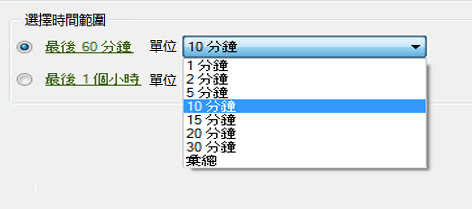

# 設定即時報表請求

關於如何設定即時報表請求日期的步驟。

1. 確保即時報表可於行銷 Reports &amp; Analytics [管理工具](https://marketing.adobe.com/resources/help/en_US/reference/real_time_admin.html)中啟動。
1. 在[!UICONTROL 「請求精靈: 步驟 1」]，按一下&#x200B;**[!UICONTROL 「即時報表]** > **[!UICONTROL `<report type>`]**」

   例如，選取一個流量報表。當您選取即時報表類型時，會顯示[!UICONTROL  選取時間範圍]的選項。

1. 選取幾小時或幾分鐘的時間範圍。

   

   即時報表只適用於過去的 20 小時。如想要更詳細，您有別的選項可選，從 1 分鐘至 30 分鐘都可以。
1. 按&#x200B;**[!UICONTROL 「下一步」]**，然後繼續[設定請求配置](/help/analyze/report-builder/layout/layout.md)。
