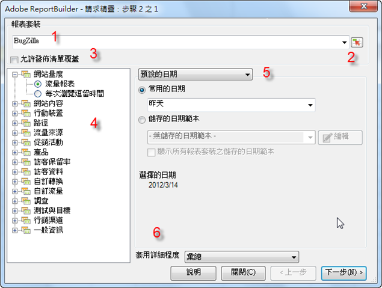

# 資料請求 - 請求精靈步驟 1

在「請求精靈: 步驟 1」表單中，您可以選擇報表套裝、報表類型、區段及設定日期。

1. **[!UICONTROL 報表套裝]**：根據登入憑證，提供給您使用的報表套裝清單。請參閱[選取報表套裝](/help/analyze/report-builder/data-requests/selecting-report-suites/t-select-report-suites.md)。

1. **範圍選取器**：讓您從 Excel 的儲存格選取報表套裝軟體。請參閱[選取報表套裝](/help/analyze/report-builder/data-requests/selecting-report-suites/t-select-report-suites.md)。

1. **區段**：區段是自訂資料子集，或由您建立之規則所篩選的資料。區段是以點擊、造訪和訪客為基準。如需區段的詳細資訊，請參閱 [Analytics 分段指南](https://marketing.adobe.com/resources/help/zh_TW/analytics/segment/)。

   例如，您可以執行[!UICONTROL 頁面報告]，然後套用首次瀏覽次數區段。

1. **允許發佈清單覆蓋**：在排程報表時，您可選取要用於散佈的發佈清單。會在「**[!UICONTROL Analytics]** > **[!UICONTROL 管理工具]**」中設定發佈清單。指派給發佈清單中每位收件者的報表套裝 ID 會取代此請求的報表套裝。請參閱[允許發佈清單覆蓋](/help/analyze/report-builder/data-requests/allow-publishing-list-overrides.md)。

1. **報表類型**：指定要在資料請求中執行基礎報表。您可以針對每個請求執行一份報表，且報表能具有一對多維度和一對多度量。報表類型的度量和維度會顯示在「[!UICONTROL 請求精靈: 步驟 2]」介面中。請參閱[選擇報表類型](/help/analyze/report-builder/data-requests/c-report-types/select-report-types.md)。

1. **日期範圍**：定義請求涵蓋的時間間隔。有幾種請求期間類型可使用，如預置、固定及遞延。期間的最大值為 366。您也可以選擇由儲存格指定的日期範圍，然後再將日期範圍儲存為範本以供日後使用。請參閱[設定報表日期](/help/analyze/report-builder/data-requests/configuring-report-dates/custom-calendar.md)。

1. **套用粒度**：指定報表所包含之時間詳細資料的等級。請參閱[粒度](/help/analyze/report-builder/data-requests/configuring-report-dates/granularity.md)。

>[!MORELIKETHIS]
>
>* [建立資料請求](/help/analyze/report-builder/data-requests/t-create-a-data-request.md)

