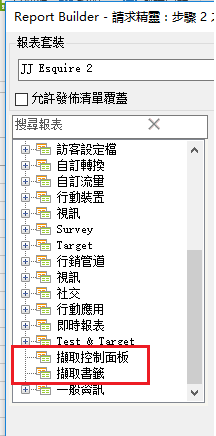

# 匯入書籤化報表與控制面板報表

現在，所有書籤化報表與控制面板報表都已列為「請求精靈步驟 1」中的維度，並且可匯入作為 Report Builder 請求。

當您選取書籤化報表時，「請求精靈」會填入定義此書籤化報表的所有維度和量度。 日期範圍、粒度及選取的區段也會根據選取的書籤加以更新.

以下說明「請求精靈步驟 1」如何顯示控制面板及其報表：

當您按一下或 **[!UICONTROL Retrieve your Dashboards]** 時，您 **[!UICONTROL Retrieve your Bookmarks]**&#x200B;的現有控制面板和／或書籤資料會擷取並貼入工作表中。

>[!NOTE] 在 Report Builder 中，可用的控制面板和書籤清單除了僅限於該使用者，也僅限於您在精靈步驟 1 中，套用至所選報表套裝的控制面板和書籤清單。相反地，在行銷 Reports &amp; Analytics 中，無論控制面板和書籤使用哪些報表套裝，您可以存取您具有存取權的所有書籤和控制面板。

>[!NOTE] 系統只會匯入資料，因此，如果書籤中包含圖表，或是控制面板報表僅由圖表組成，系統只會匯入圖表中的資料。

一旦您匯入控制面板報表 (或書籤) 建立請求後，請求便會與報表 (或書籤) 的主要維度建立關聯。因此，如果您編輯請求，樹狀檢視就不會再選取控制面板報表樹狀檢視節點 (或書籤節點)，而會選取請求的主要維度。

匯入的書籤小工具會將報表套裝、選取的區段、維度和選取的量度正確設定為「報表與分析」書籤中公開的相同參數。

>[!IMPORTANT]
>
>日期範圍會設定為相同的日期範圍，但即使該日期範圍是「Reports &amp; Analytics」書籤中的滾動式日期範圍，仍會設定為靜態日期範圍。

