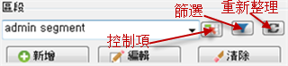
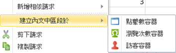
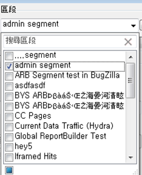
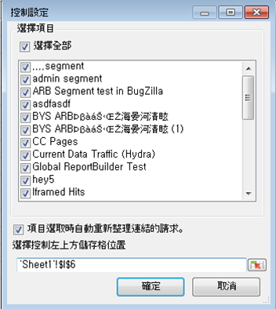
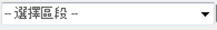
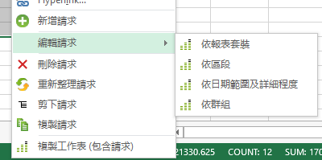

# 管理區段

如何在 Report Builder 中新增、編輯、套用及篩選 Adobe Analytics 區段。

Report Builder 在「請求精靈」的步驟 1 中設有分段面板，可讓您 建立和管理區段。

## 新增或編輯區段 {#section_B2BC136F9A53498D90C7C2ECC5DB892B}

> [!NOTE] 若要新增或編輯區段，「報告建立工具」區段介面會在Microsoft Internet explorer視窗中啟動Analytics區段產生器。 您的 Report Builder 工作階段仍可繼續使用。此作業不支援 Internet Explorer 以外的瀏覽器。

1. In the segment panel of Step 1 of the Request Wizard, click **[!UICONTROL Add]**.
1. Internet Explorer 視窗隨即啟動，並開啟 Analytics 區段產生器介面。如需有關如何建立區段的資訊，請參閱 [https://marketing.adobe.com/resources/help/zh_TW/analytics/segment/](https://marketing.adobe.com/resources/help/en_US/analytics/segment/)。
1. 在定義及儲存區段之後，返回「請求精靈」。
1. 按一下「重新整理」圖示以重新整理區段清單。

>[!IMPORTANT]
>
>系統會快取此清單，除非您重新整理，否則您新建立的區段將不會顯示。

## 建立內文中區段 {#section_6DD2C663B2854469AA1075438F907678}

您可以將要轉換成區段的報表維度合併為特定組合。您可以從 Report Builder 介面建立這些區段。例如，從「頁面」請求輸出選取一些頁面，並根據這些值建立區段。

1. 選取您要轉換成區段的報表輸出項目。
1. 按一下滑鼠右鍵選取「**[!UICONTROL 建立內文中區段於]」，並指定正確的容器 (點擊數容器、瀏覽次數容器、訪客容器)。**

   

   如需容器的詳細資訊，請參閱[劃分指南](https://marketing.adobe.com/resources/help/en_US/analytics/segment/)。

1. 區段產生器使用者介面將立即在 Internet Explorer 中啟動。區段產生器使用者介面將會依您指定的容器與篩選條件進行起始化。
1. 將名稱與說明新增至區段後，請儲存。
1. 返回 Report Builder ，按一下「重新整理」圖示以重新整理區段清單。
1. 現在，您已可套用此區段。

## 搜尋及套用區段 {#section_CACA269B48E94CFD91C2D5A15E9C77B7}

任何在「報表與分析」、「Ad Hoc Analysis」、Report Builder 或「Data Warehouse」中建立的區段，都會出現在此區段清單中。To refresh the list, click the Refresh icon ( .

您可以套用一或多個區段至任何指定的請求。這包含依序排列的區段。

1. 前往「**[!UICONTROL 區段]**」下拉式清單，按一下「**選擇區段]」方塊中的小型向下箭頭，以顯示所有區段。[!UICONTROL **

   

1. 勾選您要套用的區段。

> [!NOTE] 不論您是管理員或非管理員，在報告建立工具中，您只能看到您擁有的區段和已共用給您的區段。 (在「行銷 Reports &amp; Analytics」使用者介面中，管理員可查看組織中的所有區段。)

## 篩選區段 {#section_376E986D3E684999A7CDB08E53854159}

若要&#x200B;**篩選**&#x200B;區段，請按一下「篩選」圖示:  

可用的篩選條件包括:

| 篩選名稱 | 說明 |
|---|---|
| 標記 | 可讓您利用特定標記篩選區段。請注意，「標記」篩選條件使用 AND 運算子。如果您勾選兩個標記，右側窗格會顯示同時擁有&#x200B;**兩個**&#x200B;標記的區段。 |
| 擁有者 | 可讓您依擁有者篩選區段。請注意，「擁有者」篩選條件使用 OR 運算子。如果您勾選兩個擁有者，右側窗格會顯示&#x200B;**其中一位**&#x200B;擁有者擁有的區段。 |
| 其他篩選條件 &gt; 僅&#x200B;*報表套裝名稱* | If you apply the "Only *report suite name*" filter in the Segment Builder in [!DNL marketing reports & analytics], and then display the Advanced Filter in [!DNL report builder], the Advanced filter will display the segment for the selected report suite only. |
| 其他篩選器 &gt; 我的 | 顯示您擁有的所有區段。 |
| 其他篩選器 &gt; 與我共用 | 顯示所有其他人與您共用的區段。 |
| 其他篩選條件 &gt; 我的最愛 | 顯示所有標記為「我的最愛」的區段。 |
| 其他篩選條件 &gt; 批准 | 顯示所有已正式批准的區段。 |

## 將區段控制項新增至活頁簿 {#section_E3E5149A8464441FA5445A98DBD520AC}

新增區段控制項可讓您在活頁簿內切換區段，而無需前往「請求精靈」。

1. Click the Control icon ( ) next to the segment drop-down.

   

1. Check all the segments that you want to appear in the segment control, or check **[!UICONTROL Select All]**.
1. Notice the option **[!UICONTROL Automatically refresh linked requests upon item selection]**.

   * 如果勾選此選項，所有使用該控制項的請求都會重新整理。
   * 如果未勾選此選項，則會更新相關的請求參數，但不會重新整理請求。

1. 指定區段控制項的左上方儲存格位置。
1. 按一下「**[!UICONTROL 確定]」，區段控制項便會出現在指定的位置。**

   

## 重新整理區段清單 {#section_22E4A86789444B4A998532396B476EFB}

Any time you add a new segment or edit an existing one, you should click the Refresh icon (  to refresh the cached list of segments.

## 管理各請求中的區段 {#section_C3D63FCBE1A94369A319243313B03C93}

5.4 版之前，Report Builder 可讓使用者變更多個請求上的區段。然而，該過程一律會取代現有區段。使用者無法將新區段新增至每個請求，由於新增區段將移除先前指派給每個請求的區段集。

Report Builder 5.4 可讓您在多個目標請求當中新增、移除、取代以及取代所有區段:

1. 選取活頁簿中的多個請求。
1. Right-click and select **[!UICONTROL Edit Requests]** &gt; **[!UICONTROL By Segment]**.

   

1. 在「編輯群組」對話方塊中，選取四個選項其中一個:

   | 選項 | 說明 |
   |---|---|
   | 「新增區段」 | 可讓您選擇一個或多個區段，以便新增至現有的區段清單。 |
   | 「取代區段」 | 可讓您選擇要以一個或多個區段來取代的區段。 |
   | 「取代所有區段依據」 | 可讓您選擇要以一個或多個區段來取代的一個或多個區段。 |
   | 「移除區段」 | 可讓您從請求中移除區段。 |

