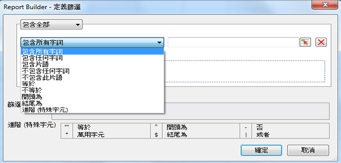

# 篩選維度概述

您可以篩選新增至「列標籤」格線的維度。篩選能減少請求傳回的資料數量，您可以從「樞紐配置」或「自訂配置」套用篩選。在「樞紐配置」中設定維度篩選時，您可以額外指定來自儲存格的項目數量。

系統現在會根據您在 Report Builder 請求中所選的元素和度量，輸入選取的篩選條件表單。

## Define filter - values and special characters {#section_15840216A4044C40974945FAA435AD93}

Information about filters in the **[!UICONTROL Most Popular Filter]** &gt; **[!UICONTROL Define Filter]** panel.

下列表格會提供篩選的範例和相關資訊:

<table id="table_8AC3A26FF02143DBA949B30F2A46CF11"> 
 <thead> 
  <tr> 
   <th colname="col1" class="entry"> 篩選器 </th> 
   <th colname="col02" class="entry"> 說明 </th> 
   <th colname="col2" class="entry"> 範例篩選器 </th> 
   <th colname="col3" class="entry"> 比對結果 </th> 
  </tr> 
 </thead>
 <tbody> 
  <tr> 
   <td colname="col1"> 
包含所有字詞 
 </td> 
   <td colname="col02"> 
包含每個以空格分隔的值，順序不拘。 
 </td> 
   <td colname="col2"> 
abc 
 </td> 
   <td colname="col3"> 
會比對 b cand b a c等。 
 </td> 
  </tr> 
  <tr> 
   <td colname="col1"> 
包含任何字詞 
 </td> 
   <td colname="col02"> 
包含至少其中一個篩選器 (以空格分隔)。 
 </td> 
   <td colname="col2"> 
ABC 
 </td> 
   <td colname="col3"> 
會比對 A1、  B2、  C但不是  D4。 
 </td> 
  </tr> 
  <tr> 
   <td colname="col1"> 
包含片語 
 </td> 
   <td colname="col02"> 
包含搜尋篩選器，也可能包含其他詞語。 
 </td> 
   <td colname="col2"> 
abc 
 </td> 
   <td colname="col3"> 
會比對 abc 和  abc def. 
 </td> 
  </tr> 
  <tr> 
   <td colname="col1"> 
不包含任何字詞 
 </td> 
   <td colname="col02"> 
傳回不包含您輸入值的所有項目。 
 </td> 
   <td colname="col2"> 
abc 
 </td> 
   <td colname="col3"> 
會比對 d e f 但不是  c d f。 
 </td> 
  </tr> 
  <tr> 
   <td colname="col1"> 
不包含此片語 
 </td> 
   <td colname="col02"> 
傳回不包含您片語的所有項目。 
 </td> 
   <td colname="col2"> 
abc 
 </td> 
   <td colname="col3"> 
排除 abc，  abc def ，與  def相符 
 </td> 
  </tr> 
  <tr> 
   <td colname="col1"> 
等於 
 </td> 
   <td colname="col02"> 
傳回完全相符的項目。 
 </td> 
   <td colname="col2"> 
abc 
 </td> 
   <td colname="col3"> 
  abc 會傳回，而不是其他項目。 
 </td> 
  </tr> 
  <tr> 
   <td colname="col1"> 
不等於 
 </td> 
   <td colname="col02"> 
傳回與您輸入的值不完全相符的所有項目。 
 </td> 
   <td colname="col2"> 
a 
 </td> 
   <td colname="col3"> 
不符合  a. 
 
Matches  a b c. 
 
Matches  abc. 
 </td> 
  </tr> 
  <tr> 
   <td colname="col1"> 
開始於 
 </td> 
   <td colname="col02"> 
傳回以特定值作為開頭的結果。 
 </td> 
   <td colname="col2"> 
abc 
 </td> 
   <td colname="col3"> 
會比對 abcd 但不  是abc 
 </td> 
  </tr> 
  <tr> 
   <td colname="col1"> 
終止於 
 </td> 
   <td colname="col02"> 
傳回以特定值作為結尾的結果。 
 </td> 
   <td colname="col2"> 
xyz 
 </td> 
   <td colname="col3"> 
會比對 wxyz 但not  wxyz0 
 </td> 
  </tr> 
  <tr> 
   <td colname="col1"> 
進階 (特殊字元) 
 </td> 
   <td colname="col02"> 
可讓您使用規則運算式字元: 
 
 <code> "", ^, -, *, $, | </code> 
 </td> 
   <td colname="col2"> 
"^Home*Page$" | sports 
 </td> 
   <td colname="col3"> 
 這會定義一個篩選器，開始於 「首頁」，然後尋找零個或多個字元，然後以  「頁面」結尾。 
 
Also, any page with  sports in it. 
 
以下是一些比對的範例: 
 
    <ul id="ul_72D76C5AFEAF405E8A0E4E3C604D10AE"> 
     <li id="li_4D490059B667450DA8A0103167C7B391">HomePage </li> 
     <li id="li_1351619156274092AEB2771D882AD357">Home 和 (其他字元) Page </li> 
     <li id="li_940EAA99A8CF49308E8471065EB317B1">Home sports </li> 
     <li id="li_50A895F14A454BE9BF06EE0F07F99B3B">sports Page </li> 
     <li id="li_F3CE0D07941D4C2485D2DE0B73E00677">sports </li> 
     <li id="li_E84C15C061824A5D922D9900392F2996">xyz sports abc </li> 
    </ul> </td> 
  </tr> 
 </tbody> 
</table>

<table id="table_8BBB06C8860745DEA41B39673699DC0F"> 
 <thead> 
  <tr> 
   <th colname="col1" class="entry"> 特殊字元 </th> 
   <th colname="col2" class="entry"> 用途 </th> 
   <th colname="col3" class="entry"> 附註 </th> 
  </tr> 
 </thead>
 <tbody> 
  <tr> 
   <td colname="col1"> " " </td> 
   <td colname="col2"> 等於 </td> 
   <td colname="col3"> 
除非未與另一個引號成對，否則不會予以逸出。例如， 17「顯示 不是片語。 
 </td> 
  </tr> 
  <tr> 
   <td colname="col1"> * </td> 
   <td colname="col2"> 萬用字元 </td> 
   <td colname="col3"> 
與規則運算式中使用的星號相同。 
 </td> 
  </tr> 
  <tr> 
   <td colname="col1"> ^ </td> 
   <td colname="col2"> 開始於 </td> 
   <td colname="col3"> </td> 
  </tr> 
  <tr> 
   <td colname="col1"> $ </td> 
   <td colname="col2"> 終止於 </td> 
   <td colname="col3"> </td> 
  </tr> 
  <tr> 
   <td colname="col1"> - </td> 
   <td colname="col2"> 否 </td> 
   <td colname="col3"> </td> 
  </tr> 
  <tr> 
   <td colname="col1"> | </td> 
   <td colname="col2"> 或 </td> 
   <td colname="col3"> 
只有在 進階(特殊字元) 篩選。 
 </td> 
  </tr> 
 </tbody> 
</table>