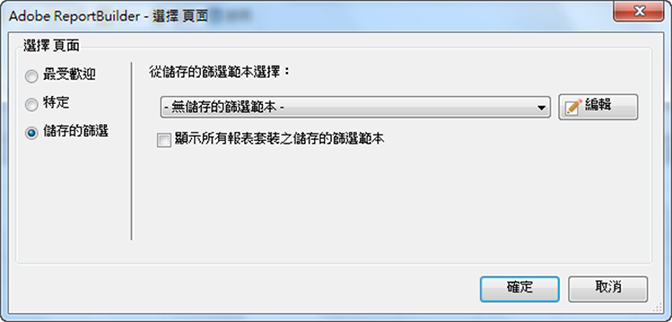

# 已儲存的篩選

您可以將篩選或其他參數儲存在 Report Builder 中，然後在其他工作表或活頁簿中使用。這些參數會儲存在 Analytics 中，以確保可供其他電腦上的其他 Report Builder 使用者使用。

在建立篩選時，您可以在「[!UICONTROL 選擇頁面]」表單中儲存篩選。如需此程序的範例，請參閱 [特定篩選](../../../../analyze/report-builder/layout/c-filter-dimensions/t-specific-filters.md#task_AD91873FD9FF4399A62EAB495DFFA12C).

