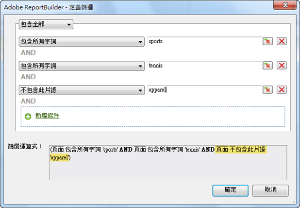
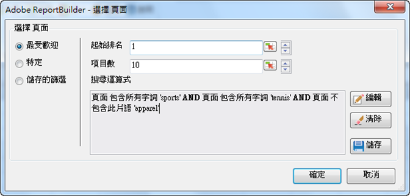

# 最受歡迎篩選

能使用布林邏輯搭配 AND/OR 搜尋運算式來排名篩選並設定篩選條件。

「最受歡迎」篩選是使用布林邏輯搭配AND/OR條件(例如包含條件或條件群組， [!UICONTROL Page does not contain]*`<product name>`* 如、或)來設定的運算式 [!UICONTROL Includes All][!UICONTROL Includes Any]篩選器 [!UICONTROL Excludes All]。 您可以[儲存](/help/analyze/report-builder/layout/c-filter-dimensions/saved-filters.md)這些運算式，以供此活頁簿中的其他請求或其他活頁簿使用。

**建立最受歡迎篩選**

1. 建立或編輯請求，然後前往 [!UICONTROL Request Wizard: Step 2]。

   

1. On the [!UICONTROL Request Wizard: Step 2], click the link next to the dimension in the grid, then choose **[!UICONTROL Filter]**.
1. 在表單 [!UICONTROL Choose Page] 中，啟 **[!UICONTROL Most Popular]**&#x200B;用，然後設定下列選項：

   **起始排名：**&#x200B;維度的起始排名。預設排名 1 代表報告之資料清單中最上層的項目。For example, for the dimension [!UICONTROL Page], a starting mark of 1 indicates the single most requested page of your site. 您可以將 10 或其他值指定為起始排名儲存格，這會產生以 10 (最高排名) 起始的報表。由於度量是以遞減順序排列的，因此系統會將活動數量最多的行項目報告為清單中的第一個項目。如果一個請求須傳回 50,000 個以上的頁面名稱，但是要報告的頁面高達數千頁，您可以複製請求並變更起始排名，以利用 50,000 為單位的區塊擷取適量的資料。

   **參加項目數：** (僅 [!UICONTROL Pivot Layout] 限)定義在日期範圍內針對特定度量報告的項目數。 某些度量會針對一個度量列出數百個項目，但某些度量可能只會顯示一些項目。For example, for the dimension [!UICONTROL Site Section], a number of entries of 25 indicates that the report shows the 25 most visited pages.

   箭頭允許您更改 [!UICONTROL Starting Rank] 工作 [!UICONTROL Number of Entries] 表中第一個資料點的和。 依預設， [!UICONTROL Starting Rank] 設為1，設為 [!UICONTROL Number of Entries] 10。 對於某些度量來說，這些值的調整範圍介於 1 到 50,000 之間。每個量度都有其專屬的上限 [!UICONTROL Number of Entries]。 這些欄位都不允許負數值或零。If you choose a [!UICONTROL Starting Rank] as 15 and [!UICONTROL Number of Entries] as 10, data requests for the metric return the 10 most visited pages, where the first most visited page is number 15 in the list for the specific date range. 系統會以遞減順序列出所有最常收到請求的頁面中第 15 名到第 25 名的頁面。

   >[!NOTE]
   >
   >將篩選條件套用至現有請求，會導致顯示的資料改變。假設您將前10個儲存格對 [!UICONTROL Pages] 應至$A$1到$A$10，其中1代表， [!UICONTROL Starting Rank] 10代表 [!UICONTROL Number of Entries]。 If you change these values to show 1 for [!UICONTROL Starting Rank] and only 3 for [!UICONTROL Number of Entries], the data previously filling cells $A$4 through $A$10 will no longer appear.

1. To create a search expression, click **[!UICONTROL Add]**.

   

1. On the [!UICONTROL Define Filter] form, configure the conditions appropriate for your needs.

   ：讓您找出在儲存格值中定義的條件。

   **新增條件：**&#x200B;將條件新增至運算式。可新增的條件數量沒有限制。

1. 按一下 **[!UICONTROL OK]**.

   

1. 在表單 [!UICONTROL Choose Page] 上，單 **[!UICONTROL Save]** 擊以保存表達式。
1. 按一下 **[!UICONTROL OK]**.
