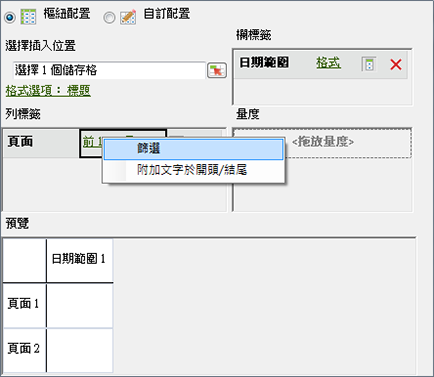
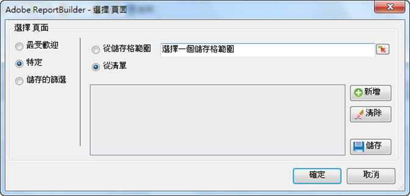

# 特定篩選

套用特定維度字詞的篩選。

您可以建立與實際條件相符的篩選來搜尋特定維度。For example, you can create the following type of filter: page in [!DNL homepage.htm], [!DNL contact_us.html], [!DNL corporate_info.html].

**建立特定的篩選**

1. 建立或編輯請求，然後前往[!UICONTROL 「請求精靈: 步驟 2」]。

   

1. On the [!UICONTROL Request Wizard: Step 2], click the link next to the dimension in the grid, then choose **[!UICONTROL Filter]**.

   

1. Enable **[!UICONTROL Specific]**, then enable one of the following options:

   * **從儲存格範圍:**&#x200B;可讓您選擇儲存格中的資料。您可以選擇︰
   * **範圍內的所有儲存格:** 可讓您映射範圍內的每一個儲存格。描述文字會說明您必須選擇的儲存格群組數量。若要映射多個儲存格群組，請在選擇儲存格時按住 Ctrl 鍵。如果必須映射的範圍內只含有一個儲存格，這便是唯一可用的選項。
   * **範圍的第一個儲存格:**&#x200B;您只需要選擇範圍左上角的儲存格，然後再選擇資料的方向。此外，如果請求含有多個期間，您可以選擇期間的方向，然後選擇是否要在各個期間當中略過一定數量的儲存格。
   * **從清單:**&#x200B;可讓您從可新增資料的清單選擇資料。
1. If you enable **[!UICONTROL From List]**, select any available listed items or click **[!UICONTROL Add]**.

   在按一下「**[!UICONTROL 新增]**」時，「[!UICONTROL 從清單選擇]」表單會針對目前的請求日期範圍顯示可用的維度值清單 (僅限前 10,000 個項目)。您可以搜尋這些項目或按一下&#x200B;**[!UICONTROL 更多...]**，此選項會顯示「[!UICONTROL 搜尋表單]」以供您建立更詳細的維度搜尋。
1. On the [!UICONTROL Select From List], click **[!UICONTROL OK]**.
1. On the [!UICONTROL Choose Page] form, save your Specific filter if you want, then click **[!UICONTROL OK]**.
