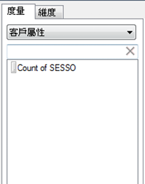
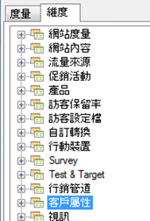

# 客戶屬性

客戶屬性儲存在稱為 VisAttr 的新元素類型中，可以設定為維度或量度。

如需如何上傳客戶屬性的詳細資訊，請參閱 [Experience Cloud 說明](https://docs.adobe.com/content/help/en/core-services/interface/customer-attributes/attributes.html)。

* 如果設定為度量，則 VisAttr 會同時公開為「維度」和度量。

    

* 支援與 eVar 相同的劃分 (任何項目都可由任何項目劃分)。
* VisAttr 支援所有 eVar 量度。
* VisAttr 做為度量，支援「值區化」(例如「網站逗留時間」: 0 到 30、31 到 60...)
* VisAttr 可以用做劃分維度。

