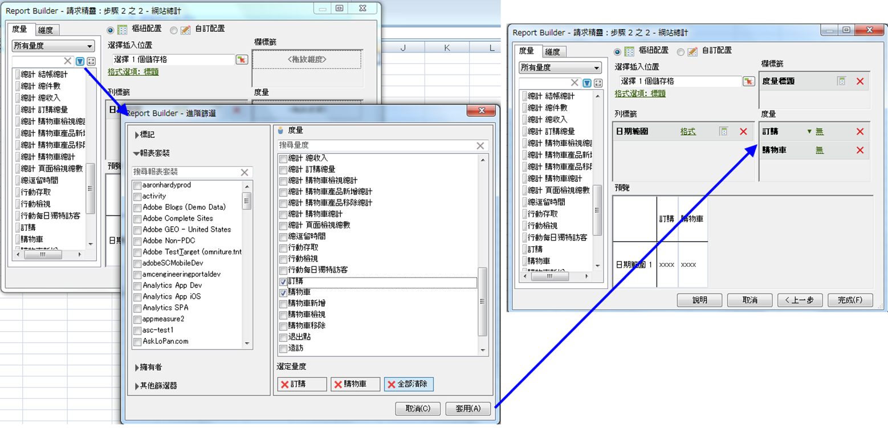

# 計算量度

報告建立工具5.2支援Adobe Analytics統一計算量度。 除了其他創新項目以外，現在所有計算量度都有全域 ID，不再侷限於單一報表套裝。

>[!NOTE] 現有活頁簿可能會指向使用舊式量度 ID 的請求。當您使用Report Builder 5.2時，這些舊有量度ID將會轉換為新的全域ID。 如果您與Report Builder v5.1或更舊版本的使用者共用此活頁簿，該使用者將無法看到計算量度。

若要進一步瞭解如何使用新的計算量度產生器和管理員來建立和管理計算量度，請參閱計 [算量度](https://marketing.adobe.com/resources/help/zh_TW/analytics/calcmetrics) 指南。

在「請求精靈」的步驟2中，您可以篩選及套用計算量度。

## 篩選計算量度 {#section_376E986D3E684999A7CDB08E53854159}

若要&#x200B;**篩選**&#x200B;計算量度，請按一下「篩選」圖示：

。「進階篩選」對話方塊會同時填入標準和計算量度。

可用的篩選條件包括：

| 篩選器名稱 | 說明 |
|---|---|
| 標記 | 可讓您篩選具有特定標籤的計算量度。 請注意，「標籤」篩選器使用AND運算子。 如果您勾選兩個標籤，右窗格會顯示已使用兩個標籤標籤的 **度量** 。 |
| 報表套裝 | 如果您在 *的「計算量度產生器」中套用「僅*&#x200B;報表套裝名稱[!DNL Reports & Analytics]」篩選條件，接著在 [!DNL Report Builder] 中顯示「進階篩選器」，則進階篩選器只會顯示所選報表套裝的計算量度。 |
| 擁有者 | 可讓您依擁有者篩選量度。 請注意，「擁有者」篩選器使用OR運算子。 如果您勾選兩個擁有者，右窗格會顯示其中一個擁有者所擁有 **的度** 量。 |
| 其他篩選器>已核准 | 顯示所有正式核准的量度。 |
| 其他篩選器>我的最愛 | 顯示您標示為「我的最愛」的所有量度。 |
| 其他篩選器 > 我的 | 顯示您擁有的所有量度。 |
| 其他篩選器 > 與我共用 | 顯示其他人與您共用的所有量度。 |

## 套用計算量度 {#section_DF5CF349460A45FDA4B6E6BB8B52F18E}

在您選取篩選器後，按一下 **[!UICONTROL Apply]** 以將篩選器套用至您的請求。 選取的量度現在會新增至報表配置。

