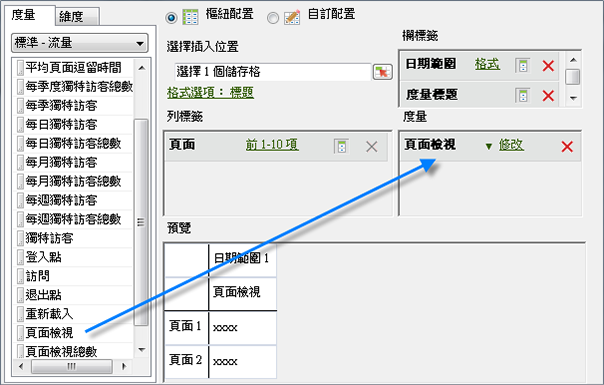
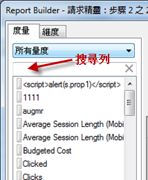
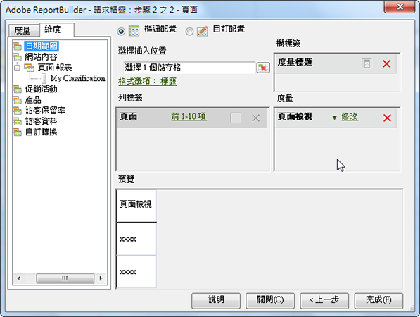

# 新增度量和維度

將度量和維度新增至請求的步驟。

1. [在「請求精靈](/help/analyze/report-builder/data-requests/data-requests.md) 」中建立 [!UICONTROL 資料請求：步驟1]，然後按「下 **[!UICONTROL 一步]**」。
1. 在[!UICONTROL 「請求精靈: 步驟 2」]中按兩下度量，或將度量拖曳到需要的位置。

   

   由於您可以在請求中顯示度量多次，因此在新增度量時，系統不會移除「[!UICONTROL 度量]」索引標籤中的度量。例如，您可以顯示小計度量以指出每個值相加的結果。然而，可用度量的清單會在您每次新增或移除維度時改變。

   您只能將度量新增至「[!UICONTROL 度量]」配置區段。會在「[!UICONTROL 欄標籤]」配置中新增度量為「[!UICONTROL 度量標題]」。如果您將「[!UICONTROL 度量標題]」從「[!UICONTROL 欄配置]」移動到「[!UICONTROL 列配置]」，度量標題會顯示在該處，並作為分支度量使用。

   請注意，搜尋列會顯示在「度量」標籤上，位在「度量」清單正上方。

   

   請記住:

   * 當您輸入搜尋字詞時，清單會自動更新，只顯示其標籤符合搜尋字詞的度量。
   * 相符項目不區分大小寫，且相當於「包含」搜尋。
   * 不支援完整文字搜尋或其他特殊搜尋標幟 (開始於、終止於、AND、OR 等)。

      退出請求精靈時 (亦即按一下「完成」或「取消」)、返回請求精靈的步驟 1 時，或變更度量類別時，都會清除搜尋字詞。

      下列情形不會清除搜尋字詞:

   * 您拖放 (或連按兩下) 清單中的一個度量項目，將它新增至「樞紐配置/自訂配置」度量面板。
   * 您從「樞紐配置/自訂配置」度量面板移除度量項目。
   * 您按一下「維度」標籤，接著返回「度量」標籤。
   * 您叫用退出後會返回請求精靈的步驟 2 的其他子表單 (強制或非強制回應)。這些表單範例包括

      * 維度篩選表單
      * 日期範圍格式化表單
      * 格式選項表單
      * 附加於開頭-結尾文字表單
      * 輸入範圍位置表單

1. (選用項目) 若要依度量排序請求，只要按一下度量標籤即可。
1. 以新增度量的方法新增維度。

在[!UICONTROL 「維度」]索引標籤中，系統會顯示在「步驟 1」和報表套裝組態中劃分的維度，或者屬於所選之任何基礎報表分類的維度。將維度拖放在配置格線時，系統會將配置格線從樹狀檢視中移除，然後重新計算剩餘可用的維度的清單。

系統會自動新增「[!UICONTROL 日期]」維度。可用的日期維度會隨著在「[!UICONTROL 請求精靈: 步驟 1]」中選擇的詳細程度而改變。(有效值為:

    *小時
    *天
    *周
    *月
    
    *年*日期範圍（未指定詳細程度時）

1. 透過設定格式選項和篩選 [器來修改](/help/analyze/report-builder/layout/t-format-display-headers.md) 量度和維度。
1. 按一下&#x200B;**[!UICONTROL 完成]**。在以下範例中，維度與「[!UICONTROL 頁面]」度量相關。在此範例中，[!UICONTROL 「反向連結網域」]維度建立了[!UICONTROL 「頁面」]和[!UICONTROL 「反向連結網域]」間的劃分報表。只會針對您可以新增至劃分報表的維度更新[!UICONTROL 「維度」]索引標籤。

