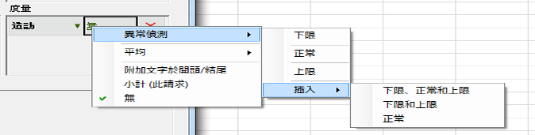
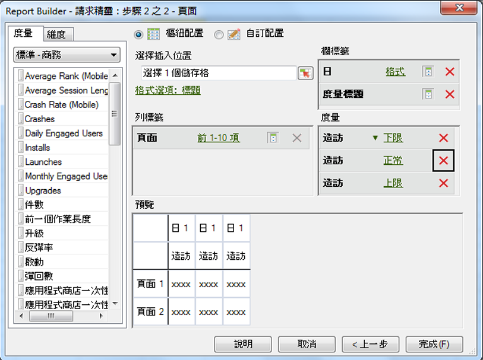

# 設定異常偵測請求

若要在Report Builder中建立異常偵測請求：

1. 選取趨勢化報表，如&#x200B;**[!UICONTROL 網站度量]**>**[!UICONTROL 流量]**&#x200B;報表。
1. 在[!UICONTROL 「套用粒度」]功能表，選取&#x200B;**[!UICONTROL 「日」]**。

   >[!NOTE]
   >
   >[!UICONTROL 「異常偵測」]功能表僅可在選取「日」粒度時適用。前 30 天的資料用於統計資料培訓期間，無論您選取的日期範圍為何。

1. 設定日期範圍後，按&#x200B;**[!UICONTROL 「下一步」]**。

   請求精靈：步驟 2 之 2，新增度量，如&#x200B;**[!UICONTROL 造訪次數]**。

   若要新增度量，請按一下&#x200B;**[!UICONTROL 「無」]**&#x200B;連結。

   

1. 選取&#x200B;**[!UICONTROL 「異常偵測]** > **[!UICONTROL `<selection>`]**」。

   

   當您選取其中一選項時，系統會建立原始度量異常偵測的複本。例如，對於造訪次數度量，將新增下界限造訪次數至[!UICONTROL 度量]群組。
1. 按一下&#x200B;**[!UICONTROL 「完成」]**，並選取要輸出成 Excel 的儲存格。

   請參閱[異常偵測](/help/analyze/analysis-workspace/c-anomaly-detection/anomaly-detection.md)，了解定義。
