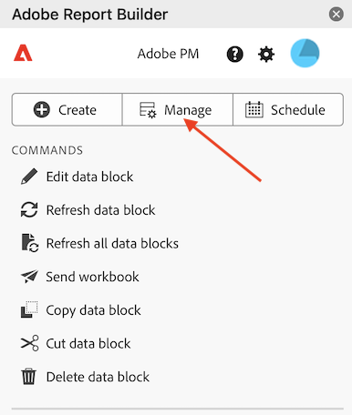

# 在 Report Builder 中管理資料區塊

您可以使用資料區塊管理員來檢視及管理活頁簿中的所有資料區塊。 資料區塊管理員提供搜尋、篩選和排序功能，讓您可以快速地找出特定資料區塊。 在選取一個或多個資料區塊後，您可以編輯、刪除或重新整理所選的資料區塊。

## 檢視資料區塊

按一下&#x200B;**管理**&#x200B;即可檢視活頁簿中的所有資料區塊清單。

資料區塊管理員會列出活頁簿中顯示的所有資料區塊。 

## 排序資料區塊清單

您可依顯示的欄來排序資料區塊清單。 例如，您可以依報表套裝、區段、日期範圍和其他變數來排序資料區塊清單。

若要排序資料區塊清單，請按一下欄標題。

## 搜尋資料區塊清單

使用「搜尋」欄位可找出資料區塊表格中的任何資料。 例如，您可以搜尋包含在資料區塊或報表套裝中的量度。 您也可以搜尋出現在日期範圍、修改日期或上次執行日期等欄中的日期。

![使用[搜尋]欄位來尋找資料區塊資料表中的任何專案。](./assets/image55.png)

## 編輯資料區塊

您可以編輯套用至一或多個資料區塊的報表套裝、日期範圍或區段。

例如，您可以在一或多個資料區塊中以新區段取代現有區段。

1. 選取您想要更新的資料區塊。 您可以選取最上層核取方塊來選取所有資料區塊，也可以選取個別資料區塊。

   

1. 按一下編輯圖示可顯示「快速編輯」視窗。

   

1. 選取區段連結以更新報表套裝、日期範圍或區段。

   

## 重新整理資料區塊

按一下重新整理圖示可重新整理清單內的資料區塊。

若要確認資料區塊是否已重新整理，請檢視重新整理狀態圖示。

成功重新整理的資料區塊會以綠色圓圈顯示核取記號： 。

無法重新整理的資料區塊會顯示警告圖示： 。這可讓您輕鬆識別是否有任何資料區塊發生錯誤。

## 刪除資料區塊

1. 在資料區塊管理員中選取資料區塊。
1. 按一下垃圾桶圖示可刪除所選的資料區塊。

## 分組資料區塊

您可以使用&#x200B;**分組方式**&#x200B;下拉式選單或按一下欄標題來分組資料區塊。 若要依欄排序資料區塊，請按一下欄標題。 若要依群組來分組資料區塊，請從&#x200B;**分組方式**&#x200B;下拉式選單中選取群組名稱。 例如，底下螢幕擷圖顯示依工作表分組的資料區塊。 其中顯示依 Sheet1 和 Sheet2 分組的資料區塊。 這很有用，例如在區段替換使用案例中。 如果您將多個區段套用至每個資料區塊，則建立一個包含您要取代的所有資料區塊的群組會很有幫助。 然後您就可以輕鬆地一次選取及編輯所有資料區塊。

![資料區塊管理員顯示[依工作表分組]清單。](./assets/group-data-blocks.png)

## 修改資料區塊管理員檢視

您可以修改可在「資料區塊管理員」視窗中看到哪些欄。

按一下欄清單  圖示可選取哪些欄要列在資料區塊管理員中。 選取要顯示欄的欄名稱。 取消選取欄名稱即可從檢視中移除該欄。

