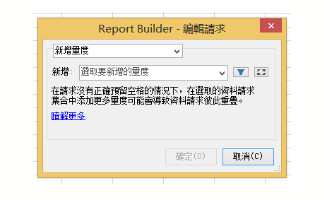
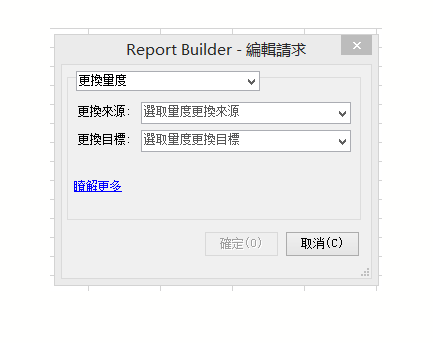
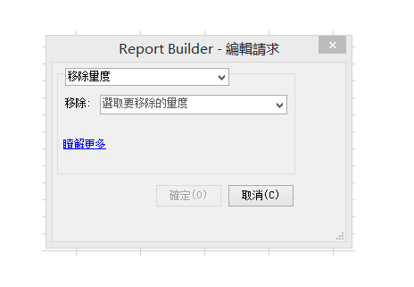

# 編輯多個請求的量度

在多個請求之間編輯量度的功能，讓您輕鬆地在預先存在的請求或一組請求中新增、移除或更換量度。

## Add metrics {#section_3FBDA9668039404895059618D70FCBCD}

請記住:

* 量度僅會新增至「樞紐配置」請求。如果某些選取的請求為「自訂配置」，則無法新增量度。這是因為您已自訂配置，Report Builder 並不知道新量度放置於試算表中的位置。
* 因此，如果您僅選取「自訂配置」請求，就無法使用&#x200B;**[!UICONTROL 「新增量度」]選項。**
* 新增量度會增加請求的大小，並可能造成與其他請求重疊。請確定您的請求周圍有足夠的空間可以新增量度。
* 如果新增的量度已存在於其中一個選取的請求當中，就不會新增量度至該請求。

若要新增一或多個量度:

1. Select one or more requests in Excel and right-click to select **[!UICONTROL Edit Metrics]**. (Or, click **[!UICONTROL Manage]** &gt; **[!UICONTROL Edit Multiple]** &gt; `<choose metric>` &gt; **[!UICONTROL Edit Group]** to select the group of requests to modify.)
1. Select **[!UICONTROL Add Metric(s)]**and select the metrics to add.

   

1. 重新整理請求，以查看實際資料。除非重新整理，否則無法查看離線資料。

## Replace metric {#section_D773AAC7B30C4FBEBDB66B203C217818}

請記住:

* 僅允許以 1 對 1 取代量度，而不允許 1 對多或多對 1。
* 如果選定的更換量度不在選取的請求當中，此請求就會維持不變。
* 新量度將會放置在與被取代量度的相同位置。這表示:

   * **在「樞紐配置」**: 如果樞紐配置請求輸出日期、瀏覽、訪客、每日不重複，還有以「收入」更換的「訪客」時，更新的請求配置將會是: 日期、瀏覽、收入、每日不重複。
   * **在「自訂配置」**: 如果「訪客」量度是在儲存格 F11 輸出，則更新的請求配置同樣會在儲存格 F11 顯示「收入」。

* 如果取代的量度已套用某項作業 (計算平均值、開頭附加文字、結尾附加文字、建立 Microchart)，則這些作業也會套用至新量度。

若要更換量度

1. Select one or more requests in Excel and right-click to select **[!UICONTROL Edit Metrics]**. (Or, click **[!UICONTROL Manage]** &gt; **[!UICONTROL Edit Multiple]** &gt; **`<choose metric>`** &gt; **[!UICONTROL Edit Group]** to select the group of requests to modify.)

1. Select **[!UICONTROL Replace Metric]**.

   

1. 選取要更換的量度以及要用來更換的量度。
1. 重新整理請求。除非重新整理，否則無法查看離線資料。

## Remove metrics {#section_D3CD5BAC7670416593B633B2B8423C60}

請記住:

* 如果任何選定的移除量度不在選取的請求當中，此請求就會維持不變。
* 在「樞紐配置」中，移除量度會造成位於被移除量度後面的量度配置位移。

   **範例**: 如果樞紐配置請求輸出日期、瀏覽、訪客、每日不重複，當您移除「訪客」時，更新的請求配置將會顯示: 日期、訪客、每日不重複。

若要移除量度:

1. Select one or more requests in Excel and right-click to select **[!UICONTROL Edit Metrics]**. (Or, click **[!UICONTROL Manage]** &gt; **[!UICONTROL Edit Multiple]** &gt; **`<choose metric>`** &gt; **[!UICONTROL Edit Group]** to select the group of requests to modify.)

1. Select **[!UICONTROL Remove Metric(s)]**.

   

1. 選取一或多個量度，將其自請求移除。
1. 重新整理請求。除非重新整理，否則無法查看離線資料。

