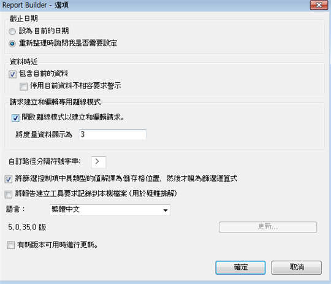
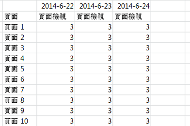

# 建立和編輯請求的離線模式

離線模式會傳回預留位置資料，以加速建立及編輯請求的處理程序。

當您建立或編輯新的請求時，系統會進行「報表 API」呼叫以擷取回應。這樣會拖慢請求建立程序，因為您必須先等候資料傳回，才能前往下個步驟。離線模式則只會傳回預留位置資料，因此無須進行任何 API 呼叫。

若要啟用離線模式，請執行下列動作:

1. 按一下 Report Builder 功能表中的&#x200B;**[!UICONTROL 「選項」]。**

   

1. Check the checkbox next to **[!UICONTROL Turn on offline mode for creating and editing requests]**.
1. 在「**[!UICONTROL 將度量資料顯示為]」欄位中，輸入您想要在請求中傳回的預留位置資料。**&#x200B;例如，您可以輸入「1」。
1. Click **[!UICONTROL OK]**.
1. 接著，在「請求精靈」中以離線模式建立並執行請求。
1. 帶有預留位置資料「1」的請求如下所示:

   

   >[!IMPORTANT]
   >
   >使用真實資料執行請求前，請務必停用離線模式。若要停用「離線模式」，只要返回「**[!UICONTROL 選項]」並移除勾選記號即可。**

