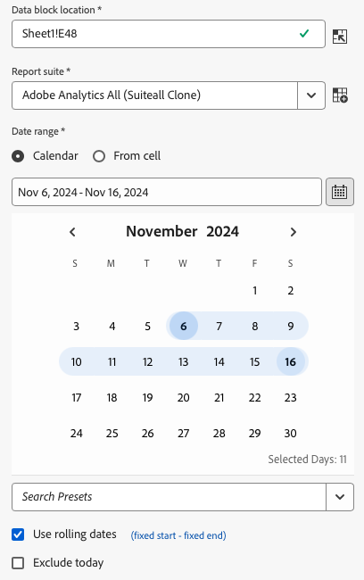

# 選取日期範圍

若要變更現有資料區塊的日期範圍，請選取「編輯資料區塊」或使用「快速編輯」面板。

使用下列選項變更資料區塊的日期範圍。

**行事曆**

「行事曆」可讓您使用下列選項建立靜態或滾動日期：

- 日期範圍欄位
- 行事曆
- 預設下拉式選單
- 滾動日期模式
- 自訂運算式


**從儲存格**

「從儲存格」選項可讓您引用工作表儲存格中輸入的日期。

您可選擇在任何選取的日期範圍中排除當天。


## 使用「行事曆」

當您使用&#x200B;**行事曆**&#x200B;時，日期範圍欄位會顯示資料區塊要求的目前日期範圍。您可在日期範圍中直接輸入日期，或是使用資料範圍選取選項。

### 日期範圍欄位

若要在日期範圍中直接輸入日期

1. 按一下行事曆圖示旁的日期範圍欄位。 

1. 輸入您的日期範圍的開始和結束日期。

### 行事曆

若要使用行事曆選取日期

1. 按一下行事曆圖示，以顯示每月行事曆。 

1. 按一下開始日期。

1. 按一下結束日期。

若要反向設定日期範圍，先按一下結束日期，然後再按一下開始日期。



### 預設下拉式選單

此預設下拉式選單包括一組標準預設日期範圍和您儲存或與您共用的資料檢視的日期範圍元件。

### 滾動日期

滾動日期選項可讓您使用滾動日期選取日期範圍。

1. 選取&#x200B;**使用滾動日期**。

1. 為您的開始和/或結束日期選取滾動運算式。

   

   **開始時間** — 可讓您選取一天、週、月、季或年的開始。

   **結束時間** — 可讓您選取一天、週、月、季或年的結尾。

   **固定日** — 可讓您在其他日期滾動時，固定開始或結束日期。

1. 選擇日、週、月、季或年作為滾動期間。

   

1. 從您的滾動日期加上或減去日數、週數、月數、季數或年數。

   

1. 按一下「下一步」以定義資料範圍。

   使用日期預覽以確認產生的日期範圍是所需範圍。

### 自訂運算式

自訂運算式選項可讓您透過建立自訂運算式來變更日期範圍，或者您可輸入算術公式。

1. 選取&#x200B;**使用滾動日期**。

1. 選取&#x200B;**使用自訂運算式**。

   當您選取&#x200B;**使用自訂運算式**&#x200B;選項時，會停用標準滾動日期範圍控制項。

   

1. 輸入自訂運算式。

   若要取得自訂運算式清單的樣本，請參閱&#x200B;**日期運算式**。

1. 使用日期預覽以驗證產生的日期範圍是所需範圍。

#### 建立自訂運算式

1. 輸入&#x200B;**日期參考**。

1. 新增&#x200B;**日期運算子**，將日期移動至過去或未來。

您可以輸入包含多個運算子的自訂日期運算式，例如 ```tm-11m-1d```。

#### 日期參考

下列表格列出了日期參考的範例。

| 日期參考 | 類型 | 說明 |
|----------------|--------------|----------------------------|
| 1/1/10 | 靜態日期 | 以 ISO 日期格式輸入 |
| td | 滾動日期 | 當天的開始 |
| tw | 滾動日期 | 本週的開始 |
| tm | 滾動日期 | 本月的開始 |
| tq | 滾動日期 | 本季的開始 |
| ty | 滾動日期 | 本年度的開始 |

#### 日期運算子

下列表格列出了日期運算子的範例。

| 日期運算子 | 單位 | 說明 |
|----------------|---------|--------------------|
| +6d | 日 | 新增 6 天至「日期參考」 |
| +1w | 週 | 將一整週加入「日期參考」 |
| -2m | 月 | 從「日期參考」減去 2 個整月 |
| -4q | 季 | 從「日期參考」減去 4 個季數 |
| -1y | 年 | 從「日期參考」減去一年 |

#### 日期運算式

下列表格列出了日期運算式範例。

| 日期運算式 | 含義 |
|-----------------|--------------------------------------|
| td-1w | 上週的第一天 |
| tm-1d | 前一個月的最後一天 |
| td-52w | 52 週前的同一天 |
| tm-11m-1d | 去年同一個月的最後一天 |
| 「2020-09-06」 | 2020 年 9 月 9 日 |

## 儲存格的日期範圍

可在工作表儲存格中指定日期範圍。使用&#x200B;**儲存格的日期範圍**&#x200B;選項，從選取的儲存格中選擇資料區塊的開始和結束日期。當您選取&#x200B;**從儲存格**&#x200B;選項時，面板會顯示&#x200B;**開始**&#x200B;和&#x200B;**結束**&#x200B;欄位，您可在此輸入儲存格位置。


## 排除當天

選擇&#x200B;**排除當天**&#x200B;選項，從選取的日期範圍排除當天。若選擇包括當天，可能會提取當天不完整的資料。

選取完畢後，**排除當天**&#x200B;選項會從所有日期範圍模式 (包括行事曆、滾動日期或自訂運算式) 中排除當天。

## 有效的日期範圍

下列清單說明有效的日期範圍格式。

- 開始和結束日期必須為下列格式: YYYY-MM-DD

- 開始日期必須早於或等於結束日期。兩個日期都可以設在未來。

- 若使用滾動日期，開始日期必須為當天或過去。如果勾選&#x200B;**排除當天**，則必須為過去。

- 您可以建立一個為未來設定的靜態日期範圍。例如，您可能需要為下週推出的行銷活動設定一個未來日期。這個選項可預先為活動建立活頁簿監控。

## 變更日期範圍

選取「命令」面板中的「編輯資料區塊」，或「快速編輯」面板中的日期範圍連結，您就可以編輯現有資料區塊的日期範圍。

**編輯資料區塊** — 可讓您為單一資料區塊編輯多個資料區塊參數，包括日期範圍。

**快速編輯: 日期範圍** — 可讓您編輯一或多個資料區塊的日期範圍。

若要從「快速編輯」面板編輯日期範圍

1. 請選取工作表中一或多個資料區塊內的儲存格。

1. 按一下「快速編輯」面板中的&#x200B;**日期範圍**&#x200B;連結。

1. 使用任何日期選取範圍選項來選取日期範圍。

1. 按一下&#x200B;**「套用」**。


Report Builder 會將新的日期範圍套用至選取範圍中的所有資料區塊。
