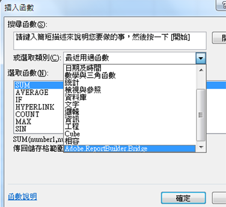
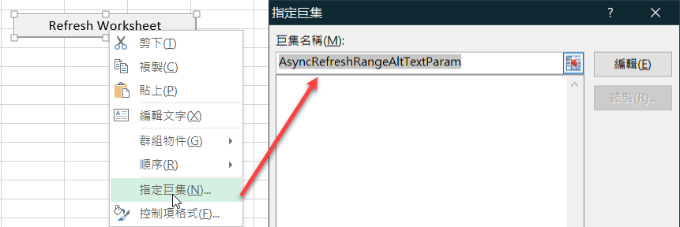
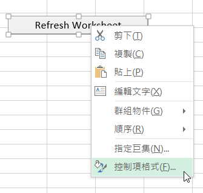
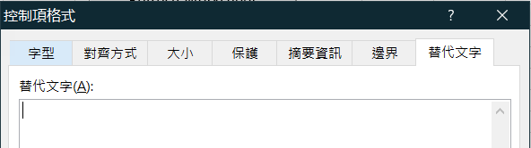

# 從 Microsoft Excel 函數叫用 Report Builder 功能

此功能進一步整合 Report Builder 在一般 Excel 工作流程中的用途，讓您無須存取 Report Builder 使用者介面。

例如，您可能想要自動重新整理 Report Builder 請求，而該請求的輸入篩選條件是根據 Excel 中從其他來源提取的資料。您現在可以使用下列字串函數 RefreshRequestsInCellsRange(..) 這麼做。函式。 所有呼叫皆為非同步。它們會立即傳回，而不會等待呼叫完全執行。

> [!NOTE] 您必須安裝Report Builder 5.0（或更新版本），才能使用此功能。

下表列出各種公開函數:

| 函數名稱 | 說明 |
|---|---|
| string AsyncRefreshAll() | 重新整理活頁簿顯示的所有 Report Builder 請求。 |
| string AsyncRefreshRange(string rangeAddressInA1Format) | 重新整理指定儲存格範圍位址 (以 A1 格式表示儲存格範圍的字串表示式，例如「Sheet1!A2:A10」) 中顯示的所有 Report Builder 請求。 |
| string AsyncRefreshRangeAltTextParam() | 重新整理指定儲存格範圍 (通過 Ms 表單控制項中的替代文字) 中顯示的所有 Report Builder 請求。 |
| string AsyncRefreshActiveWorksheet() | 重新整理使用中工作表顯示的所有 Report Builder 請求。 |
| string AsyncRefreshWorksheet(string worksheetName) | 重新整理指定工作表顯示的所有 Report Builder 請求 (工作表名稱為索引標籤上顯示的名稱)。 |
| string AsyncRefreshWorksheetAltTextParam(); | 重新整理特定工作表名稱 (通過 Ms 表單控制項中的替代文字) 中顯示的所有 Report Builder 請求。 |
| string GetLastRunStatus() | 傳回說明上一次執行狀態的字串。 |

若要存取 Report Builder 中的函數，請前往「[!UICONTROL 公式]」&gt;「[!UICONTROL 插入函數]」。您可以在類別清單的底部找到 Adobe.ReportBuilder.Bridge:



## Use these functions in a formula {#section_034311081C8D4D7AA9275C1435A087CD}

例如，公式

```
=IF(OR(ISTEXT(P5),ISBLANK(P5)),AsyncRefreshRange("P9"),"")
```

內容為「如果儲存格 P5 的值是文字或空白，就重新整理儲存格 P9 的範圍。」

## Use Report Builder functions with format control {#section_26123090B5BD49748C8D8ED7A1C5ED84}

您現在可以將巨集指派給您建立的控制項，而且該控制項可以是重新整理活頁簿請求的函數。例如，函數 AsyncRefreshActiveWorksheet 會重新整理工作表中的所有請求。不過，有時候您可能只想重新整理某些請求，而非全部。

1. 設定巨集參數。
1. Right-click the control and select **[!UICONTROL Assign Macro]**.
1. 輸入 Report Builder 函數名稱 (不包含參數及括號。)



## Pass parameters to Report Builder functions via format control {#section_ECCA1F4990D244619DFD79138064CEF0}

採用參數的兩個函數可與「格式控制項」搭配使用，但只能透過「替代文字」欄位:

* AsyncRefreshRange(string rangeAddressInA1Format)
* AsyncRefreshWorksheet(string worksheetName)

1. Right-click the control and select **[!UICONTROL Format Control]**.

   

1. 按一下「[!UICONTROL 替代文字]」索引標籤。

   

1. 在「[!UICONTROL 替代文字]」下，輸入您要重新整理的儲存格範圍。
1. 在「[!UICONTROL 公式]」&gt;「[!UICONTROL 插入函數]」&gt;「[!UICONTROL Adobe.ReportBuilder.Bridge]」下，開啟 Report Builder 參數的清單。

1. Pick one of the two functions that end with AltTextParam and click **[!UICONTROL OK]**.

