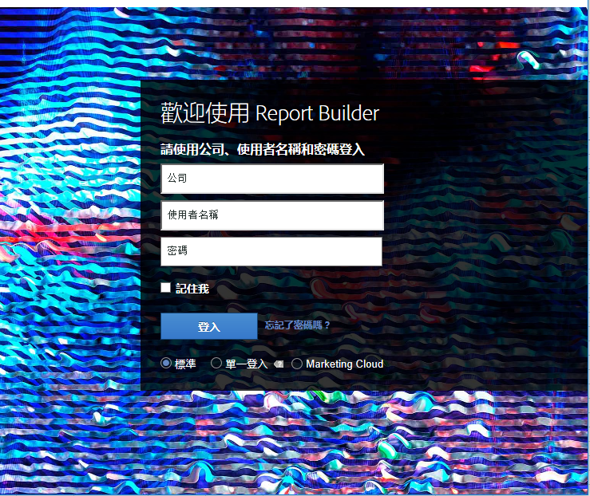
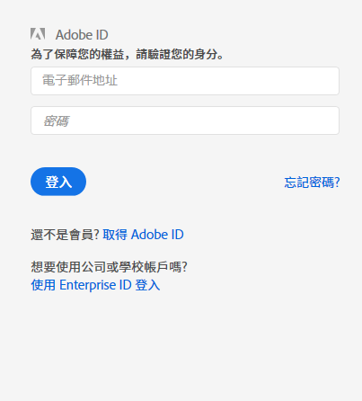

# 登入 Report Builder

三種 Report Builder 登入方法的相關資訊。

目前，當您在 Report Builder 中按一下&#x200B;**[!UICONTROL 「登入」]**，可使用下列登入選項。

* [標準](/help/analyze/report-builder/setup/login.md#section_6D54B8ADAE7F416BB83F5082B3771CFA)
* [單一登入](/help/analyze/report-builder/setup/login.md#section_6970A5F926774976B85FFE576610E85F)
* [Experience Cloud 和單一登入](/help/analyze/report-builder/setup/login.md#section_1FA230F35AB54021A874A7A28DE4C850)

## 標準 {#section_6D54B8ADAE7F416BB83F5082B3771CFA}

如果您想使用 Adobe Analytics 憑證登入 Report Builder，請使用這個登入選項。

**Report Builder 登入 – 欄位定義**

| 欄位 | 定義 |
|--- |--- |
| 公司 | 用於 Adobe Analytics 的公司登入憑證。 |
| 使用者名稱 | 用於 Adobe Analytics 的使用者名稱登入。使用者的排程任務會與使用者名稱連結。如果您以相同的登入憑證登入 Report Builder，將可從任何電腦檢視排程任務。 |
| 密碼 | 您的 Analytics 密碼。 |
| 記住我 | 登入資訊會經過加密，並儲存在安裝 Report Builder 的機器上的使用者設定檔內。由於登入資訊會儲存在電腦中，因此使用同一台電腦的報表建立者在開啟含報表的試算表時，都能重新整理和編輯資料。如果您與其他使用者共用電腦且想要維持試算表資料的隱私，請勿啟用此選項。若要停用自動登入設定，請按一下工具列中的&#x200B;**[!UICONTROL 「請使用其他憑證登入」]**，並停用&#x200B;**[!UICONTROL 「記住我」]**。 |
| 使用代理伺服器 | 如果您透過代理伺服器存取網際網路且必須提供代理使用者名稱和密碼，請啟用此選項。 |

## 單一登入 {#section_6970A5F926774976B85FFE576610E85F}

此 (舊版) 單一登入只能讓您登入 Adobe Analytics，無法登入整個 Experience Cloud。

您也可以輸入網域，系統會辨別網域並將您重新導向至貴公司的單一登入頁面，以讓您登入 Adobe Analytics。

## Experience Cloud {#section_1FA230F35AB54021A874A7A28DE4C850}

Experience Cloud 登入可讓您使用 Enterprise ID (電子郵件與密碼) 來登入 Adobe Experience Cloud。按一下&#x200B;**[!UICONTROL 「登入]** > **[!UICONTROL 使用 Enterprise ID 登入」]**，系統會將您重新導向至貴公司的單一登入頁面。如需 Enterprise ID 的詳細資訊，請按一下[這裡](https://helpx.adobe.com/tw/enterprise/kb/enterprise-id-faq.html#whatis)。

> [!NOTE] Experience Cloud 登入是以工作階段為準，代號會在 30 天後過期。

