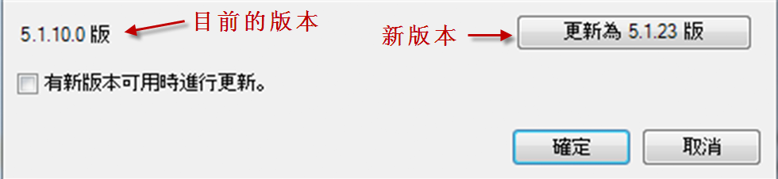
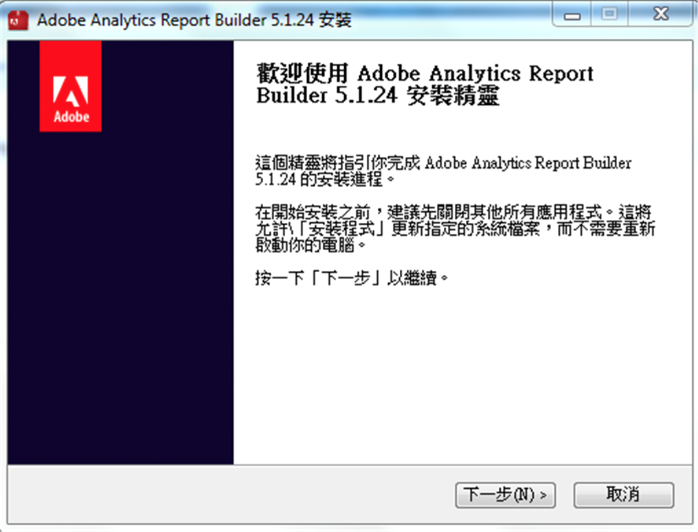

# 升級 Report Builder

升級 Report Builder 的相關步驟和考量事項

## 升級常見問題解答 {#section_AFE40FF5544C418790A1C298C25CC18A}

**問: 升級後會保留舊版 Report Builder 嗎?**

答: 不會，系統會移除舊版本。

**問: 我的現有報表會遺失嗎?**

答: 不會，所有現有報表都能持續運作。

**問: 我需要對新版本重新驗證嗎?**

答: 不用，您的所有設定 (包括驗證設定) 都能持續運作。

## Upgrade instructions {#section_73B8110A619549189A30079735E81867}

1. 登入目前的 Report Builder 版本。
1. 前往「**[!UICONTROL 選項]」功能表，升級至最新版本。**&#x200B;您目前的版本號碼會顯示在「選項」對話方塊底部。

   

1. If a new version is available, click **[!UICONTROL Update...]**. 按鈕會顯示您可以更新至哪個版本，例如: 「更新至 5.0.50 版」

   >[!NOTE]
   >
   >如果此按鈕變灰，則不會提供新版本的Report Builder。

1. Optionally select the **[!UICONTROL Update when a new version is available]**checkbox. 日後有可用的新版本時，就會自動啟動更新程序。
1. When the setup screen appears, click **[!UICONTROL Next &gt;]**.

   

1. 升級完成後，重新登入 Report Builder。

## Manual upgrade instructions {#section_27A0200010DC4747A718F1A65B180599}

您永遠都能從 Adobe Analytics 取得 Report Builder 的最新版本。

1. Log in to Adobe Analytics and go to **[!UICONTROL Tools]**.
1. Click **[!UICONTROL Report Builder]**.
1. 在「**[!UICONTROL 概述]」畫面上，選取 32 位元或 64 位元版本。**
1. Click **[!UICONTROL Download Now!]**.

