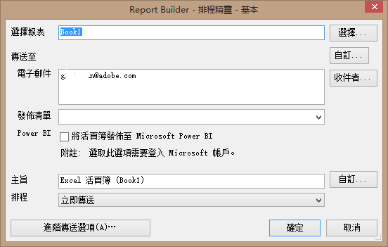

# 排程活頁簿

您可以排程活頁簿、指定進階傳送選項、指定收件者及檢視排程歷史記錄。進階傳送選項可設定在特定時間或依照時間間隔傳送活頁簿。您也可以指定傳送活頁簿時的檔案格式。

例如，您可以將活頁簿排程為立即傳送或按照週期傳送，然後在「[!DNL Advanced Delivery Options]」中指定檔案格式。活頁簿上傳的檔案大小限制為 5 MB。

Additionally, after you create a workbook schedule in Report Builder, you can view and edit the schedule in **[!UICONTROL Analytics]** > **[!UICONTROL Reports]**. (請參閱「Reports &amp; Analytics」說明中的[報表排程與分發](/help/analyze/reports-analytics/scheduling.md))。

>[!NOTE] 您必須安裝 Excel 2007 或相容性套件，才能排程活頁簿。每一個 Report Builder 授權最多可建立 10 個排程活頁簿。不過，您可以從其他授權扣除，以建立更多活頁簿。若要這麼做，請前往 **[!UICONTROL Admin]** > **[!UICONTROL Company Settings]** > **[!UICONTROL Report Builder Reports]**。 活頁簿排程 (或上傳至活頁簿庫) 後，若超過 28 個月從未更動 (更新、更換)，系統將加以刪除。

>[!NOTE] 使用者輸入的「傳送時間」/「每日時間」是指定活頁簿開始處理的時間，而非實際傳送活頁簿的時間。實際傳送活頁簿的時間主要會根據處理所需時間 (複雜和大型活頁簿的處理時間比簡單的活頁簿長)。例如，如果活頁簿需要 15 分鐘處理，則實際傳送時間至少會超過原本指定的「傳送時間」/「日期時間」15 分鐘。
>此外，還有其他許多因素可能會進一步拉長實際傳送活頁簿前的延遲時間：
>
> * 如果&#x200B;**同時執行許多同類型的不同排程**，可能會使系統過載。排程系統僅允許同時執行少數 (5 至 10 個) 任一類型的活頁簿，因此，要是一次排程超過 5 至 10 個活頁簿，部分活頁簿就得等待其他活頁簿完成，才能開始處理。將公司活頁簿的排程分散到一整天或一個小時內，而非同時處理，即可緩解此問題。
> * 除了特定的活頁簿類型外，如果公司&#x200B;**同時排程超過 15 至 20 個任一類型活頁簿，活頁簿也會排隊等候 (涵蓋所有不同活頁簿類型)**。錯開排程時間，而非同時執行多個活頁簿，即可緩解此問題。
> * 排程器所仰賴之&#x200B;**下游服務的問題**&#x200B;也會影響活頁簿的傳送作業。舉例來說，如果單獨使用 API 來執行活頁簿，並填滿 API 請求佇列，當您爭用該資源時，已排程活頁簿的傳送速度可能就會很慢。
> * **報表套裝延遲** (資料彙集延遲) 也可能會延遲部分已排程的活頁簿。

## 排程活頁簿

1. 產生並儲存活頁簿。
1. On the Report Builder Toolbar, click **[!UICONTROL Schedule]**.

   The [!UICONTROL Scheduled Reports] tab summarizes all the tasks you have created, as well as the number of remaining tasks.
1. 在標籤 **[!UICONTROL Scheduled Reports]** 上，按一下 **[!UICONTROL New]**。
1. 「基本排程精靈」顯示：

   

1. 在中， [!UICONTROL Basic Scheduling Wizard]配置以下選項：

| 欄位 | 說明 |
|--- |--- |
| 選擇報表 | 活頁簿的名稱。對於新的排程報表，此欄位會填入作用中的活頁簿名稱。 |
| 選擇 | 顯示「選擇報表」頁面。您可以從伺服器 (儲存舊排程活頁簿的位置) 選擇報表，或從本機電腦選擇。如果您從本機磁碟選擇 .xls 格式的活頁簿，系統會將檔案轉換為 .xlsx。在轉換時，檔案會在Excel中開啟並設為作用中。 如果排程報表的選取活頁簿檔案名稱與目前在Excel中開啟的活頁簿檔案名稱相同，系統會選取本機檔案，而非先前上傳的檔案。 如果是從排程庫選擇報表，系統會在伺服器中建立活頁簿的副本並加上 1 以更新檔案名稱。新建立的排程報表則會使用複製的活頁簿。 |
| 自訂 | 可讓您自訂日期格式。 |
| 結束日期 | 顯示Outlook通訊簿（如果適用）。 |
| 傳送至：電子郵件 | 活頁簿的電子郵件收件者。 |
| 傳送至：發佈清單 | 顯示此公司的可用分發清單。 |
| Power BI | 如需詳 [細資訊，請參閱將活頁簿發佈至Microsoft Power BI](/help/analyze/report-builder/c-publish-power-bi/integration-power-bi.md) 。 |
| 主旨 | 用戶定義的說明。 |
| 計劃 | 可讓您指定活頁簿的傳送時間(立即、每小時、每日、每週、每月及每年)。 |

## 進階傳送選項

1. 按一 **[!UICONTROL Advanced Delivery Options]** 下以設定檔案和發佈選項：

| 欄位 | 說明 |
|--- |--- |
| **「排程」索引標籤** |  |
| 傳送時間 | 可讓您立即排程活頁簿或排程稍後的傳送時間。一天中的時間與您電腦上指定的時區有關。 |
| 定期模式 | 根據您的選擇傳送活頁簿。 |
| 週期範圍 | 可讓您指定接收活頁簿的開始時間和停止時間。附註：若將活頁簿排程定於目前期間 (週、月、季或年) 的第一天，系統只會傳回第一天的資料。 |
| **「檔案選項」索引標籤** |  |
| 檔案格式 | 可讓您選擇傳送格式，包括 Excel 2007 (.xlsx) 或 2003 (.xls)、.pdf、.csv、.mht、 .txt 及 .xml。 |
| 檔案目標 | 指定電子郵件或FTP。 頁面上的選項會依您的選擇而改變。 對於FTP，您必須確保主機可從外部使用。 |
| 發佈清單 | 如果將排程活頁簿傳送給多份發佈清單，活頁簿會針對每份清單執行一次。指派給發佈清單的報表套裝軟體會取代變動報表套裝軟體。 |
| 檔案內容語言 | 指定封面信要使用的語言。 您可以選取中文（簡體或繁體）、德文、法文、日文、韓文、巴西葡萄牙文或西班牙文。 |
| **「發佈選項」索引標籤** |  |
| 發佈至 Power BI | <ul><li>將活頁簿發佈至 Power BI</li><li>以 Power BI 資料集發佈所有 Report Builder 請求</li><li>以 Power BI 資料集發佈所有格式化表格</li></ul> |
| 將此Power BI報表標籤為 | 標籤詳細資訊 |

1. 按一 **[!UICONTROL OK]**&#x200B;下，然後按一 **[!UICONTROL Exit]**&#x200B;下。

   Report Builder 會在[「排程任務管理員」](/help/analyze/report-builder/r-arb-scheduled-reports.md)中顯示排程活頁簿。

