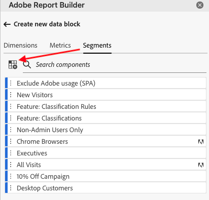
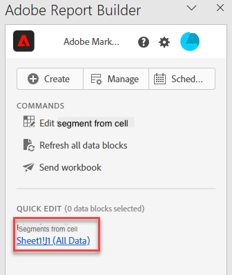

# 在Report Builder中使用區段

當您建立新的資料區塊或從「命令」面板選取&#x200B;**編輯資料區塊**&#x200B;選項時，可以套用區段。

## 將區段套用至資料區塊

若要將區段套用至整個資料區塊，請按兩下區段，或將篩選器從元件清單拖放至「表格」的「區段」區段中。

## 套用區段至個別量度

若要將區段套用至個別量度，請將區段拖放至表格中的量度上。 您也可以按一下[表格]窗格中量度右邊的&#x200B;**...**&#x200B;圖示，然後選取&#x200B;**[!UICONTROL 區段量度]**。 若要檢視套用的區段，請將滑鼠游標停留在「表格」窗格中的量度上或選取量度。 含有已套用區段的量度會顯示篩選器圖示。

## 快速編輯區段

您可以使用「快速編輯」面板來新增、移除或取代現有資料區塊的區段。

當您選取試算表中的儲存格範圍時，快速編輯面板中的&#x200B;**[!UICONTROL 區段]**&#x200B;連結會顯示該選取範圍中的資料區塊所使用的區段摘要清單。

若要使用「快速編輯」面板編輯區段

1. 請從一或多個資料區塊選取儲存格範圍。

   

1. 按一下&#x200B;**[!UICONTROL 區段]**&#x200B;底下的連結以啟動「快速編輯 — 篩選器」面板。

   ![顯示[新增區段]欄位和[已套用區段]清單的[區段]面板。](./assets/quick_edit_filters.png)

### 新增或移除區段

您可以使用「新增/移除」選項來新增或移除區段。

1. 選取「快速編輯 — 區段」面板中的&#x200B;**[!UICONTROL 新增/移除]**&#x200B;索引標籤。

   套用至所選資料區塊的所有區段都會列在「快速編輯 — 區段」面板中。 套用至選取範圍中所有資料區塊的區段會列在&#x200B;**[!UICONTROL 套用至所有選取的資料區塊]**&#x200B;標題下。 套用至部分而非全部資料區塊的區段會列在&#x200B;**[!UICONTROL 套用至1或多個選取的資料區塊]**&#x200B;標題下。

   若所選取的資料區塊中出現多個區段，您可以使用&#x200B;**[!UICONTROL 新增篩選器]**&#x200B;搜尋欄位來搜尋特定區段。

   

1. 從&#x200B;**[!UICONTROL 新增區段]**&#x200B;下拉式選單中選取區段，以新增區段。

   可搜尋區段清單包含報表套裝可存取的所有區段（存在於一或多個選取的資料區塊中），以及組織中全域可用的所有區段。

   新增區段會將該區段套用至選取範圍中的所有資料區塊。

1. 若要移除區段，請按一下&#x200B;**已套用區段**&#x200B;清單中區段右側的刪除圖示&#x200B;**[!UICONTROL x]**。

1. 按一下&#x200B;**[!UICONTROL 套用]**，即可儲存變更，並返回中心面板。

   Report Builder會顯示訊息，以確認套用的區段變更。

### 取代區段

您可以使用其他區段取代現有區段，以變更資料的分段方式。

1. 選取「快速編輯 — 區段」面板中的&#x200B;**[!UICONTROL 取代]**&#x200B;索引標籤。

   ![選取[取代]索引標籤。](./assets/replace_filter.png)

1. 使用&#x200B;**[!UICONTROL 搜尋清單]**&#x200B;搜尋欄位來尋找特定區段。

1. 選擇一或多個要取代的區段。

1. 在取代為欄位中搜尋一或多個區段。

   選取篩選器並將其新增至&#x200B;**[!UICONTROL 取代為]** ... 清單。

1. 按一下&#x200B;**[!UICONTROL 「套用」]**。

   Report Builder會更新區段清單以反映取代結果。

### 從儲存格定義資料區塊區段

資料區塊可參考儲存格中的區段。 多個資料區塊可參考區段的相同儲存格，讓您一次輕鬆切換多個資料區塊的區段。

若要從儲存格套用區段

1. 導覽至資料區塊建立或編輯程式中的步驟2。 請參閱[建立資料區塊](./create-a-data-block.md)。
1. 按一下&#x200B;**[!UICONTROL 區段]**&#x200B;索引標籤以定義篩選器。
1. 按一下&#x200B;**[!UICONTROL 從儲存格]**&#x200B;建立區段。

   

1. 選取您要資料區塊參照區段的儲存格。

1. 按兩下區段或將區段拖放至&#x200B;**[!UICONTROL 已包含區段]**&#x200B;區段，即可新增您想要新增至儲存格的區段選擇。

   注意：一次只能為指定的儲存格選取一個選項。

   

1. 按一下&#x200B;**[!UICONTROL 套用]**&#x200B;以建立參考儲存格。

1. 從&#x200B;**[!UICONTROL 區段]**&#x200B;索引標籤，將新建立的參考儲存格區段新增至您的資料區塊。

   顯示Sheet1！J1（所有資料）區段新增至表格的

1. 按一下&#x200B;**[!UICONTROL 「完成」]**。

   現在，此儲存格可供其區段中的其他資料區塊參照。 若要將參照儲存格作為區段套用至其他資料區塊，只需從區段索引標籤將儲存格參照新增至其區段即可。

#### 使用參考儲存格來變更資料區塊區段

1. 選取試算表中的參考儲存格。

1. 按一下「快速編輯」功能表中&#x200B;**[!UICONTROL 儲存格區段]**&#x200B;下的連結。

   

1. 從下拉式選單中選取您的區段。

   

1. 按一下&#x200B;**[!UICONTROL 套用]**。
