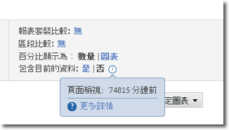
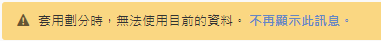

# 目前的資料

Reports &amp; Analytics 中的「包含目前的資料」選項可讓您檢視最新 Analytics 資料，通常是在資料全部處理完並最終化之前。目前的資料會在數分鐘內顯示最多的量度，提供可操作的資料以幫助快速決策。

這會顯示為報表設定中的一個選項：

依預設，會在所有支援的報告上啟用目前的資料。若要在資料完全處理後檢視所有量度，有幾個選項可供使用：

* 使用 Analysis Workspace，此工具會使用已完全處理的資料。
* 在目前的資料報表設定中按一下「否」，僅使用已完全處理的資料。
* 進入 Admin Console，從產品設定檔中移除「目前的資料」權限項目，以防止非管理員使用者看見此選項。如需詳細資訊，請參閱管理員使用指南中的 [Analytics 工具權限項目](/help/admin/admin-console/permissions/analytics-tools.md)。

由於系統會排定資料開放使用的優先順序，「目前的資料」目前無法用於區段、分類、劃分、路徑分析和某些量度。如果使用其中一項功能，「目前的資料」在報表中將會強制設為「否」，並顯示黃色通知，說明「目前的資料」無法使用的原因。

## 目前的資料典型延遲

量度會在下列三個時段之一中顯示。按一下「包含目前的資料」旁邊的時鐘圖示，會切換為查看報告上每一個量度的實際延遲值。

| 時間段 | 量度 |
| --- | --- |
| 10 分鐘以內 | 流量變數的例項和頁面檢視 |
| 10 到 35 分鐘之間 | 轉換變數的轉換事件、例項和頁面檢視 |
| 45 到 120 分鐘之間 | 其他所有資料，例如瀏覽數、不重複訪客數和參與率 |

由於「目前的資料」檢視上顯示的某些資料尚未完全處理，因此您可能會發現，報告中所述「目前的資料」檢視和「已完成」檢視的值有所差異。在趨勢報告上，資料的差異通常會在 1% 內。

## 計算量度

因為可以使用有不同延遲的量度建立計算的量度，所以可能會使用目前的資料檢視裡不完整的資料來計算某些最近的值。

例如，您使用公式 `Page Views divided by Visits` 建立「每次瀏覽的頁面檢視數」計算量度。「頁面檢視數」通常會在 10 分鐘內顯示，而「瀏覽數」通常會在 2 小時內顯示，因此系統會使用不完整的量度，計算此延遲時段內的計算量度。如果您張貼一個新頁面，在 2 小時內就獲得 4000 次不重複瀏覽，累積 4000 次點擊，這些量度間的延遲差異可能會導致計算不完整。

針對新值製作報表或使用短時段時，此資料差異最為明顯。報表使用較長的日期範圍時，彙整報表前幾小時內發生的延遲差異不太可能對計算量度有任何明顯的影響。

如果您所計算的量度有可能受這些差異所影響，請關閉目前的資料，或使用具有相同預期延遲時段的量度。

## 下載的報告

當您在啟用目前的資料檢視時下載報告時，報告會佇列、產生，然後傳回給瀏覽器。如果在報表產生期間收集資料，該資料會顯示在報表中。由於多了這段時間，下載的報表可能會含有更多資料。
