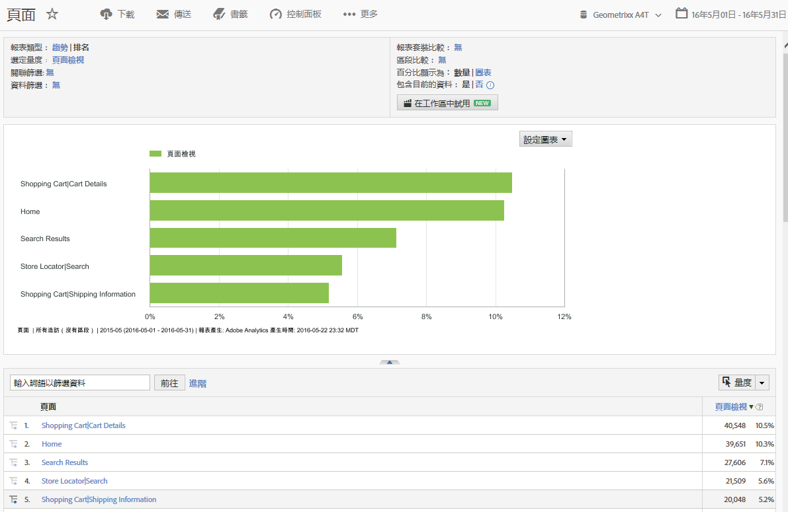

# Reports &amp; Analytics 快速入門

開始使用 Reports &amp; Analytics 前，請先了解這些基本的登入和設定工作，以及存取帳戶資訊的方法。

## Reports &amp; Analytics 快速入門

開始使用 Reports &amp; Analytics 前，請先了解這些基本的登入和設定工作，以及存取帳戶資訊的方法。

「報告」可提供傳統網頁型通路及創新型通路 (例如行動、視訊及社交網路) 的分析。行銷報告的一些範例包括：

* 多少訪客瀏覽您的網站
* 多少訪客是獨特訪客 (僅計算一次)
* 他們如何來到站點 (例如跟隨連結到達站點，或直接到達)
* 搜尋站點內容時所用的關鍵字
* 在指定網頁或整個站點上逗留的時間
* 訪客點按的連結，以及離開網站的時間
* 產生收入或轉換事件的最有效行銷管道
* 訪客花費在觀看視訊的時間
* 他們用來造訪網站的瀏覽器和裝置

## 瀏覽器和系統需求

登入「Report &amp; Analytics」介面的瀏覽器和系統需求。

* 瀏覽器：

   * 建議使用：最新版本的 Firefox、Chrome、Safari 或 Edge。
   * 最新版本的 Microsoft Internet Explorer 11

      >[!NOTE]
      >
      >Adobe Analytics 已於 2018 年 11 月 13 日停止支援 Internet Explorer 11。請及早改用 Microsoft Edge 或其他支援的瀏覽器。

* 必須啟用 Cookie 和 JavaScript。
* 1024 x 768 監視器解析度，使用 16 位元色彩深度 (或更高)。

## 登入 Reports &amp; Analytics

存取介面之前，請與您的帳戶管理員或 Adobe 客戶服務人員合作，共同設定您公司的帳戶。

## 使用 Experience Cloud 登入

說明如何透過 Adobe Experience Cloud 登入的步驟。

1. 在連接網際網路的電腦上，啟動瀏覽器。
1. 前往 [!DNL https://login.experiencecloud.adobe.com/] 。
1. 在[!UICONTROL 登入]頁面上按一下&#x200B;**[!UICONTROL 單一登入]**。
1. 填寫下列資訊，然後按一下&#x200B;**[!UICONTROL 登入]**。

   **[!UICONTROL 公司]**：指定公司 ID。

   **[!UICONTROL 使用者名稱]**：指定您的 帳戶 ID。

   **[!UICONTROL 密碼]**：指定您的 帳戶密碼。
1. 從 Experience Cloud 首頁，前往&#x200B;**「Analytics >報表」**。

   Experience Cloud 會在您閒置 30 分鐘後自動將您登出。

## 執行報告

說明如何產生報告的步驟。

1. 登入 [!UICONTROL Report &amp; Analytics]。

   「報表」功能表或[控制面板](/help/analyze/reports-analytics/dashboard.md)隨即顯示 (若您已設定)。

1.  按一下&#x200B;**[!UICONTROL 「網站內容]** > **[!UICONTROL 頁面」]** (舉例)。

   

   請參閱[報表功能](/help/analyze/reports-analytics/overview/report-overview.md)，了解報表介面功能的相關資訊。

## 編輯使用者的帳戶設定

編輯使用者帳戶、重設使用者密碼以及編輯連絡人資訊的相關資訊。

您可以檢視和編輯聯絡資訊、指定密碼、檢視網站服務資訊，以及排除這部電腦不進行資料蒐集。

按一下右上角的「帳戶」圖示 ，然後按一下您登入名稱旁的&#x200B;**[!UICONTROL 「帳戶設定」]**(轉輪) 圖示。

所有使用者都能存取[!UICONTROL 帳戶資訊]頁面。下列資訊可供檢視或編輯：

<table id="table_58F5D292485F45F9902B372E4E1E3103"> 
 <thead> 
  <tr> 
   <th colname="col1" class="entry"> 資訊類型 </th> 
   <th colname="col2" class="entry"> 定義 </th> 
  </tr> 
 </thead>
 <tbody> 
  <tr> 
   <td> 
聯絡 
 </td> 
   <td> 
提供您帳戶的下列個人資訊： 
 
    <ul id="ul_7925E35904EB47E3AC648FA80A09EF91"> 
     <li id="li_CDD8D7B73A1D4C78A41FF02BD0E5E788">名字 (必要) </li> 
     <li id="li_7255F50ABFFA4EE8A0A9D04F92BE432D">姓氏 (必要) </li> 
     <li id="li_3DF6107291CC4D46AAA0E4A13D59128F">標題 </li> 
     <li id="li_B5BE95E0FE594939A2D4C6680A6B8BDD">電子郵件地址 (必要) </li> 
     <li id="li_B764239241CE4F1CA74F77D796E7AB1D">電話號碼 </li> 
    </ul> </td> 
  </tr> 
  <tr> 
   <td> 
 登入 
 </td> 
   <td> 
顯示帳戶使用者名稱，並讓您變更帳戶密碼。 
 
另請參閱：<a href="https://helpx.adobe.com/tw/analytics/kb/How-to-Reset-Report-and-analytics-password.html"  >如何重設 Reports &amp; Analytics 帳戶密碼</a>。 
 </td> 
  </tr> 
  <tr> 
   <td> 
網站服務 
 </td> 
   <td> 
顯示與此帳戶相關的網站服務使用者名稱和共用機密。要透過網站服務 API 存取 Experience Cloud 時，請使用這些認證。如需詳細資訊，請參閱 <a href="https://marketing.adobe.com/developer"  >Developer Connection</a>。 
 
 
附註：只有當帳戶已獲授權為網站服務使用者，才會顯示此項資訊。 
 
 </td> 
  </tr> 
  <tr> 
   <td> 
 排除此電腦 
 </td> 
   <td> 
套用 Cookie 至目前電腦，排除它不進行資料蒐集。如果您不希望您的線上活動影響您網域內的「頁面檢視」和「訪客」計數，此選項會很有用。 
 
 
附註：若要使用此功能，您的瀏覽器必須啟用 Cookie。如果您刪除電腦上的 Cookie，就必須重設排除 Cookie。 
 
 </td> 
  </tr> 
 </tbody> 
</table>

## 變更介面語言

說明如何變更介面語言的步驟。您可以使用您選擇的語言來檢視「Reports &amp; Analytics」介面。

1. 登入 Analytics，並選取&#x200B;**[!UICONTROL 「報表」]**&#x200B;標籤。
1. 在頁尾中，按一下&#x200B;**[!UICONTROL 「語言」]**&#x200B;功能表所提供的語言，然後選取您偏好的語言。

您可以從 Adobe Experience Cloud 存取文件和首頁(**[!UICONTROL 「說明]** > **[!UICONTROL 說明首頁」]**)。
