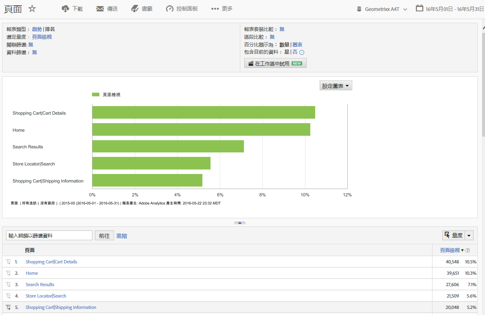
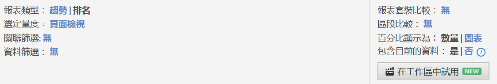
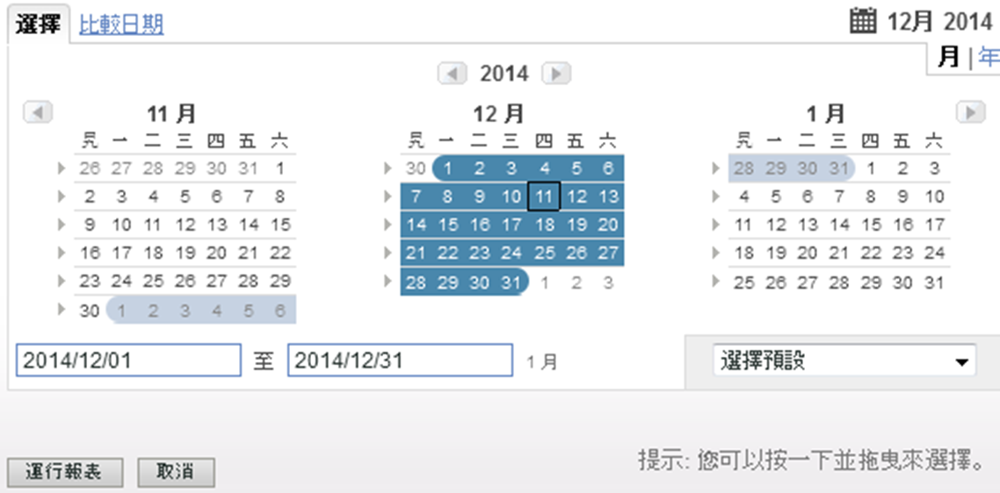
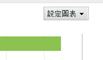
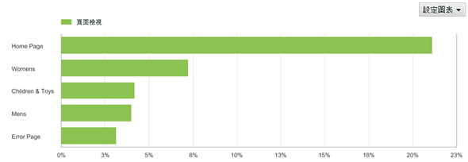
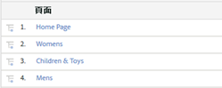

# 報表功能

報告功能 (包括工具列、日曆及詳細資料表格) 的簡介。

此範例顯示[!UICONTROL 頁面報告]。視您執行的報告而定，設定選項會跟著改變。例如，您可以不從網站內容報告中選取趨勢或[!UICONTROL 排名]，改為在[!UICONTROL 網站度量]報告中指定精細度和頁面名稱。

## 範例頁面報告 {#section_288CC85536684C2DB184141358481EF0}

An example of a Pages Report ( **[!UICONTROL Reports]** &gt; **[!UICONTROL Site Content]** &gt; **[!UICONTROL Pages Reports]** &gt; **[!UICONTROL Pages]**).

{width="672px"}

## 報告工具列 {#section_0D674177AE6C4A71B07234DB25910ECD}

可讓您與能依照資料變更網站，或與行銷策略的決策者共用您的報告資料。

{width="672px"}

另請參閱自 [訂報表](/help/analyze/reports-analytics/reports-customize/customizing-reports-overview.md)。

## 報告標題與設定 {#section_12A90FAE02EC43FB9F11F0E2CE8FAE8F}

顯示報告設定，並可讓您設定報告類型、選擇度量等等。此群組的可用選項會依您執行的報告而異。

{width="672px"}

如需詳 [細資訊，請參閱自訂報表](/help/analyze/reports-analytics/reports-customize/customizing-reports-overview.md) 。

## 日曆 {#section_8C6C4AD84D9043E8ABD53FF8F645AAB1}

只要按一下「日曆」按鈕並選擇日期範圍，即可指定日期。您亦可選擇兩個時間範圍來比較效能。

{width="672px"}

請參 [閱選擇日期或日期範圍](/help/analyze/reports-analytics/reports-customize/customizing-reports-overview.md)[和比較日期](/help/analyze/reports-analytics/reports-customize/customizing-reports-overview.md)。

## 圖表類型 {#section_8B9CBA4096E64FC3B744E2E06EB83C19}

選擇要查看的圖形或圖表類型：

See [Changing Report Graphs.](/help/analyze/reports-analytics/reports-customize/t-reports-graphs.md)

## 圖表顯示 {#section_4C78ADC82C234CC6841AC92C803636F4}

依您所選取的圖表類型而定，通常可看到詳細清單中的前幾個項目。如果您的圖表是顯示不同時段的趨勢圖表，則會顯示所有時段。:

請參閱 [自訂報表。](/help/analyze/reports-analytics/reports-customize/customizing-reports-overview.md)

## 量度 {#section_8B8F9EC72B864E29B91039E7B7381EAD}

將度量新增到您的報告。管理員可以指定預設度量。

請參閱 [量度.](/help/analyze/reports-analytics/metrics.md)

## 詳細資料表格 {#section_449A5DC848744F65A10DA12E189B835D}

詳細資料是整批的報告資料。在此例中，您會列出頁面，並且依「頁面檢視」來測量這些頁面，即在時段內載入的次數：

在詳細資料表格中，您可以篩選資料、建立劃分、新增度量等等。

請參閱 [自訂報表.](/help/analyze/reports-analytics/reports-customize/customizing-reports-overview.md)
