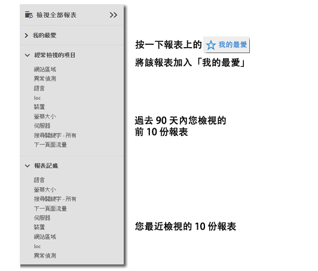
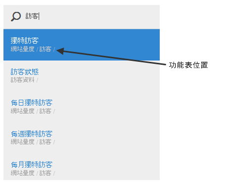

# 報表功能表{#reports-menu}

「Report &amp; Analytics」中的報表功能表概述。

報表功能表提供下列功能：

* 存取完整的報表集
* 能夠設定我的最愛報表以供快速存取
* 經常檢視的報表
* 增強型搜尋

「我的最愛」、「經常檢視」和「報表記錄」都是報表套裝的特定功能。如果您變更報表套裝，這三個清單也會隨之改變。

報表導覽使用階層式檢視進行。按一下&#x200B;**[!UICONTROL 「檢視全部報表」]**&#x200B;或按正斜線鍵 (/)，接著按向下鍵 (?) 即可使用方向鍵來快速顯示並導覽功能表。按 Esc 鍵可關閉功能表而不變更目前報表，按 Enter 鍵則可載入選取的報表。

{width=&quot;672px&quot;}

如需個別報表的詳細資訊，請參閱[報表說明](https://marketing.adobe.com/resources/help/zh_TW/reference/reports_descriptions.html)。

## 搜尋報表 {#section_E5EF11E36CB9451AA7B079E585CA7DB6}

「報表」功能表提供增強型搜尋體驗。按一下&#x200B;**[!UICONTROL 「檢視全部報表」]**&#x200B;或按正斜線鍵 (/)，接著開始輸入即可快速尋找報表。報表搜尋已擴充完成，現在 Analytics 左側導覽器中會包含所有項目 (管理員、元件等)。

按 Tab 鍵或向下鍵 (?) 可以在報表清單間瀏覽。按 Esc 鍵可關閉搜尋而不變更目前報表，按 Enter 鍵則可載入選取的報表。

> [!NOTE]您也可以依據 prop、eVar 和事件編號來搜尋報表清單。在搜尋列中輸入 prop、eVar 或事件編號。

## 導覽概述 {#section_A6A0A369207149BABE504753B48A42D7}

<table id="table_3BA295966BBC4C94ABDC3718D1894698"> 
 <thead> 
  <tr> 
   <th colname="col1" class="entry"> 功能表項 </th> 
   <th colname="col2" class="entry"> 說明 </th> 
  </tr>
 </thead>
 <tbody> 
  <tr> 
   <td colname="col1">Experience Cloud 解決方案功能表 </td> 
   <td colname="col2"> 按一下此圖示即可展開 Experience Cloud 功能表，存取其他 Marketing Cloud 解決方案。 </td> 
  </tr> 
  <tr> 
   <td colname="col1">切換報表功能表  </td> 
   <td colname="col2"> 按一下此按鈕可以展開或收合「報表」功能表，因此您可以使用瀏覽器視窗的完整寬度來檢視報表。 </td> 
  </tr> 
  <tr> 
   <td colname="col1">區段  </td> 
   <td colname="col2">帶出區段邊欄，讓您新增或管理區段。您也可以從區段邊欄存取<a href="https://marketing.adobe.com/resources/help/zh_TW/analytics/segment/seg_build_ui.html"  >「區段產生器」</a>和<a href="https://marketing.adobe.com/resources/help/zh_TW/analytics/segment/seg_manage.html"  >「區段管理員」</a>介面。 </td> 
  </tr> 
  <tr> 
   <td colname="col1">量度  </td> 
   <td colname="col2"> 帶出量度邊欄，讓您新增或管理量度和計算量度。 </td> 
  </tr> 
  <tr> 
   <td colname="col1"> 檢視全部報表 </td> 
   <td colname="col2">「檢視全部報表」區段包含您所有報表套裝的特定報表、控制面板、書籤、計算量度以及目標。按一下這裡即可隨時導覽至任何可用項目。 </td> 
  </tr> 
  <tr> 
   <td colname="col1">檢視全部報表中的搜尋列 </td> 
   <td colname="col2"> 
 讓您搜尋您需要的資源。如果使用所謂的「模糊」搜尋，則不需輸入要尋找的確實字句。搜尋結果會顯示在直式清單中，您可以使用向上、向下和橫向方向鍵來導覽。在搜尋結果上按 Enter 鍵會直接前往該報表。 
 </td> 
  </tr> 
  <tr> 
   <td colname="col1">我的最愛 </td> 
   <td colname="col2">您可以從本區域輕鬆擷取標示為「已收藏」的報表。如果您有 10 個以上的我的最愛，以個別使用者和個別報表套裝為基礎，此處會顯示 10 個我的最愛和一個「更多...」連結。 
請注意，您可以重新命名我的最愛中的報表，但不能重新命名控制面板。 
 
我的最愛類似於書籤，但我的最愛不會儲存在資料夾，也不能透過<a href="/help/analyze/reports-analytics/bookmarks.md"  >書籤管理器</a>以類似書籤的方式來管理。 
 </td> 
  </tr> 
  <tr> 
   <td colname="col1"> 經常檢視 </td> 
   <td colname="col2"> Adobe Analytics 可追蹤最近 90 天內您最常運行的 10 個報表，並在此處根據運行頻率排序顯示這些報表。如果您在最近 90 天內未曾進入此報表套裝，則會填入 10 個最受歡迎報表的一般清單。 </td> 
  </tr> 
  <tr> 
   <td colname="col1"> 報告歷史記錄 </td> 
   <td colname="col2"> 您可以在此處找到最近 90 天內存取的最近 10 個報表或控制面板。讓您可輕鬆回到分析或報表的上一個步驟。 </td> 
  </tr> 
  <tr> 
   <td colname="col1"> 下載 </td> 
   <td colname="col2">可讓您下載 PDF、CSV、Excel 和 Word 格式的報表。 </td> 
  </tr> 
  <tr> 
   <td colname="col1"> 傳送 </td> 
   <td colname="col2">可讓您以電子郵件立即傳送報表，或排程一次或週期性的電子郵件傳送。格式選項包括 PDF、CSV、Excel、HTML、Word 或 Mobile (純文字)。</td> 
  </tr> 
  <tr> 
   <td colname="col1"> 書籤... </td> 
   <td colname="col2">讓您為報表建立<a href="/help/analyze/reports-analytics/bookmarks.md"  >書籤</a>。 </td> 
  </tr> 
  <tr> 
   <td colname="col1"> 控制面板... </td> 
   <td colname="col2">讓您將報表新增至<a href="/help/analyze/reports-analytics/dashboard.md"  >控制面板</a>。 </td> 
  </tr> 
  <tr> 
   <td colname="col1"> 更多... </td> 
   <td colname="col2"> 讓您執行所有或部分下列動作：列印、擷取資料、新增警報、建立自訂報表、複製圖形、建立此報表的連結，以及開啟新視窗。 </td> 
  </tr> 
  <tr> 
   <td colname="col1">報表套裝選擇器  </td> 
   <td colname="col2">讓您選取<a href="https://marketing.adobe.com/resources/help/zh_TW/reference/report_suites_admin.html"  >基本報表套裝</a>或<a href="https://marketing.adobe.com/resources/help/zh_TW/reference/virtual-report-suites.html"  >虛擬報表套裝</a>。 </td> 
  </tr> 
  <tr> 
   <td colname="col1">日曆  </td> 
   <td colname="col2">帶出<a href="/help/analyze/reports-analytics/overview/report-overview.md#section_8C6C4AD84D9043E8ABD53FF8F645AAB1"  >日曆</a>，讓您決定報告時段。 </td> 
  </tr> 
 </tbody> 
</table>

## 自訂全部報表功能表 {#section_7E47312747564FBE8A55EE5726B7DFF4}

管理員可以變更「報表」功能表中所含的報表。請參閱「管理說明」中的[功能表自訂](https://marketing.adobe.com/resources/help/zh_TW/reference/customize_menus.html)。
