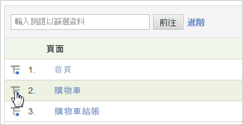

# 劃分

當您想要詳細瞭解報告項目或區段如何與其他報告產生關聯時，請使用劃分。這通常稱為依據某一報表「劃分」另一報表。

例如，劃分名為「年齡群組」的自訂流量報表；此報表中，您透過調查收集了網站訪客的年齡。透過該報告，您可確認在網站上產生最多流量的年齡組。但是，如果您已花了一番功夫擷取到訪客年齡之類的資料，就可能會想要更進一步瞭解頁面檢視之外的其他資訊。因此，您可以產生一個劃分報告，其中列出訪客所用的搜尋引擎、關鍵字，及其地理位置。您可以將年齡組關聯至搜尋引擎。

如果報告的細分依據是&#x200B;*`Referrer Type`*，您可能會看到 *`Inside Your Site`* 的資料點。這個值代表位於「內部 URL 篩選器」清單上的反向連結頁面。請參閱「管理參考」中的[內部 URL 篩選器](/help/admin/admin/internal-url-filter-admin.md)。

您可以透過任何其他變數來細分任何 Analytics 變數 (eVar 或 prop)。The **[!UICONTROL Breakdown By]** menu in the report table matches the standard Analytics reporting menu, keeping selections consistent

## 執行劃分報告 {#task_F685624830E64C829C8BE6435A107F69}

說明如何執行報告劃分的步驟。

<!-- 

t_reports_breakdown.xml

 -->

1. 開啟報表，例如 **[!UICONTROL Analytics]** > **[!UICONTROL Reports]** > **[!UICONTROL Site Content]** > **[!UICONTROL Pages]**。
1. In the report table, click the **[!UICONTROL Breakdown By]** icon.

   If the **[!UICONTROL Breakdown By]** icon is not visible, the feature is either not available or not enabled.

   

   The **[!UICONTROL Breakdown By]** menu displays all available breakdown options available for the current report.
