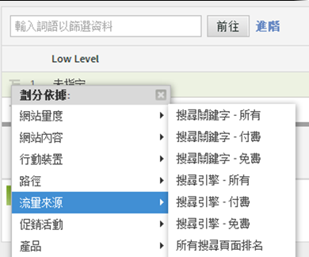
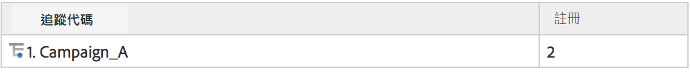
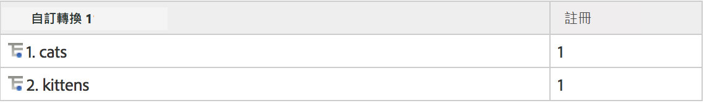
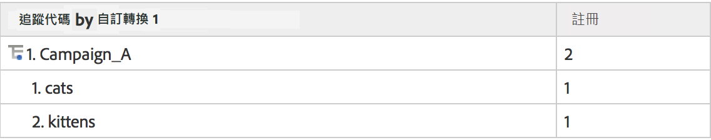
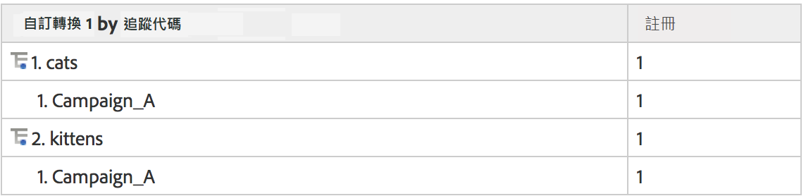

# 子關聯

所有轉換報告都會啟用完全子關聯，因此您可以依據任何 eVar 劃分另一個 eVar。報告表格中的「劃分依據」功能表與標準的 Analytics 報告功能表相同，讓選擇能夠保持一致

## 子關聯如何運作 {#section_5BD862BB74FE411B96B59204520E4631}

為了協助說明子關聯如何運作，請參考以下範例:

1. 某個使用者透過 Campaign_A 前來您的網站，進入首頁。
1. 該使用者搜尋「貓」('cats')，並出現搜尋結果。eVar1 持續追蹤內部搜尋詞。
1. 使用者訂閱郵件清單，此事件使用 event1 來追蹤。
1. 另一個使用者也透過 Campaign_A 前來您的網站，進入首頁。
1. 這位使用者搜尋「小貓」('kittens')，出現搜尋結果 (eVar1)，他也訂閱了郵件清單 (event1)。

如果提取追蹤代碼報表，您會看到下列內容:

如果提取 eVar1 報表，您會看到下列內容:

如果提取 eVar1 報表，您會看到下列內容:

如果使用促銷活動來子關聯 eVar1 報表，您會取得下列內容:

由於轉換變數的持續性質，會使用兩個資料欄來儲存 eVar 值: 引發的值，以及持續的值。如果查看此範例的原始資料匯出，會類似於這樣 (此範例的簡化版):

後端運作方式為允許 post_campaign 和 post_evar1 持續保存促銷活動和 evar1 中定義的值。子關聯報表只關注包含成功事件的點擊 (以亮黃色強調顯示的列)。這些資料接著根據持續值填入子關聯報表 (在此例中為 post_campaign 和 post_evar1，以亮黃色強調顯示的儲存格)。

從本質上來看，子關聯依照下列步驟填入您的報表:

* 隔離包含您於報表中檢視之成功事件的影像請求。
* 從子關聯中使用的每個轉換變數傳回持續值。
* 根據子關聯順序排列值。如果變數不具有持續值 (例如假設 eVar 從未定義或過期)，則會分類至「無」下方。

