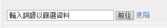
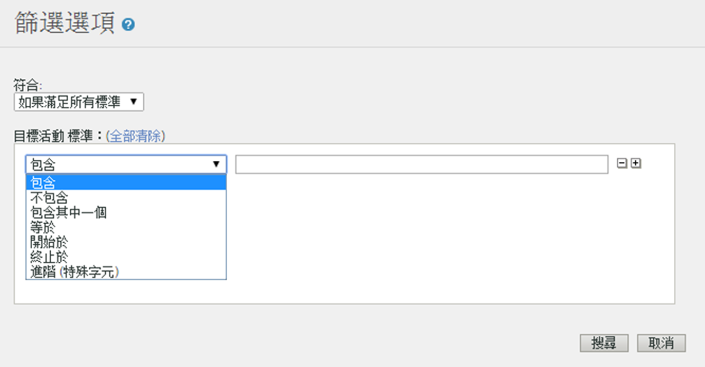

# 篩選報表資料 {#concept_09DC5B986A644738B12204DAC76A90E1}

篩選條件可以縮小報告的範圍來包含或排除符合篩選條件的行項目。

## 簡單篩選{#section_5C4DE873F8D5484BB77F38A4AEB57B4A}



簡單篩選出現在大多數報告上，可以讓您快速找出特定的行項目。簡單篩選不使用任何特殊字元，因此 `-, ", ', +` 和其他特殊字元將會比對報表中的常值。您可以使用空格找出包含多個詞語的行項目。

例如：

```
help search
```

比對下列頁面：

```
help:Search
help:Paid Search Detection
help:Configure paid search detection
help:Search Keywords Report
help:Internal Search Term
```

## 進階篩選 {#section_E016626C084640E8A066B2FDA5B932BF}

進階篩選可以讓您使用一組篩選條件控制搜尋的範圍。您可以選擇比對所有篩選條件或任何篩選條件。



**包含**

如果詞語出現在行項目的任何地方即相符。這個的運作方式和簡單篩選一樣。

> [!NOTE]篩選條件中不可使用空格，因為搜尋功能會將空格視為分隔符號

**不包含**

如果詞語未出現在行項目的任何地方即相符。您可以使用「不包含」來篩選報表中的「未指定」、「無」、「沒有關鍵字」和其他[特殊值](https://marketing.adobe.com/resources/help/zh_TW/reference/none-unspecified-unknown-other.html)。

不包含： `none`

如需更精準的篩選，您可以使用進階 (特殊字元) 篩選：

* 進階 (特殊字元)：`-^none$`
* 進階 (特殊字元)：`-"keyword unavailable"`

例如，下列行項目是以「不包含」條件篩選而得，而非以「進階 (特殊字元)」條件篩選而得：

```
help:Rename the None classification key
```

**包含其中一個**

如果在行項目中找到空格分隔的任何項目即相符。下列篩選條件顯示包含「mens」或「sale」的所有頁面：

包含其中一個：`mens sale`

比對下列頁面：

```
Womens
Mens
Mens:Desk & TravelJewelry & Accessories:Accessories:Hats:Mens
Sale & Values
```

**等於**

如果包含空格和其他字元的整個行項目符合指定的字句即相符。

等於：`mens:desk & travel`

`Mens:Desk & Travel`

**開始於**

如果包含空格和其他字元的行項目以指定的字句為開頭即相符。

開始於：`mens`

比對下列頁面：

```
Mens
Mens:Desk & Travel
Mens:Apparel
Mens Perfume Spray
Mens Hemp/Bamboo Flip Flops
```

**終止於**

如果包含空格和其他字元的行項目以指定的字句為結尾即相符。

終止於：`jean`

比對下列頁面：

```
Bell Bottom Jean
Velvet Dream Skinny Leg Jean
Dark Slimmer Jean
Bling Belt High Waist Jean
Ocean Blue Jean
```

## 進階 (特殊字元) {#section_83DA3B6C23EB4C119DB6D74062DB501D}

進階可以讓您執行萬用字元和其他複雜搜尋。

| 進階 (特殊字元) | 說明 |
|--- |--- |
| `" "` | 比對完整的字句。 |
| `*` | 萬用字元是無所不包的比對方式。<br>例如，`r*p` 會比對出「Registration Signup」。 |
| `^` | 開始於<br>請勿在特殊字元與搜尋字句之間加上空格。 |
| `$` | 終止於<br>請勿在特殊字元與搜尋字句之間加上空格。 |
| `-` | 否<br>請勿在特殊字元與搜尋字句之間加上空格。 |
| `|` | 或者，<br>附註：您必須在直線字元 `" | "` 的兩側加上空格。 |

## 建立報告特定篩選器 {#task_DEBB0632411D4CA8AA0B3BA267A5B35F}

說明如何建立報告篩選器的步驟。

<!-- 

t_reports_filter_specific.xml

 -->

有些報告具有自身特定的篩選器。例如，[!UICONTROL 購買轉換漏斗報告]可讓您依據網頁進行篩選。[!UICONTROL 地域劃分報告]可讓您依據地理區域進行篩選。其他報告均具有自身特定的其他篩選。

存取這些篩選時，您可以看到清單中所指定項目的報告精細度。

**建立報告特定篩選器**

1. 產生報表，例如[!UICONTROL 購買報表] (**[!UICONTROL 網站量度]** > **[!UICONTROL 購買]** > **[!UICONTROL 購買轉換漏斗]**)。
1. 在報告標題中，按一下&#x200B;**[!UICONTROL 篩選]**&#x200B;連結。
1. 在[!UICONTROL 篩選選擇器]頁面上，按一下&#x200B;**[!UICONTROL 套用篩選]**，然後選取篩選類型。
1. 若要搜尋項目，請在&#x200B;**[!UICONTROL 搜尋]**&#x200B;欄位中輸入字元字串。
1. 按一下&#x200B;**[!UICONTROL 「確定」]**。

## 新增關聯篩選器 {#task_065042E384DA4BF3864C58AF2B88D6E2}

說明如何新增關聯篩選器的步驟。

<!-- 

t_reports_correlation_filter.xml

 -->

某些報告可讓您新增自訂關聯篩選器。例如，若您正在檢視網站區域與女性頁面相關聯之報告套裝的[!UICONTROL 頁面報告]，則可建立一個篩選規則，用來產生一份顯示「網站區域 = 女性」的最受歡迎頁面。

您可以使用任何可用關聯來篩選顯示於關聯報告中的資料。此範例顯示如何新增搜尋引擎關聯篩選器。

**要新增關聯篩選**

1. 執行支援關聯的報告(請參閱[執行劃分報表](/help/analyze/reports-analytics/reports-customize/breakdowns.md#task_F685624830E64C829C8BE6435A107F69))。
1. 在報告標題中，按一下「**[!UICONTROL 關聯篩選]**」連結。
1. 在[!UICONTROL 「篩選規則產生器」]下，選擇與項目關聯的類別。
1. 按一下&#x200B;**[!UICONTROL 「確定」]**。
