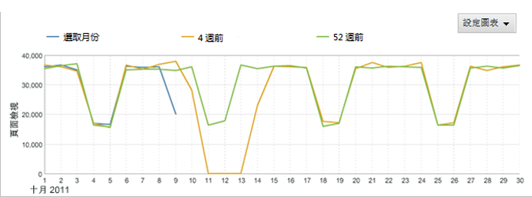
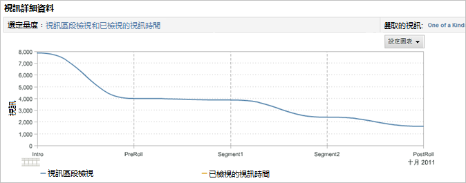
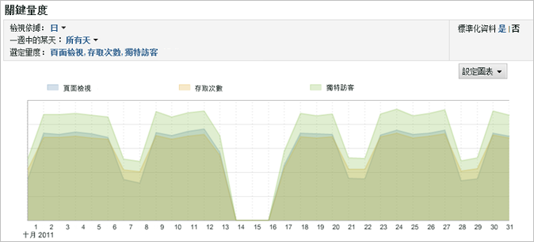
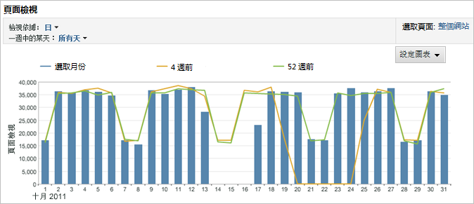
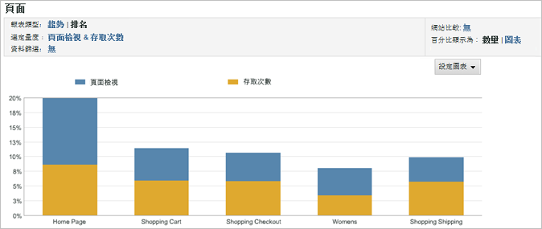
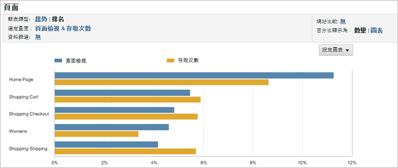
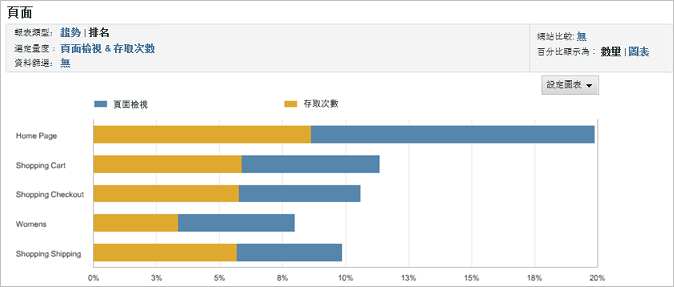
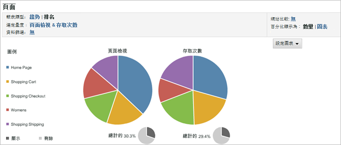
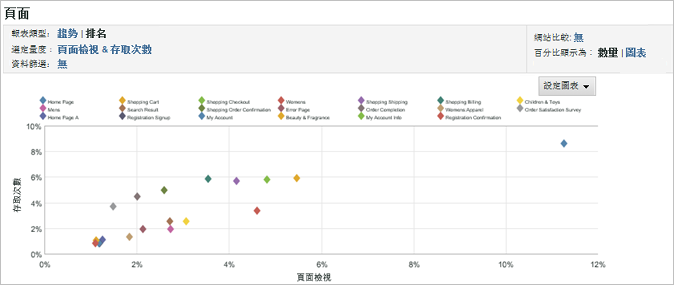
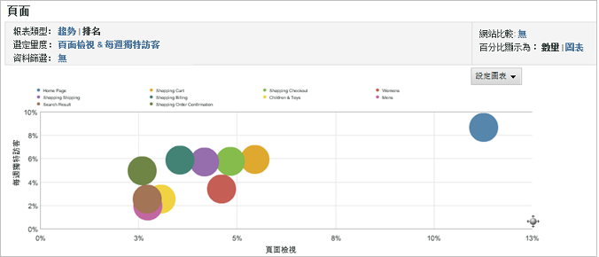

# 變更報表圖表

說明如何將圖表自訂成對目標對象最有用之圖表的步驟。

可用的圖表類型取決於您執行的報告類型。例如，「趨勢線」圖表對於趨勢報告有用，但是您還可使用具有趨勢線的垂直橫條圖表，它清楚地表明了特定日期、週、月等的趨勢。或者，可選擇圓形圖來表示已檢視頁面的百分比。

**若要變更報告圖形**

1. 執行報告。
1. 按一下&#x200B;**[!UICONTROL 設定圖表]**。
1. 選取圖表類型。

   **[!UICONTROL 趨勢線]**：趨勢線顯示報告度量的每日趨勢，可用來隨時間對一個度量進行趨勢分析。

   

   **[!UICONTROL 平滑線]**：可將此圖形類型用於[!UICONTROL 視訊詳細資料報告]。它顯示視訊特定區段的檢視數量或百分比。此視訊特定區段的檢視情況增加，即表示觀眾多次倒帶並檢視視訊的那個部分。如果使用百分比，此圖顯示的百分比是所有檢視區段的百分比，而不是觀看此區段的觀眾百分比。例如，圖中，所有報告區段的總數是 39。從 0 至 10 秒區段的檢視數量是 10，因此此區段的檢視百分比大約是 26%。

   

   **[!UICONTROL 區域圖]**：區域圖與趨勢線類似，但會填滿線之下的區域。您必須在檢視趨勢報告時才能顯示區域圖。

   

   **[!UICONTROL 堆疊區域]**：當許多產品或促銷活動傾向出現在某個時段時，堆疊區域圖很有用。例如，如果您讓前 5 項產品顯示收入，則可快速確定這些產品在一段時期內帶來的總收入。另外，您可使用搜尋篩選器來包括或排除特定產品，以改善檢視。

   

   **[!UICONTROL 垂直條]**：垂直條圖顯示報告度量的相對百分比。

   

   **[!UICONTROL 堆疊垂直條]**：堆疊類似的項目，有助於快速瞭解某個項目的整體影響。例如，在[!UICONTROL 促銷活動報告]中，您可以將類似的成功度量堆疊起來，然後確定哪個促銷活動最有效地促成了總體成功。堆疊方便尋找在某個度量上並非表現最佳、但在度量組合上表現為最佳的促銷活動。

   

   **[!UICONTROL 水平條]**：水平條圖與垂直條圖類似，但欄是水平的。

   

   **[!UICONTROL 堆疊水平條]**：堆疊水平條圖與垂直條圖類似，但欄是水平的。

   

   **[!UICONTROL 圓形圖]**：圓形圖顯示最高度量值彼此相對的百分比，並顯示選定度量占整體的百分比。您可以為排名報告顯示圓形圖。

   

   **[!UICONTROL 散佈圖]**：散佈圖顯示所選度量彼此相對的散佈狀況。散佈圖以兩維方式形象化資料，藉此您可識別那些無關的項目。

   

   **[!UICONTROL 泡泡圖]**：泡泡圖顯示所選度量彼此相對的泡泡圖形。泡泡的位置顯示水平軸和垂直軸上度量之間的關係，而泡泡大小表示報告度量的重要程度。泡泡圖以兩維方式形象化資料，藉此您可識別那些無關的項目。

   

