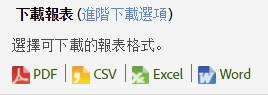
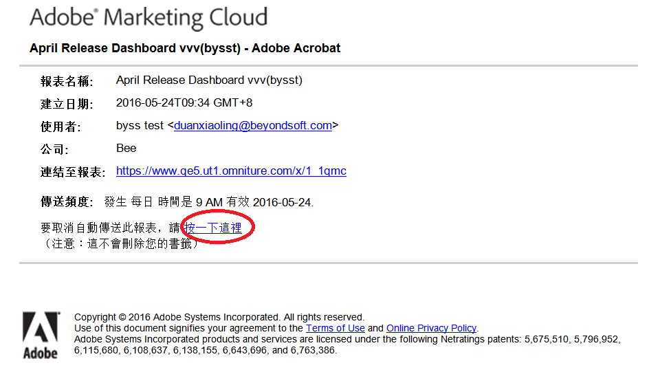

# 報表排程和分發

排程、下載和發佈報表的相關資訊。

在 Adobe Analytics 應用程式內排程要傳送的報表時，您可以使用「排程和分送」工具檢視已自動傳送的檔案，以及修改或終止傳送。

由於處理機制和平台的差異，Adobe Analytics 中各種可供下載資料和排程報表，在單一請求中可處理的最大列數都有不同的限制。以下是每個項目的限制:

* Word、CSV、Excel、HTML 和 PDF: 與報表中的可見列數相同。依預設此限制為 50 列，但可提高至 200 列。劃分報表則嚴格限制為 50 列。
* 資料擷取: 50,000 列
* Data Warehouse: 無限制

這些限制適用於個別排程和下載的報表；控制面板會限制在小報告內的可用空間量。

> [!NOTE] 使用者輸入的「傳送時間」/「日期時間」會指定報表應開始處理的時間，而非實際傳送的時間。 實際傳送報表的時間主要取決於處理所花的時間（複雜和大型報表的處理時間比較簡單報表）。 例如，如果報表需要15分鐘處理，則實際傳送時間至少會超過最初指定的「傳送時間」/「日期時間」15分鐘。
>此外，還有許多其他因素可進一步增加報表實際傳送前的延遲：
>
> * **同時執行許多相同類型的不同排程** （例如，許多控制面板等）會使系統過載。 排程系統僅允許同時執行少數(5-10)個任何類型的報表，因此，當一次排程超過5-10個報表時，有些報表需要排隊等候完成，才能開始處理。 此問題可借由將公司報表排程在一天或一小時中錯開，而非同時排程，來減輕。
> * 除了特定報表類型（控制面板等）外，如果公司一次排程超過15-20種任何類型的報表（跨所有不同的報表類型），報表也會排行 ****。 這可借由錯亂的排程時間來減輕，而非同時執行多次。
> * **排程器所依賴的下游服務** ，其問題也可能影響報表的傳送。 例如，如果您是獨立使用API來執行報表並填寫API請求佇列，則排程報表在您競爭該資源時傳送速度可能會很慢。
> * **報表套裝延遲** （資料收集的延遲）也可能會延遲某些排程報表。

## 傳送報告 {#task_27642CD33D484FD0BF59EBD159EEF52C}

說明如何下載和透過電子郵件傳送各種格式之報告及計劃報告傳送的步驟。

1. Run a report, then click **[!UICONTROL More]** &gt; **[!UICONTROL Send]**.
1. 指定傳送選項:

   | 選項 | 說明 |
   |--- |--- |
   | 格式 | 選取 PDF 或 HTML. |
   | 傳送至 | 提供接收報告的電子郵件地址實施流量分類。 |
   | 主旨 | 電子郵件的主旨。 |
   | 排程 | 選取立即發送報告，或以不同間隔發送。 |

1. Click **[!UICONTROL Advanced Delivery Options]** to specify a delivery schedule.

| 選項 | 說明 |
|--- |--- |
| 報告檔案名稱 | 指定報告的名稱。The default format is `<report name> for <suite> - <report date range>`. 若要指定自訂名稱，請選取[!UICONTROL 自訂]。 |
| 報告格式 | 可讓您指定 PDF、CSV、Excel、HTML、Word 或行動格式以進行傳送。如果選取 CSV，則也可以指定 CSV 的編碼:<ul><li>Shift-JIS: 日文字元編碼。</li><li>EUC-JP:擴充的Unix程式碼，主要適用於日文、韓文和簡體中文。</li></ul> |
| 報告內容 | <ul><li>表格的行數: 指定要在傳送報告的表格中顯示的行數。</li><li>頁首和頁尾的語言: 指定頁首和頁尾的語言。</li><li>備註: 指定出現在報告起始處的文字。</li></ul> |
| 傳送數位簽名檔案 | 當您請求報表（例如書籤化報表或資料倉庫請求）時，可以請求資料簽名。 Adobe的數位簽章並不限制誰可以存取資料，但數位簽章檔案(.sig)的目的是驗證傳送之報表檔案的有效性。 使用數位簽名，報告的接收方可以驗證檔案是否來自 Adobe 且沒有發生更改。 |
| 報告目標 | <ul><li>電子郵件: 可讓您設定電子郵件地址設定、主旨行以及附註。</li><li>FTP: 可讓您設定 FTP 設定，包括主機、連接埠、目錄、使用者名稱以及密碼。</li></ul> |

1. Click **[!UICONTROL Scheduling Options]**.

| 選項 | 說明 |
|--- |--- |
| 立即傳送報告 | 立即傳送報告。 |
| 稍後計劃 | 顯示選項，供您指定時間範圍和傳送選項。 |
| 報告時間範圍 | **固定**: 防止日期隨時間流逝而前移。**滾動**: 允許日期隨時間流逝而前移。需要考慮的事項︰<ul><li>如果您選擇「滾動」起始日期和結束日期，並且選擇前一日的每日報表，每日您將收到前一日的電子郵件報表。</li><li>如果您選擇「固定」起始日，並滾動至結束日，您會在第一天收到前一天的報表。 第二日您將收到前兩日的報告，而第三天將收到前三天的報告，以此類推。</li><li>如果您選擇「固定」起始和結束日期，每日您將收到指定日期的相同報告。</li><li>您無法選擇滾動起始日期和固定完成日期。</li></ul> |
| 傳送頻度 | <ul><li>**每小時**: 以每小時、每兩小時或任何其他小時間隔傳送電子郵件。</li><li>**每日**: 以每天、每兩天、每三天或任何其他天數間隔傳送電子郵件。另外也可以每週中傳送。</li><li>**每週**: 以每週、每兩週、每三週或任何其他週數間隔傳送電子郵件。另可指定傳送的週日期。</li><li>**每月**: 指定間隔的月份數，也可選擇在一個月內的哪一天傳送電子郵件，或在一個月內指定週的哪一天傳送電子郵件。</li><li>**每年**: 指定在一年內的某一天傳送電子郵件，或者可以在一年中任意週內指定的某一天傳送。</li><li>**每日時間**: 適用於選定報告套裝上所附的時區。</li></ul> |
| 結束傳送選項 | <ul><li>**從不結束**: 指定永不結束。</li><li>**發生次數後`value`結束**:指定結束傳送前的發生次數。</li><li>**結束於**: 可讓您指定特定的日期。如果您希望在處理報告資料的同一個日期處理資料，報告則僅包含發送報告時資料庫裡所記錄的資料。處理完畢最長時需要 24 小時，因此，可能無法在傳送報告時使用完整的資料。要獲得完整資料，請始終將處理時間設為報表結束後的 24 小時。</li></ul> |

## 列印報告 {#task_0F7CF6D6ED54462CAE4A793E271AF7E5}

說明如何列印報告的步驟。

1. 執行報告.
1. Click **[!UICONTROL More]** &gt; **[!UICONTROL Print]**.  

## 使用基本選項下載報表 {#task_43660107A1C9485D92981CD75B562577}

以 PDF、CSV、Excel 或「原始資料集匯出」格式下載特定報表的詳細資訊。

1. 在 **Analytics** &gt; **[!UICONTROL 報表]**&#x200B;中，選取報表以檢視。
1. 按一下&#x200B;**[!UICONTROL 「下載」]**。

   

1. 選取想要的報表格式: 

   * **[!UICONTROL PDF]**: 指定該報表將下載為 Adobe PDF，因此您可與其他人共用報表，無論收件者的電腦系統為何都能開啟該檔案。
   * **[!UICONTROL CSV]**:指定將以(逗號分隔值 [!DNL .csv] 格式)下載報表。
   * **[!UICONTROL Excel]**: 指定該報表將下載為 Microsoft Excel 格式，因此您可與其他人共用報表，讓別人在試算表程式中將其開啟。
   * **[!UICONTROL Word]**&#x200B;指定該報表將下載為 Microsoft Word 格式。
   >[!NOTE]
   >
   >如果您使用其中一種原始匯出格式下載報表，而頁面名稱為空白，Adobe Analytics可能沒有足夠的時間處理資料。 稍後下載報表。

## 管理計劃報告 {#task_C17677C543454FF2B06D10EA5652DFBC}

與管理計劃報告相關的資訊。

在[!UICONTROL 計劃報告管理器]中，您可以編輯和刪除周期性報告的傳送。您可以建立傳送計劃，透過電子郵件或 FTP 將報告傳送至指定位址。您可以設定這些計劃以特定時間間隔或無限制自動傳送報告，或停止傳送週期性報告。

[!UICONTROL 計劃報告管理器]會顯示特定使用者建立的項目。若應用程式內的使用者帳戶已被停用，所有已安排的傳送將停止。

1. To access the manager, click **[!UICONTROL Analytics]** &gt; **[!UICONTROL Components]** &gt; **[!UICONTROL Scheduled Reports]**.

## 共用報告連結 {#task_9711DDE9E140451B8C914EC5513E21EC}

描述如何透過產生報告連結 (URL) 以傳送給另一個使用者來共用報告的步驟。

當收件者按一下連結時，系統即要求登入憑證 (公司名稱、使用者名稱和密碼)。登入後，收件者顯示報告由最初使用者產生。套用標準權限限制。

**要共用報告連結**

1. 執行報告.
1. Click **[!UICONTROL More]** &gt; **[!UICONTROL Link to This Report]**.

## 取消訂閱排程報表 {#concept_6B48360F935740B6851BA85D32DEF637}

您可以取消訂閱排程報表。您不會再收到報表，即使將您的使用者名稱重新新增回排程報表亦同。

>[!IMPORTANT]
>
>為了讓您再次收到報表，必須建立新的排程。

若要取消訂閱排程報表:

1. 找出具有您想取消訂閱之報表連結的電子郵件。

   

1. Click the **[!UICONTROL click here]** link next to **[!UICONTROL To cancel automatic delivery of this report]**.

1. 確認您要取消報表傳送。

   >[!NOTE]
   >
   >無論您是報表排程器或報表收件者，此工作流程都相同。

取消訂閱報表並不會取消排程的報表。

若要取消排程報表，請導覽至「計劃管理員」並按一下報表名稱旁的紅色 X。[更多...](/help/analyze/reports-analytics/scheduling.md#task_C17677C543454FF2B06D10EA5652DFBC)
