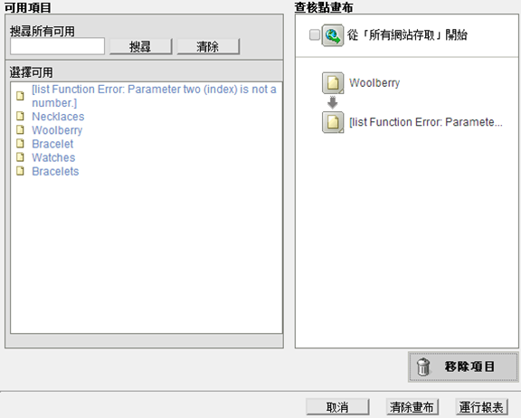
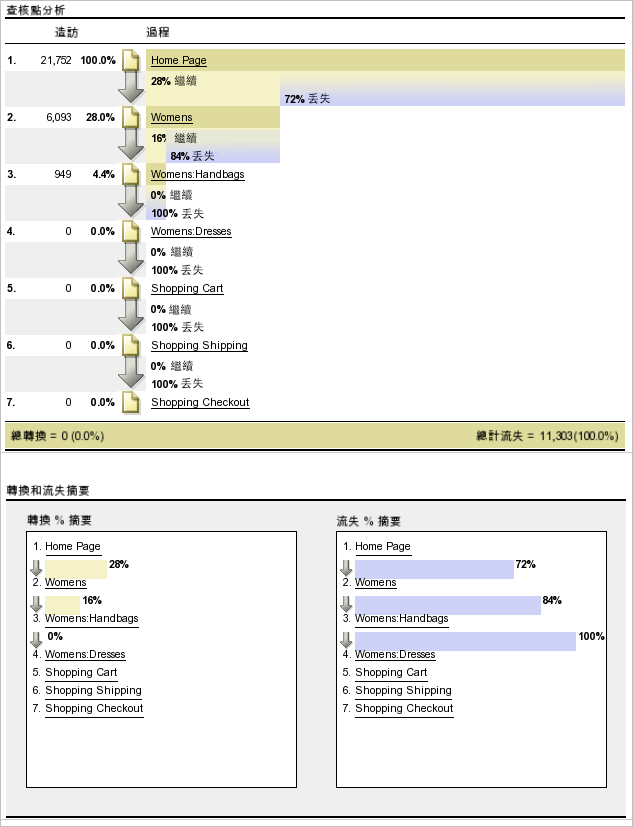
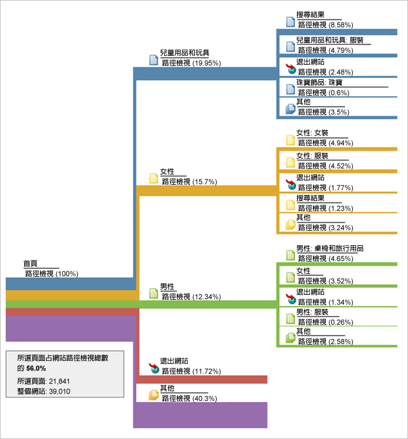
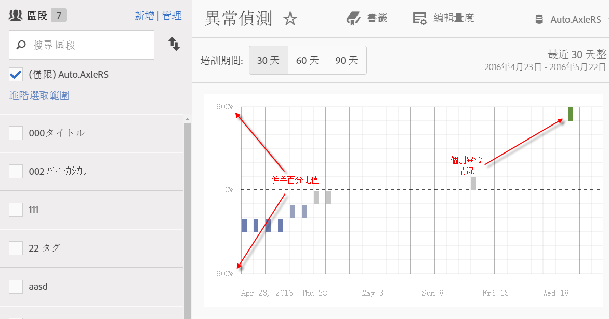
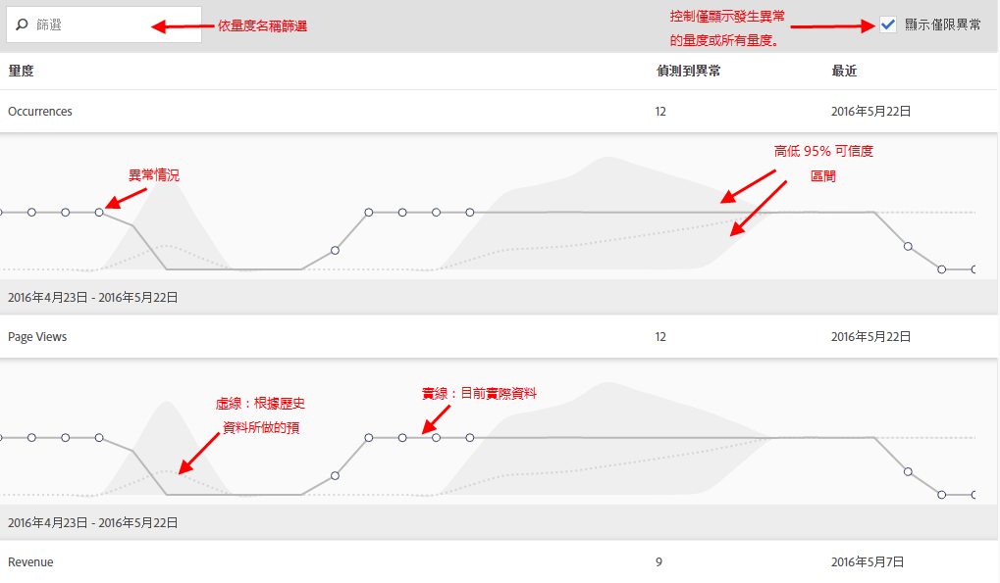
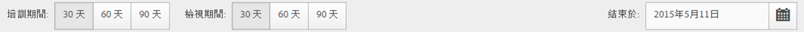
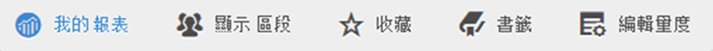
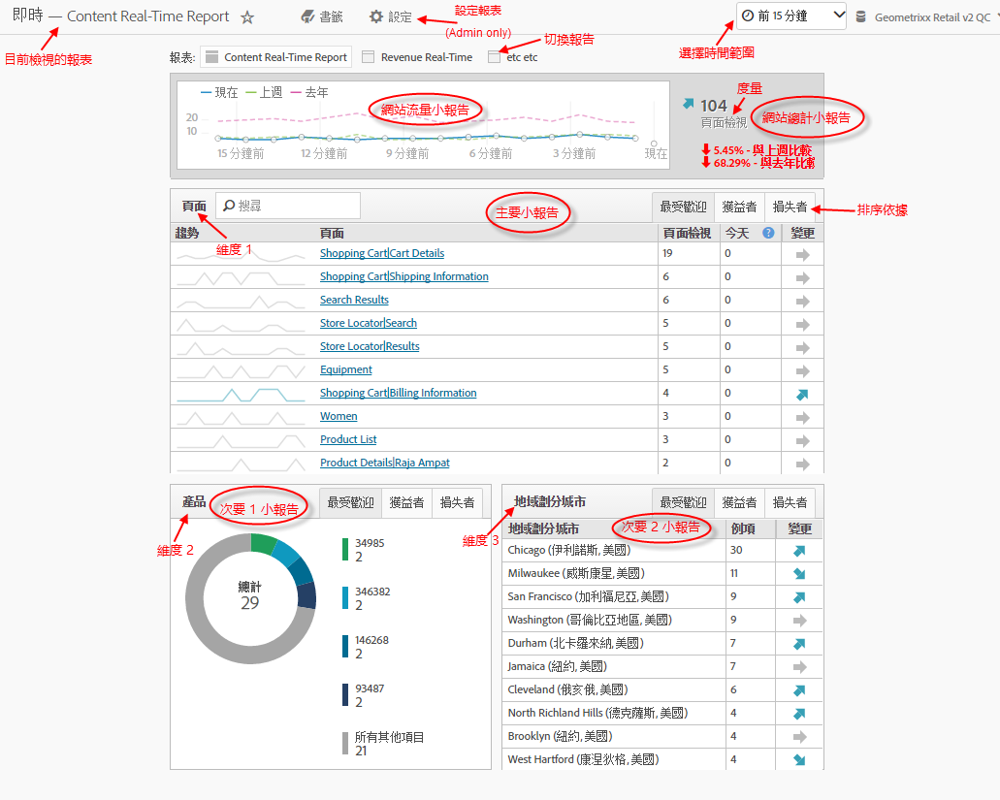
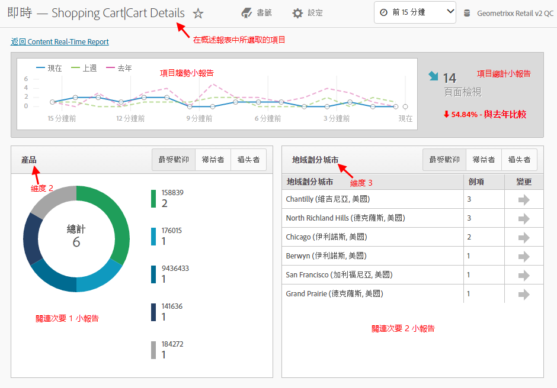

# 執行不同的報表類型

執行不同報表類型的步驟。

## 執行排名報告 {#task_C570BA4A213F4F2EB7B30E012934BE7D}

在排名報表中，表格會根據數目或百分比，顯示與量度相關的報表頁面排名。 「排名」報告可在一個報告中顯示多個量度。

<!-- 

t_reports_ranked.xml

 -->

1. 產生報表，例如 [!UICONTROL Pages Report] ( **[!UICONTROL Reports]** > **[!UICONTROL Site Content]** > **[!UICONTROL Pages]**)。
1. In the report header, click **[!UICONTROL Ranked.]**
1. 若要將報告排名，請按一下表格中的欄標題。

   排名報告最多可在表格中列示 200 個項目 (例如產品、類別、網頁等等) 和 10 個度量 (收入、訂購、檢視等等)。

## 執行趨勢報告 {#task_F03B4E760B9E4EA29FC3F654E6316887}

趨勢報表會顯示一段時間的量度。 當您想要瞭解區段在一個時段到下一個時段的執行情形時，可使用此報表類型。

<!-- 

t_reports_trended.xml

 -->

大部分的「轉換」和「流量」報表都有可用的「趨勢」檢視。 使用 [!UICONTROL Calendar]時，您可以顯示任何時段劃分的改善，包括一個月中的幾天、一年中的數週、一個季度中的數週、一年中的數月等等。 趨勢報表顯示單一量度（收入、訂購、檢視等）對最多5個項目（例如產品、類別、網頁等）的趨勢。

**若要執行趨勢報表**

1. 執行轉換或流量報表，例如 **[!UICONTROL Reports]** > **[!UICONTROL Site Content]** > **[!UICONTROL Pages]**。
1. Under **[!UICONTROL Report Type]**, click **[!UICONTROL Trended.]**

## 執行轉換漏斗報告 {#task_B926A74AA6A641138C2986C1635120CB}

「轉換漏斗」報表顯示為執行所需動作而經過一組事件的訪客百分比。 例如，您可以看到有多少訪客從瀏覽您的網頁、新增項目至購物車，然後進入購買項目。 此報告還顯示中途放棄的人數。

<!-- 

t_reports_conversion_funnel.xml

 -->

若要執行此報表，請選取報表，例如頁面報表( **[!UICONTROL Reports]** > **[!UICONTROL Campaigns]** > **[!UICONTROL Tracking Code]** > **[!UICONTROL Campaign Conversion Funnel]**)。

如需相關說明，請參閱[轉換報告](https://marketing.adobe.com/resources/help/zh_TW/reference/reports_conversion.html)。

## 執行流失報告 {#task_8FD97C8260464F9DA731A93DB8F80184}

顯 [!UICONTROL Fallout Report] 示瀏覽預先指定頁面順序的訪客數。 此外，它還會顯示每個步驟之間的轉換率和流失率。

<!-- 

t_reports_fallout.xml

 -->

查看 Analysis Workspace 新的[流失分析](https://marketing.adobe.com/resources/help/zh_TW/analytics/analysis-workspace/fallout_flow.html)面板！

1. 在中 [!UICONTROL Adobe Analytics]，按一下 **[!UICONTROL Reports]** > **[!UICONTROL Paths]** > **[!UICONTROL Pages]** > **[!UICONTROL Fallout]**。
1. 在頁面上 [!UICONTROL Fallout Report] ，按一下 **[!UICONTROL Launch the Fallout Report Builder]**。

   

1. On the [!UICONTROL Define Checkpoints] page, specify the checkpoints that you want to use for the report.
1. 按一下 **[!UICONTROL Run Report]**.

   

>[!MORELIKETHIS]
>
>* [流失報告說明](https://marketing.adobe.com/resources/help/zh_TW/reference/reports_fallout.html)

## 執行頁面流程報告 {#task_133E8B87C3F04DA0A42D10CBA499305B}

「頁面流量」報表顯示訪客存取頁面及瀏覽您網站的順序。 此報告有助於回答

查看 Analysis Workspace 新的[流量視覺化](https://marketing.adobe.com/resources/help/zh_TW/analytics/analysis-workspace/flow.html)！

執行路 [徑](https://marketing.adobe.com/resources/help/zh_TW/reference/reports_paths.html) 報表。

例如，按一下 **[!UICONTROL Reports]** > **[!UICONTROL Paths]** > **[!UICONTROL Pages]** > **[!UICONTROL Next Page Flow]**。

從選取的頁面開始，您會從左至右閱讀此報表。 在選取頁面後檢視的頁面會以向右延伸的分支圖示。

每個後續頁面被檢視的百分比會顯示在頁面名稱的旁邊。 連接到每個下一頁的線條寬度描繪了此相對百分比。

**[!UICONTROL Path Views]**:指出在限制為顯示路徑時，頁面被檢視的次數。

例如，「隱私權政策」頁面的頁面檢視總次數可能為10,000次，但其中只有500次是緊接在「首頁」後進行的。 因此，使用術語路徑視圖。

相對百分比由線條的相對寬度描述。 依預設，此報表會顯示5個2級分支和5個3級分支。您可以將分支數目增加到10個2級分支和5個3級分支。 這樣會增加報表的高度，而且很可能需要捲動才能檢視整個圖表。

## 執行漏斗報告 {#task_2BBF6FACD48F479E8B2EE458919941CB}

您可以選取成功事件，並將其新增至 [!UICONTROL Purchase Conversion Funnel] 報表或報 [!UICONTROL Product Conversion Funnel] 表。

<!-- 

t_reports_funnel.xml

 -->

1. 按一 **[!UICONTROL Reports]** 下> **[!UICONTROL Products]** >產 [品轉換漏斗](https://marketing.adobe.com/resources/help/zh_TW/reference/reports_conversion_funnel.html)。

## 執行行銷管道報告 {#task_64ADED5CC75248319E06E3E029B47F78}

行銷渠道報表提供首次接觸和上次接觸渠道配置的概述報表，以及收入、訂購和成本等標準報表量度。 這些報表可讓您分析每個渠道產生多少收入。

<!-- 

t_reports_marketing_channel.xml

 -->

See the [Marketing Channel](https://marketing.adobe.com/resources/help/zh_TW/mchannel/index.html) help system for more information.

## 執行異常偵測報告 {#task_4808C96327354D789C075823F5C3A049}

說明如何解讀異常偵測中的摘要和個別度量表。

<!-- 

t_anomaly_view.xml

 -->

查看 Analysis Workspace 內新的[「異常偵測」和「貢獻邊際分析」](https://marketing.adobe.com/resources/help/zh_TW/analytics/analysis-workspace/anomaly_detection.html)功能！

**[!UICONTROL Reports]** > **[!UICONTROL Site Metrics]** > **[!UICONTROL Anomaly Detection]** .

>[!NOTE]您也可以在 Analysis Workspace 專案內執行「異常偵測」。[更多...](https://marketing.adobe.com/resources/help/zh_TW/analytics/analysis-workspace/anomaly_detection.html)

如需設定異常偵測的詳細資訊，請參閱參 [考指南](https://marketing.adobe.com/resources/help/zh_TW/sc/user/index.html#Setting_up_Anomaly_Detection)。

異常偵測顯示兩種圖表：摘要圖表和個別度量圖表。 只有在該量度至少偵測到一個異常時，才會顯示個別量度圖表。

<table id="table_88163CD8FC164342855D90D01F9C581A"> 
 <thead> 
  <tr> 
   <th colname="col1" class="entry"> 
圖表類型 
 </th> 
   <th colname="col2" class="entry"> 
什麼是 
 </th> 
  </tr> 
 </thead>
 <tbody> 
  <tr> 
   <td colname="col1"> 
摘要圖 
 
 
 </td> 
   <td colname="col2"> 
 
     <ul id="ul_D26DA3024CD7468291369F549557B28A"> 
      <li id="li_1C22B6E02FFB479FB71EFAD89EB37A4E">每個方塊代表一天追蹤的一個異常，對應於下方的量度。 </li> 
      <li id="li_8FC587D3FF4E452D83263CC7A10B6675">綠色表示趨勢線上方的異常，藍色表示趨勢線下方的異常。 </li> 
      <li id="li_25135AB691BF443599AF2A3A60E2E71A">指出異常的強度：異常愈大，資料點的顏色愈深，離趨勢線愈遠。 </li> 
      <li id="li_0C42AFA8897D420D8AB1A5D0F65B3B3A">按一下個別異常會將該異常的個別度量圖表（在摘要圖表下方）帶到頂端。 </li> 
      <li id="li_85C0F426952547B5A75D6BD31DE19CA5">偏差百分比值（圖表左側）的計算方式如下： 
       <ul id="ul_BEC0A88BFFAC4CF78BC9885FEB749694"> 
        <li id="li_1BAB2F50482745B69937DFAF1E09982E">如果上限和預期值相同，則偏差百分比為100% </li> 
        <li id="li_CA48064F5788448C8646CCE196161237">若不同，偏差百分比是 ((實際值 - 上限值) / (上限值 - 預期值)) * 100 </li> 
        <li id="li_4090357A0D214BC7B1C3DE0615875554">如果下限和預期值相同，則偏差百分比為 -100% </li> 
        <li id="li_EF694E1A4E874ECD94E1E8F7302E494F">若不同，偏差百分比是 ((下限值 - 實際值) / (預期值 - 下限值)) * -100 </li> 
       </ul> </li> 
      <li id="li_5C05EF7023484CC993E96D63E842B65C">按一下「顯示區段」會開啟區段邊欄，供您套用區段至異常偵測報表。<a href="https://marketing.adobe.com/resources/help/zh_TW/analytics/segment/"  >深入了解</a>區段。 </li> 
      <li id="li_1B41CABF13D1407886C68EE3BC201E60">按一下「編輯量度」可讓您選取和取消選取您要偵測異常的量度。 </li> 
     </ul> 
 </td> 
  </tr> 
  <tr> 
   <td colname="col1"> 
個別度量圖表 
 
 
 </td> 
   <td colname="col2"> 
 
     <ul id="ul_739C5687013743A29B63089FDA763F45"> 
      <li id="li_456A0BDA4D4E46CE9CC1C3DBAA1E2220">將個別趨勢量度（包括計算量度）的異常資料點顯示為點。 </li> 
      <li id="li_89FD847C65F04F48BCA7CD38D0EC51CD">在上方顯示最近的異常，並依異常數排序。 </li> 
      <li id="li_98B97A9706DE4455B8D8850904CBDE03">顯示實線以指出目前收集的實際資料。 這會與預測和誤差餘量進行比較，以得出資料點是否異常。 </li> 
      <li id="li_0EEA38DDDC344BF3879430E67D74EB72">顯示虛線，該虛線代表基於歷史資料（即培訓期間）的預測。 </li> 
      <li id="li_035BD2725D004AEDB630BF8DFF4DA4F3">以灰色陰影顯示上下95%的信賴區間／界限。 </li> 
      <li id="li_021A3D1F2EDB4319B9B39620EF1C038A">可讓您按一下量度名稱旁的向上或向下雙箭頭，收合和展開個別報表。 </li> 
      <li id="li_722E4B9FC21047AC96D7B143197E293D">透過對概述報表中的向下切入作出回應，變更量度圖表的顯示順序（請參閱上文） </li> 
      <li id="li_A2441169B185475AA68A64F81E6E40B8">可讓您使用搜尋詞來篩選圖表，例如所有與頁面相關的度量的「頁面」。 </li> 
      <li id="li_F1BBBFCA8E2A43C29658E4FCAA36C904">可讓您顯示您定義的所有量度，或僅顯示異常數度。 </li> 
     </ul> 
 </td> 
  </tr> 
 </tbody> 
</table>

## 設定異常偵測 {#task_AF347B34F56E44A6AE70E019B6EB2F08}

對於異常偵測選取報告套裝、度量和訓練/檢視期間。

<!-- 

t_anomaly_config.xml

 -->

您會針對每個報表套裝分別設定異常偵測。

1. 導覽至 **[!UICONTROL Analytics > Reports > Site Metrics > Anomaly Detection]** 。
1. 選擇您要每日追蹤異常偵測的報告套組。若要顯示報表套裝，請按一下報表套裝選取器下拉式功能表。
1. To select the metrics and/or define filtered metrics, click **[!UICONTROL Edit Metrics]** at the top right of the screen:  .

   您可以從所有度量的清單或追蹤度量的清單選取度量 (包括計算的度量)。您也可以篩選特定詞彙以縮小清單。1. Once the report has been generated, define the **[!UICONTROL Training Period]** and the **[!UICONTROL View Period]** for anomaly detection. (訓練時段可視為演算法的「學習時段」)。

   

   請記住：

* 培訓期間會直接在檢視期間開始之前結束。
* 兩者的預設值為30天，您可將兩者延長至60或90天。
* 延長培訓期間可讓您的資料更豐富，並可能減少異常的大小。

   「異常偵測」度量報表會在您每次變更參數時重新整理。
1. (Optional) Apply segments to the report by clicking **[!UICONTROL Show Segments]** and selecting one or more existing segments or creating a new segment and applying it.

   

   如需建立和管理區段的詳細資訊，請參閱[分析分段指南](https://marketing.adobe.com/resources/help/zh_TW/analytics/segment/)。1.(可選) 收藏報表或將報表設為書籤。
1. (選用) 變更視圖時段的結束日期。預設值為昨日。
1. 您現在可以開始解讀報告。[檢視異常偵測圖表](/help/analyze/reports-analytics/t-running-report-types.md#task_4808C96327354D789C075823F5C3A049)。

## 執行即時報告 {#task_5D25929C918E40B18965222FA94176B0}

說明如何檢視和解讀即時報告。

<!-- 

reports_realtime.xml

 -->

**[!UICONTROL Reports > Site Metrics > Real-Time]** 。

即時報表提供兩種主要報表——概述報表和詳細報表。 每個報表都包含數個小報表。

如需設定即時報表的詳細資訊，請參閱 [Analytics參考指南](https://marketing.adobe.com/resources/help/zh_TW/reference/index.html#RealTime_Reports_Configuration)。

1. Take a look at the **[!UICONTROL Overview]** report and its components:  

   <table id="choicetable_8586BECF55E843B2B5CD41205567EA32"> 
   <thead class="chhead sthead"> 
   <th class="choptionhd"> UI元件 </th> 
   <th class="chdeschd"> 說明 </th> 
   </thead> 
   <tr class="chrow strow"> 
   <td class="choption"><strong>選取報表套裝</strong></td> 
   <td class="chdesc stentry"> 顯示此即時報告涵蓋的報告套裝。若要變更報告套裝，請參閱<a href="https://marketing.adobe.com/resources/help/zh_TW/reference/t_realtime_admin.html"  >即時報告組態</a>。 </td> 
   </tr> 
   <tr class="chrow strow"> 
   <td class="choption"><strong>切換報告</strong></td> 
   <td class="chdesc stentry"> 讓您切換您設定的報告 (最多 3 個)。 </td> 
   </tr> 
   <tr class="chrow strow"> 
   <td class="choption"><strong>選擇時間範圍</strong></td> 
   <td class="chdesc stentry"> 讓您選擇報告中的所有小報告使用的整體時間範圍。 </td> 
   </tr> 
   <tr class="chrow strow"> 
   <td class="choption"><strong>設定報表</strong></td> 
   <td class="chdesc stentry"> 只有在您擁有管理員權限時，這個齒輪圖示連結才會出現。按一下連結，即可進入「管理工具 &gt; 報告套裝 &gt; 編輯設定 &gt; 即時」下的報告套裝管理員。 </td> 
   </tr> 
   <tr class="chrow strow"> 
   <td class="choption"><strong>全螢幕檢視</strong></td> 
   <td class="chdesc stentry"> 只有在監視器有特定的長寬比 (16:9 或 16:10) 而且瀏覽器支援它的情況下，全螢幕檢視圖示才會顯示。請注意，您無法在全螢幕模式中互動操作畫面 (按下 Esc 即可退出)。全螢幕模式不會逾時。 </td> 
   </tr> 
   <tr class="chrow strow"> 
   <td class="choption"><strong>網站流量小報告</strong></td> 
   <td class="chdesc stentry"> 藍色趨勢線資料顯示整個網站的流量總計。 X軸使用常值標籤（15分鐘前，10分鐘前），但目前值除外，其顯示為即時運算式。 </td> 
   </tr> 
   <tr class="chrow strow"> 
   <td class="choption"><strong>網站總計小報告</strong></td> 
   <td class="chdesc stentry"> 顯示最近N分鐘即時報表所選量度的網站總計計數。 「N」可透過時間範圍選擇器進行設定。 
箭頭顏色和方向均以下列演算法為準： 
      <ul id="ul_9F40CEA33798467393CB1266BB36D500"> 
      <li id="li_CCD01A44F912487DA5681EA50113643C">顯著增加 (向上箭頭)：&gt; 100% </li> 
      <li id="li_7402491A9A614851B7F2AE0C77BD9A97">增加 (向右上箭頭)：介於 5% 與 100% 之間 </li> 
      <li id="li_BCA79C08B5714D4B9315068112C66107"> 持平 (向右箭頭)：介於 5% 與 -5% 之間 </li> 
      <li id="li_234ECBD7D83A4AE680E4A70BF288681F"> 減少 (向右下箭頭)：介於 -5% 與 -100% 之間 </li> 
      <li id="li_10C5EA8803604C1CA714D3DB27478B31"> 顯著減少 (向下箭頭)：&lt; -100% </li> 
      </ul> 
 
如果網站總計在「例項」中報告，這些例項會反映主要小報表中的維度。 如果例項特定名稱存在（例如「頁面檢視」），網站總計會報告該名稱。 
 </td> 
   </tr> 
   <tr class="chrow strow"> 
   <td class="choption"><strong>主要小報告</strong></td> 
   <td class="chdesc stentry"> 即時報表的主要維度及其度量的報表。 顯示所選時間範圍內該元素的趨勢線。 量度總計代表整個趨勢線的總和。 箭頭指示項目是強增、增加、持平、減少還是強減。 </td> 
   </tr> 
   <tr class="chrow strow"> 
   <td class="choption"><strong>搜尋對話方塊</strong></td> 
   <td class="chdesc stentry"> 搜尋會影響所有小報表。 當您檢視報表時，搜尋會持續存在。 </td> 
   </tr> 
   <tr class="chrow strow"> 
   <td class="choption"><strong>排序依據... 最熱門/增加/減少</strong></td> 
   <td class="chdesc stentry"> 您可以切換為按照最熱門 (預設)、增加 (顯示最有成長) 和減少 (向下減少的維度) 進行排序。 
判斷增加或減少的公式如下：「即時」會查看最早的範例和倒數第二個範例，並執行簡單的「百分比變更」計算。因此，如果選擇「最後 15 分鐘」，而且 n 代表目前的分鐘數，則 n-1 會與 n-15 比較。即時目前不會進行任何加權。 目前的分鐘會被忽略，因為它不完整，而且可能會產生錯誤的%變更。 
 
此公式在即時報表中使用的所有量度上都保持一致。 
 </td> 
   </tr> 
   <tr class="chrow strow"> 
   <td class="choption"><strong>次要 1 小報告</strong></td> 
   <td class="chdesc stentry"> 針對第二個布建報表的維度和量度顯示即時報表。 
次要的1個小報告顯示前4個類別；第5個值是所有剩餘值的集合。 對於每個類別，都會提供該類別的原始檢視總數。 此外，所有類別的總計會顯示在中心。 
 
 暫留在區段上會反白顯示相關類別，並在環圈下顯示類別趨勢線。 
 
 暫留在行項目上會反白標示行項目加上相關區段，並在環圈下方顯示類別趨勢線。 
 </td> 
   </tr> 
   <tr class="chrow strow"> 
   <td class="choption"><strong>次要 2 小報告</strong></td> 
   <td class="chdesc stentry"> 針對第三個布建報表的維度和量度顯示即時報表。 暫留在項目標籤上方會將標籤向右滑動，並顯示已暫留項目的趨勢線。 </td> 
   </tr> 
   </table>

1. Click a list item in the Primary Reportlet to launch the **[!UICONTROL Details]** view for that list item:  

   | **項目趨勢小報表** | 顯示最近N分鐘在「概述報表」中選取的項目趨勢線。 N可透過時間範圍選擇器進行設定。 |
   |---|---|
   | **項目總計小報表** | 顯示最近N分鐘在概述報表中選取項目的總量度計數。 N可透過時間範圍選擇器進行設定。 |
   | **關聯次要1小報告** | 此小報表與次要1小報表非常類似。 唯一的差別是填入此報告所用的資料來源：在此範例中，它顯示特定頁面 (您在概述報告的主要小報告中選取的頁面) 與檢視的例項之間的關連 (或劃分)。 |
   | **關聯次要2小報告** | 此小報告與次要2小報告非常類似。 唯一的差別是填入此報告所用的資料來源：在此範例中，它顯示特定頁面 (您在概述報告的主要小報告中選取的頁面) 與語言維度之間的關連 (或劃分)。 |
