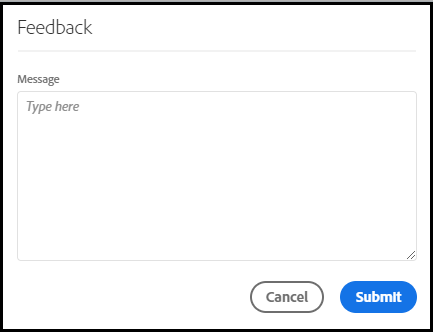

# [!UICONTROL Labs] 使用手冊

[!UICONTROL Labs] 可讓您更快速地建立早期構想的原型。此功能結合了工具和程序，能夠以透明方式加速開發，並且以客戶為中心。它讓使用者運用新興技術參與互動、發掘有價值的深入分析資料，並影響未來的功能開發與優先項目。您可以使用Labs提早存取Adobe Analytics創新，並根據您自己的商業使用案例和資料評估即將推出的功能。

## 要求

[!UICONTROL Labs] 已為所有管理員設為自動啟用。其他團隊成員則必須連絡各自的產品管理員要求存取權。

如果您尚未閱讀並簽署適用的「保密協定」和「條款與條件」表單，請逕行相關動作。

## Access the [!UICONTROL Labs] Portal

若要存取 [!UICONTROL Labs]:

1. If you do not already have access to [!UICONTROL Workspace] and [!UICONTROL Labs], ask your administrator for permissions.

1. Click the **[!UICONTROL Labs]** tab.

## 評估原型

如何啟動並評估原型：

1. 在畫面 [!UICONTROL Labs] 上，按一 **[!UICONTROL Launch]** 下以取得您要檢視的原型。 啟動原型時，您會在原型環境的左上角看到其名稱。

   

1. Watch a video that highlights the prototype by clicking **[!UICONTROL Watch Video]** in the upper right of the screen. 視訊 **[!UICONTROL Close]** 完成時，按一下。

   

1. 使用原型進行作業。在原型環境中操作時：

* 在原型環境中建立的專案無法儲存或共用。

* 在原型中，您可以使用您在工作區中可存取的任何維度、量度、區段和視覺化來評估資料。

* 您在原型中所做的任何變更都不會影響資料收集或處理。

* 透過建立或修改區段、計算量度和警報所做的變更，會持續沿用至原型環境之外。

## 提供意見回饋

1. Click **[!UICONTROL Give Feedback]** to provide feedback in the message box at any point when working with the prototype.

   

1. Click **[!UICONTROL Submit]** to send your feedback.

1. To try a different prototype, or to exit the prototype environment, click **[!UICONTROL Leave Prototype]** in the upper right of the screen and complete the short survey for the prototype. 退出原型環境後，對原型專案所做的任何更改都將遺失。

   

1. Click **[!UICONTROL Submit]** to return to the main Previews portal.

## 其他資訊

* Some prototypes within [!UICONTROL Labs] become Adobe Analytics features, others may not. 您的意見回饋會影響我們的決策，因此請審視原型，讓 Adobe 知道您對各項原型的看法。
* Labs 可供所有 SKU 權限使用。
