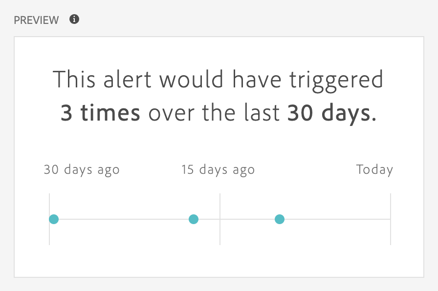

# 建立警報 {#create-alerts}

<!-- markdownlint-disable MD034 -->

>[!CONTEXTUALHELP]
>id="components_alerts_timegranularity"
>title="時間詳細程度"
>abstract="時間粒度是指系統檢查警報的頻率。"

<!-- markdownlint-enable MD034 -->

>[!NOTE]
>
>僅擁有 Adobe Analytics Prime 或 Ultimate 套件的組織才能使用具有異常偵測的警報 (也稱為 _智慧型警報_)。

Adobe Analytics 中的警報可讓您根據變更的百分比或特定資料點來接收通知。根據您的 Adobe Analytics 套件，您還可以使用根據異常臨界值觸發的警報。伺服器呼叫使用情況警報是另一種警報，僅供 Analytics 管理員使用。這些警報會通知您伺服器呼叫耗用量和承諾使用量資料有超額的風險或發生超額的情況。若需更多詳細資訊，請參閱[伺服器呼叫使用情況警報](/help/admin/tools/server-call-usage/scu-alerts.md)。

有關警報的更多詳細資訊，請參閱[警報概觀](alerts-overview.md)。

若要建立警報：

1. 使用下列任一方式來建立警報：

   * 在 Analysis Workspace 中開啟專案，然後選取「**[!UICONTROL 元件]**」>「**[!UICONTROL 建立警報]**」。
   * 在 Analysis Workspace 中開啟專案，然後使用以下快速鍵：***Cmd+Shift+A*** (macOS)，或 ***Ctrl+Shift+A*** (Windows)。
   * 在 Analysis Workspace 中開啟專案，在自由格式表格中選取一個或多個條列項目，然後按一下右鍵並選取「**[!UICONTROL 從選取範圍建立警報]**」。此動作會立即預先填入[警報產生器](alert-builder.md)，以使用正確的量度和篩選器建立警報。
   * [從警報管理員](/help/components/alerts/alert-manager.md#create-alerts)建立警報。

   顯示警報產生器。此介面和在 Analytics 中建置區段或計算量度的介面相似。

## 警報產生器

警報產生器的介面和在 Customer Journey Analytics 中用於建置區段或計算量度的介面相似：

在警報產生器中為警報指定以下詳細資訊：

| 元素 | 說明 |
|---------|----------|
| **[!UICONTROL 標題]** | 指定警示的名稱。 警報名稱中可以包含報表的名稱或量度臨界值。 |
| **[!UICONTROL 說明 (選用)]** | 指定警報的說明。 |
| **[!UICONTROL 時間詳細程度]** | 選取您希望檢查量度的頻率：每日、每週或每月。
 |
| **[!UICONTROL 收件者]** | 指定可傳送警報的位置。警報可以傳送給 Analytics 用戶、Analytics 群組、原始電子郵件地址或電話號碼。
<b>重要提示</b>：電話號碼前面必須加上 `+` 和[國家/地區代碼](https://countrycode.org/)。

使用者收到的電子郵件範例：

 |
| **[!UICONTROL 過期日]** | 設定警報過期的日期和時間。 |
| **[!UICONTROL 延遲]** | 資料完整並可在 Customer Journey Analytics 中報告以前所需的時間因組織而異，通常是資料事件時間過後的 3 到 9 小時。為了確保警報準確，特定事件範圍的事件資料必須完整，這表示 Adob&#x200B;&#x200B;e 不再接收指定事件範圍的任何事件資料。
為了解決攝取時間的延遲，警報發送前的預設延遲時間為 9 小時。

您可以將預設延遲時間從 9 小時調整為 0 至 24 小時之間的任意值。但是，將延遲時間減少到 9 小時以下可能表示您報告的資料不完整，這會導致警報資訊不準確。

減少延遲時間時，請考慮以下事項：
<ul><li>**了解資料可用性和資料完整性**：所有批次資料在經過 3 至 9 小時之後才會擷取至 Experience Platform 資料集。為了確保警報準確，資料攝取必須完整，並且所有批次資料在資料集中都可供使用。</li><li>**確定資料需要多長時間才會完整並可在資料集中供使用**：資料攝取時間因組織而異。請確認所選的警報傳遞延遲時間等同或短於批次資料在 Platform 資料集中可供使用所需的時間<!--add link? -->。</li>
**提示：** 想要了解所有批次資料都完整並被攝取至 Platform 資料集所需的時間，最準確方法是諮詢組織中的資料工程師。

或者，您可以大致了解組織的批次傳遞需要多長時間，才能在 Experience Platform 資料集中可供使用：在 Analysis Workspace 中建立下列自由格式表格：
<ol><li>在 Analysis Workspace 中的自由格式表格中，新增一個「[!UICONTROL **事件**]」量度和一個「[!UICONTROL **天**]」維度。</li><li>使用「[!UICONTROL **小時**]」維度來劃分「[!UICONTROL **天**]」維度。
沒有資料的小時會顯示為 0。
</li></ol><li>**解決計算中的錯誤**：如果您減少預設延遲時間，此延遲時間必須設定為比您的組織完成資料擷取所需時間至少多一個小時。例如，如果資料擷取完成之前有 3 小時的延遲，那麼您應該將延遲設為 4 小時。</li> |
| **[!UICONTROL 傳送警報的時機]** | [!UICONTROL **這些量度中的任何一個均會觸發**]：將量度 (包括計算量度) 拖放至此處，以建立警報觸發程式。
如果並非所有警報中的量度、維度或區段均與目前選取資料檢視相容，系統會顯示&#x200B;**「不相容的元件」**&#x200B;訊息。

決定設定警報前，量度必須超過的臨界值。 您可以將此值設為臨界值以及下列其中一個條件：
<ul><li>異常存在</li><li>異常高於預期</li><li>異常低於預期</li><li>高於或等於</li><li>低於或等於</li><li>變更者</li><li>您可以設定 90%、95%、99%、99.75% 或 99.9% 的臨界值。</li></ul>
[!UICONTROL **包括所有篩選器**]：拖放區段或維度以新增篩選器至警報中。例如，新增「*僅限行動裝置*」區段代表只有行動裝置才會觸發這項規則。您可以透過使用 AND 陳述式新增其他篩選器。您可按一下齒輪圖示，新增 AND 或 OR 規則。

請參閱「[警報 - 使用案例](alerts-use-cases.md)」，了解用例範例。
 |
| **[!UICONTROL 預覽]** | 互動式警報預覽會根據過去經驗，顯示觸發警報的大約頻率。
例如，如果您將時間粒度設為每日，則預覽將告訴您在過去 30 或 31 天裡，此警報會因為某個量度而被觸發 x 次。

如果您發現警報觸發次數過多，可在「[管理警報](alert-manager.md)」中調整臨界值。

{width="50%"}
 |

<!--

   

1. Specify the following options to configure the alert:

   | Option | Description |
   |---------|----------|
   | [!UICONTROL **Title**]  | Specify a name for the alert. The alert name might contain the name of the report or the metrics threshold. |
   | [!UICONTROL **Description (optional)**] | Specify a description for the alert. |
   | [!UICONTROL **Time granularity**] | Select how often you want the metric to be checked: Hourly, Daily, Weekly, or Monthly.
<b>Note:</b> For report suites with a custom calendar, monthly granularity in the Alert Builder is not supported.<!--true?--
<b>Important:</b> The phone number must be preceded by `+` and a [country code](https://countrycode.org/).

The e-mail that a user would receive once an alert has been triggered looks similar to:

 |
   | [!UICONTROL **Expiration date**] | Set the date and time when you want the alert to expire. |
   | [!UICONTROL **Send an alert when**] | [!UICONTROL **Any of these metrics trigger**]: Drag and drop metrics (including calculated metrics) here to create triggers for the alert.
An **"incompatible components"** message appears if not all the metrics, dimensions, or segments in the alert are compatible with the currently selected data view.

Determine the threshold that the metric must exceed before an alert is set. You can set this value to a threshold and then to one of the following conditions:
<ul><li>anomaly exists</li><li>anomaly is above expected</li><li>anomaly is below expected</li><li>is above or equals</li><li>is below or equals</li><li>changes by</li><li>You can set a threshold of 90%, 95%, 99%, 99.75%, and 99.9%.</li></ul>
[!UICONTROL **With all of these filters**]: Drag and drop segments or dimensions to add filters. For example, adding a *Mobile Devices Only* segment would mean that the rule triggers only for mobile devices. You can add additional filters by using an AND statement. You can add AND or OR rules by clicking the gear icon.

See [Alerts - use cases](/help/components/alerts/alerts-use-cases.md) for example.
 |
   | [!UICONTROL **Preview**] | The interactive alert preview shows you how often, approximately, an alert will fire based on past experience.
For example, if you set the time granularity to daily, the preview can tell you that the alert would have been triggered for a certain metric x times during the last 30 or 31 days. The preview approximation window is established by the alert frequency setting. For daily alert frequencies, the preview window approximates the previous 30 days. For weekly alert frequencies, the preview window approximates the last 12 weeks. For monthly alert frequencies, the preview window approximates the previous 12 months.

If you find that too many alerts will be triggered, you can adjust the threshold in the [Alert Manager](/help/components/alerts/alert-manager.md).

 |

1. Select [!UICONTROL **Save**].

-->