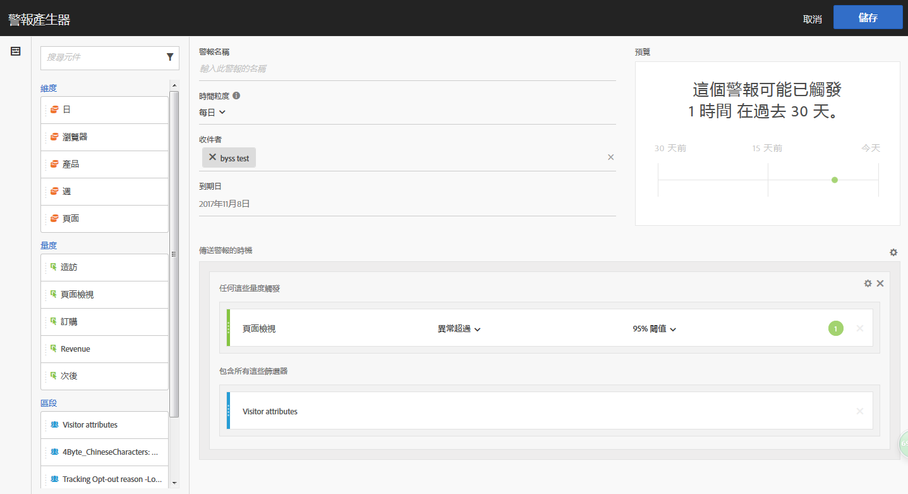

# 警報產生器

>[!IMPORTANT]
>
>智慧型警報僅供 Adobe [!DNL Analytics] Prime 與 Adobe [!DNL Analytics] Ultimate 的客戶使用。

存取警報產生器有四種方法：

* 在 Analysis Workspace 中使用下列快速鍵：

   `ctrl (or cmd) + shift + a`
* 前往「**[!UICONTROL 工作區]** > **[!UICONTROL 元件]** > **[!UICONTROL 新增警報]**」。
* 選取一或多個自由表格條列項目、以滑鼠右鍵按一下並選取&#x200B;**[!UICONTROL 「從選取範圍建立警報」]**。
* 在 [!UICONTROL Reports &amp; Analytics] 報表中，前往&#x200B;**[!UICONTROL 「更多]** > **[!UICONTROL 新增警報」]**。

警報產生器的介面與在 [!DNL Analytics] 中建立區段或計算量度時所用的介面類似：

**警報名稱**

指定警報的名稱。警報名稱中可以包含報告的名稱或量度臨界值。

**時間粒度**

指定您希望檢查量度的時間：每小時、每日、每週或每月。

> [!NOTE] 對於使用自訂日曆的報表套裝，警報產生器不支援每月粒度。

**收件者**

指定可傳送警報的位置。警報可以傳送給 [!DNL Analytics] 使用者、[!DNL Analytics] 群組、原始電子郵件地址或電話號碼。

>[!IMPORTANT]
>
>電話號碼前面必須加上「+」符號和[國家/地區代碼](https://countrycode.org/)。

**到期日**

設定警報的到期日。

**傳送警報的時機...**

*... 任何這些量度觸發*

* 拖放量度到畫布以新增觸發。

   請注意，如果警報中並非所有元件 (量度/維度/區段) 都與目前所選報表套裝相容，則會出現&#x200B;**「不相容的元件清單」**&#x200B;訊息。

* 確定觸發警報前必須超過的量度臨界值。您可以將此值設為臨界值以及下列其中一個條件：

   * 存在異常
   * 異常超出預期
   * 異常低於預期
   * 異常超過
   * 高於或等於
   * 低於或等於
   * 變更者

* 「異常超過」是遠超過現有 (靜態) 臨界值的新條件。它引進動態定義觸發的「異常偵測」演算法。您可以設定 90%、95%、99%、99.75% 或 99.9% 的臨界值。
* 每小時粒度設定為 99.75% 臨界值，每日粒度為 99%。
* 請注意您也可以使用計算量度。

*... 包含這些篩選*

拖放區段或維度以新增篩選條件。例如，新增「僅限行動裝置」區段可以代表規則僅會針對行動裝置而觸發。

可使用 AND 陳述式新增其他篩選器條件。

**新增規則**

您可按一下齒輪圖示，新增 AND 或 OR 規則。

## 警報預覽 {#section_10D75BA7B77E4C5FAF58A719C082E070}

互動式警報預覽會根據過去經驗，顯示觸發警報的大約頻率。

例如，如果您將時間粒度設為每日，則預覽可告訴您在過去 30 或 31 天裡，針對某個量度觸發了 x 次警報。

如果您覺得觸發的警報次數過多，可在「[警報管理器](/help/components/c-alerts/alert-manager.md)」中調整臨界值。

