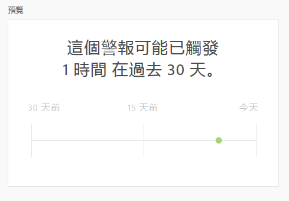

# 建立警報 {#create-alerts}

<!-- markdownlint-disable MD034 -->

>[!CONTEXTUALHELP]
>id="components_alerts_timegranularity"
>title="時間詳細程度"
>abstract="時間詳細程度指的是警報的檢查頻率以及包含的內容"

<!-- markdownlint-enable MD034 -->

>[!NOTE]
>
>使用具有異常偵測的警報（也稱為&#x200B;_智慧型警報_）僅適用於具有Adobe Analytics Prime或Ultimate套件的組織。

Adobe Analytics中的警報可讓您根據變更的百分比或特定資料點收到通知。 視您的Adobe Analytics套件而定，您也可以使用要根據異常臨界值觸發的警報。 伺服器呼叫使用量警報是另一種警報，僅供Analytics管理員使用。 這些警報會通知您伺服器呼叫耗用量和承諾使用量資料中發生超額的風險或發生次數。 如需詳細資訊，請參閱[伺服器呼叫使用量警報](/help/admin/admin/c-server-call-usage/scu-alerts.md)。

如需警示的詳細概觀資訊，請參閱[警示概觀](/help/components/c-alerts/intellligent-alerts.md)。

若要建立警示：

1. 存取警報產生器以開始建立警報。 您可以透過下列任何方式存取警報產生器：

   * 在Analysis Workspace中開啟專案，然後選取&#x200B;**[!UICONTROL 元件]** > **[!UICONTROL 建立警報]**。
   * 在Analysis Workspace中開啟專案，然後使用以下捷徑： ***ctrl （或cmd） + shift + a***。
   * 在Analysis Workspace中開啟專案，在自由格式表格中選取一或多個條列專案，然後按一下滑鼠右鍵並選取&#x200B;**[!UICONTROL 從選取範圍建立警報]**。 這個動作會立即預先填入警報產生器，使用正確的量度和篩選器建立警報。
   * 從警示管理員](/help/components/c-alerts/alert-manager.md#create-alerts)建立警示[。

   警報產生器隨即顯示。 此介面與Analytics中建立區段或計算量度的介面類似：

   

1. 指定下列選項來設定警示：

   | 選項 | 說明 |
   |---------|----------|
   | [!UICONTROL **標題**] | 指定警報的名稱。警報名稱中可以包含報表的名稱或量度臨界值。 |
   | [!UICONTROL **描述（選擇性）**] | 指定警示的說明。 |
   | [!UICONTROL **時間粒度**] | 選取您希望檢查量度的頻率：每小時、每日、每週或每月。
<b>注意：</b>對於使用自訂日曆的報表套裝，不支援警報產生器中的每月粒度。<!--true?-->
 |
   | [!UICONTROL **收件者**] | 指定可傳送警報的位置。警報可以傳送給 Analytics 用戶、Analytics 群組、原始電子郵件地址或電話號碼。
<b>重要：</b>電話號碼前面必須加上`+`和[國家/地區代碼](https://countrycode.org/)。

一旦觸發警報，使用者收到的電子郵件顯示如下：

 |
   | [!UICONTROL **過期日**] | 設定您想要警報到期的日期和時間。 |
   | [!UICONTROL **傳送警報的時機**] | [!UICONTROL **這些量度觸發器的任一項**]：將量度（包括計算量度）拖放到這裡，以建立警示的觸發器。
如果警報中並非所有量度、維度或區段都與目前選取的資料檢視相容，則會出現&#x200B;**「不相容的元件」**&#x200B;訊息。

確定觸發警報前必須超過的量度臨界值。您可以將此值設為臨界值以及下列其中一個條件：
<ul><li>存在異常</li><li>異常超出預期</li><li>異常低於預期</li><li>高於或等於</li><li>低於或等於</li><li>變更者</li><li>您可以設定 90%、95%、99%、99.75% 或 99.9% 的臨界值。</li></ul>
[!UICONTROL **包含所有這些篩選器**]：拖放區段或維度以新增篩選器。 例如，新增「僅限行動裝置」區段表示規則僅會針對行動裝置觸發。 您可以使用AND陳述式來新增其他篩選器。 您可按一下齒輪圖示，新增 AND 或 OR 規則。

請參閱[警示 — 使用案例](/help/components/c-alerts/alerts-use-cases.md)範例。
 |
   | [!UICONTROL **預覽**] | 互動式警報預覽會根據過去經驗，顯示觸發警報的大約頻率。
例如，如果您將時間詳細程度設為每日，則預覽可告訴您在過去30或31天中，針對特定量度觸發了x次警報。 預覽近似視窗是由警示頻率設定所建立。 若為每日警示頻率，則預覽視窗約略高於前30天。 對於每週警報頻率，預覽視窗大約是過去12週。 對於每月警報頻率，預覽視窗大約是前12個月。

如果您發現將觸發的警報過多，可在[警報管理員](/help/components/c-alerts/alert-manager.md)中調整臨界值。

 |

1. 選取「[!UICONTROL **儲存**]」。
