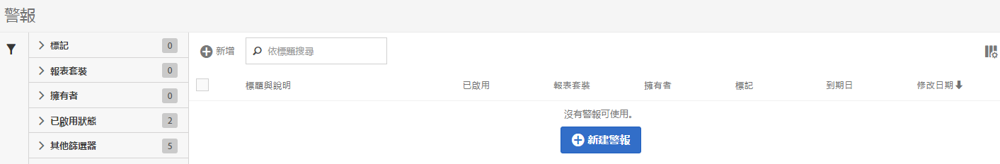

# 警報管理器

警示管理員的結構相當類似於[區段管理員](https://experienceleague.adobe.com/docs/analytics/components/segmentation/segmentation-workflow/seg-manage.html?lang=zh-Hant)和[計算量度管理員](https://experienceleague.adobe.com/docs/analytics/components/calculated-metrics/calcmetric-workflow/cm-manager.html?lang=zh-Hant)。

## 存取「警報管理器」

1. 在Adobe Analytics中，選取&#x200B;[!UICONTROL **元件**] > [!UICONTROL **警報**]。

## 「警報管理器」中的可用動作

在「警報管理器」中，您可以：

* 按一下&#x200B;**[!UICONTROL 「+ 新增」]**&#x200B;以存取警報產生器。
* 標記警報。這可讓您組織警報以方便使用。
* 刪除警報。
* 重新命名警報。
* 核准警報。
* 複製警報。
* 啟用/停用警報。
* **更新**&#x200B;警報到期日。選取一或多個警報後，按一下&#x200B;**[!UICONTROL 「續訂」]**&#x200B;即可續訂警報。如此一來，到期日將從按一下&#x200B;**[!UICONTROL 「續訂」]**&#x200B;之日算起延長 1 年，無論原始到期日為何。
* 將警報匯出為 .CSV 檔案。
* 按兩下警報標題以編輯警報。
* 搜尋警報。
* 新增警報至其他報表套裝。
* 指定/變更警報的擁有者。
* 新增其他篩選器
* 定義警報&#x200B;**到期日**。

## 設定欄

您可以設定顯示的資料欄，以設定「警示管理員」中每個警示顯示的資訊。

若要在「警報管理員」中設定可見欄：

1. 在Adobe Analytics中，選取&#x200B;**[!UICONTROL 元件]**&#x200B;標籤，然後選取&#x200B;**[!UICONTROL 警示]**。

1. 在警示管理員中，選取&#x200B;**自訂欄**&#x200B;圖示，然後選取您要顯示在警示管理員中的欄。

   可使用下列欄:

   | 欄標題 | 說明 |
   |---|---|
   | 標題和說明 | 這些值會在警報產生器中提供。 若要編輯標題和說明，請選取標題連結以開啟警報產生器。 |
   | 我的最愛 | 在每一個警示旁邊顯示星號圖示，讓您將警示標示為我的最愛。<!-- For more information, see [Mark calculated metrics as favorites](/help/components/c-calcmetrics/c-workflow/cm-workflow/cm-favorite.md). --> |
   | 類型 | 顯示警示是Analytics資料警示還是伺服器呼叫使用量警示。 |
   | 已啟用 | 顯示警示目前是啟用還是停用。 |
   | 報表套裝 | 指出上次將警報儲存到的目標報表套裝。 |
   | 所有者 | 指出警報的擁有者。 如果您不是管理員，就只能看見自己所擁有或已共用給您的警報。 |
   | 標記 | 顯示套用至警示的標籤，這些標籤是由您自己或與您共用警示的人員所設定。 |
   | 到期日 | 顯示警示設為到期的日期和時間。 |
   | 修改日期 | 表示上次修改警示的日期。 |

   {style="table-layout:auto"}

   <!-- When "Last used" column is added, add this information as the description: Shows the date when the alert was last used. 
This information can help you determine whether a component is valuable to users in your organization, where it is used, and if it needs to be deleted or modified.

Consider the following when viewing this column:
<ul><li>This information does not include usage from the API, Report Builder, or Data Warehouse.</li><li>For some components, this column might not contain data if the component was last used prior to September 2023.</li></ul> -->

