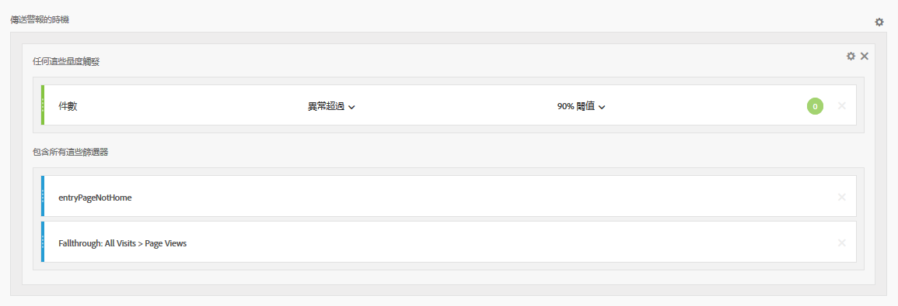
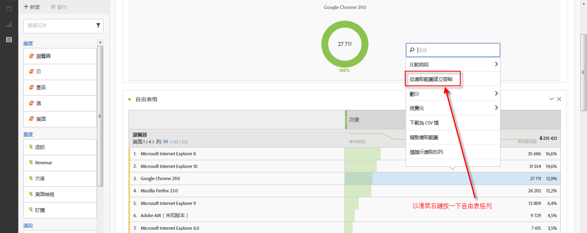
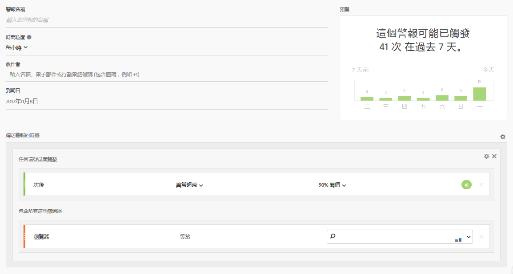
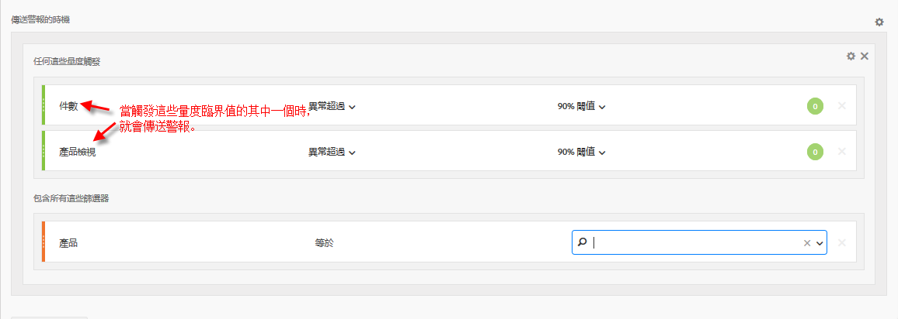

# 智慧型警報 - 使用案例

## 建立依兩個區段篩選的簡單警報 {#filter}

## 從表格選取範圍建立警報 {#from-selection}

在自由表格中，此時可以用滑鼠右鍵按一下表格列並選取&#x200B;**[!UICONTROL 「從選取範圍建立警報」]**，建立內容感知警報。

如此會立即預先填入警報產生器，使用正確的量度和篩選器建立警報：

## 合併 (堆疊) 警報，而非建立多個警報 {#stacking}

堆疊警報可確保結合警報，以免您收到大量的單獨警報。

