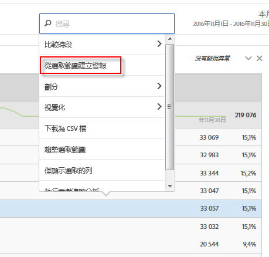

# 智慧型警報

新的智慧型警報系統可提供更細微的警報控制能力，並可將異常偵測功能與警報系統整合。

以下是影片概觀：

>[!VIDEO](https://video.tv.adobe.com/v/25446/?quality=12)

## 概觀 {#section_6AC8CA81DEA94E99B0F192B60D0FDF03}

>[!IMPORTANT]
>
>智慧型警報僅供 Adobe [!DNL Analytics] Prime 與 Adobe [!DNL Analytics] Ultimate 的客戶使用。

智慧型警報可讓您

* 根據異常 (90％、95％、99%、99.75% 或 99.9% 臨界值；％ 變化；以上/以下) 建立警報。
* 預覽警報觸發的頻率.
* 透過電子郵件或簡訊傳送警報，當中附有可自動產生 Analysis Workspace 專案的連結。
* 建立在單一警報中擷取多個量度的「堆疊」警報。

警報系統的元件包括：警報產生器、警報管理器、警報預覽，以及更出色的內容感知存取權 (可用來建立警報)。 舊的警報系統使用者介面將會停用，而警報則會遷移。 部分舊型警報功能[將不再可用](https://experienceleague.adobe.com/docs/analytics/analyze/reports-analytics/alerts.html?lang=zh-Hant)。

取得「警報產生器」有三種方式：

* 在 Analysis Workspace 中使用下列快速鍵：

  `ctrl (or cmd) + shift + a`
* 直接前往「警報產生器」：「**[!UICONTROL Workspace]** > **[!UICONTROL 元件]** > **[!UICONTROL 新增警報]**」。
* 選取一或多個自由表格行項目、以滑鼠右鍵按一下並選取&#x200B;**[!UICONTROL 「從選取範圍建立警報」]**。如此會開啟「警報產生器」並從表格套用的適當量度和篩選器預先填入產生器。接著您可以視需要編輯警報。

  

## 常見問題集：系統如何計算及觸發警報 {#trigger}

% 臨界值代表標準差。例如，95% = 2 標準差與 99% = 3 標準差。 根據您選擇的時間詳細程度，會使用[不同的模型](/help/analyze/analysis-workspace/c-anomaly-detection/statistics-anomaly-detection.md)來計算每個資料點距離基準有多遠（多少標準差）。 若您設定較低的臨界值 (例如 90%)，您收到異常警報的次數就會比設定較高臨界值 (99%) 時多。我們特別導入 99.75% 與 99.99% 以用於每小時詳細程度的臨界值，因此不會觸發那麼多的異常警報。

+++ 警報的異常偵測能多早判斷出資料異常？

培訓期間會依選擇的詳細程度而有所不同。請參閱<a href="/help/analyze/analysis-workspace/c-anomaly-detection/statistics-anomaly-detection.md">異常偵測</a>所使用的統計技術，以取得詳細資訊。摘要如下：

* 每月 = 15 個月 + 去年的相同範圍
* 每週 = 15 週 + 去年的相同範圍
* 每天 = 35 天 + 去年的相同範圍
* 每小時 = 336 小時

+++

+++ 若只收到行為狀況突然減少或增加警報，是否適合使用異常功能？還是我需要使用絕對值？

使用絕對值仍會在下降時觸發警報，並在尖峰時觸發。 您無法獨立隔離突然減少或增加的警報。

+++

+++ 我是否可以將警報設定為只在一天中的特定時段觸發（例如只在營業時間觸發，不在非營業時間觸發）？

目前沒辦法。

+++

+++ 我能否取得包含虛線的「預期值」表格（或某種顯示相關數值的輸出資料）？

Workspace不行，但Report Builder可以。 觀看[此影片](https://experienceleague.adobe.com/docs/analytics-learn/tutorials/exporting/report-builder/anomaly-detection-in-report-builder.html?lang=zh-Hant)有關Report Builder中的異常偵測。

請留意，Report Builder 使用的是較簡單的異常偵測方式。此方式是使用固定 30 天培訓期，固定 95％ 間隔。

+++
