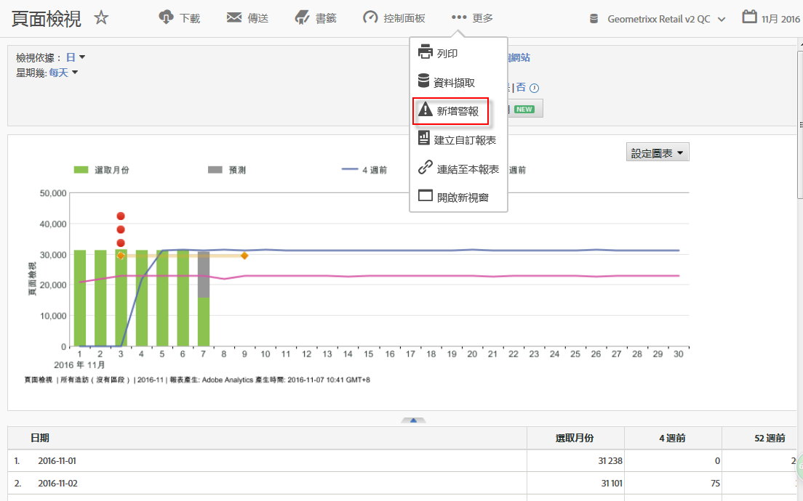

# 智慧提醒

新的智慧型警報系統可提供更細緻的警報控制能力，並整合警報系統的異常偵測功能。

## 概述 {#section_6AC8CA81DEA94E99B0F192B60D0FDF03}

>[!IMPORTANT]
>
>Intelligent Alerts are available to Adobe [!DNL Analytics] Prime and Adobe [!DNL Analytics] Ultimate customers only.

The new Alert Builder and Alert Manager replace the existing alert functionality in Adobe [!DNL Analytics]. 智慧型警報可讓您

* 根據異常 (90％、95％、99%、99.75% 或 99.9% 臨界值；％ 變化；以上/以下) 建立警報。
* 預覽警報觸發的頻率。
* 透過電子郵件或簡訊發送附有與自動產生的 Analysis Workspace 專案連結的警報。
* 建立在單一警報中擷取多個量度的「堆疊」警報。

新警報系統的元件包括: 警報產生器、警報管理器、警報預覽和更理想的內容感知存取建立警報方式。舊的警報系統使用者介面不再可用，但我們會移轉警報。部分舊型警報功能[不再提供使用](https://marketing.adobe.com/resources/help/en_US/sc/user/deprecated_alerts.html)。

取得「警報產生器」有四種方式:

* 在 Analysis Workspace 中使用下列快速鍵:

   `ctrl (or cmd) + shift + a`
* By going directly to the Alert Builder:  **[!UICONTROL Workspace]** &gt; **[!UICONTROL Components]** &gt; **[!UICONTROL New Alert]** .
* By selecting one or more freeform table line item/s, right-clicking and selecting **[!UICONTROL Create Alert from Selection]**. 如此會開啟「警報產生器」並從表格套用的適當量度和篩選器預先填入產生器。接著您可以視需要編輯警報。

   

* From within a [!UICONTROL Reports &amp; Analytics] report, by going to  **[!UICONTROL More]** &gt; **[!UICONTROL Add Alert]** . 如此會開啟新的「警報產生器」，並從報表套用的適當量度和篩選器預先填入產生器。接著您可以視需要編輯警報。

   

## 常見問題集: 系統如何計算及觸發警報 {#section_1F3B1DAF21784306953B49AAD4C3DCAB}

% 臨界值代表標準差。例如，95% = 2 標準差與 99% = 3 標準差。依您選擇的時間粒度而定，[不同模式](/help/analyze/analysis-workspace/virtual-analyst/c-anomaly-detection/statistics-anomaly-detection.md)會用於計算各資料點距離基準有多遠 (多少標準差)。若您設定較低的臨界值 (例如 90%)，您收到異常警報的次數就會比設定較高臨界值 (99%) 時多。99.75% 與 99.99% 是特別引進用於每小時粒度的臨界值，因此不會觸發那麼多的異常警報。

<table id="table_B3AA85E1DE3543DCA34966A52E3CE4AB"> 
 <thead> 
  <tr> 
   <th colname="col1" class="entry"> 問題 </th> 
   <th colname="col2" class="entry"> 回答 </th> 
  </tr> 
 </thead>
 <tbody> 
  <tr> 
   <td colname="col1"> 
<b>問: 警報的異常偵測能多早判斷出資料異常?</b> 
 </td> 
   <td colname="col2"> 
培訓期間會依選擇的粒度而有所不同。請參閱[異常偵測中使用的統計技巧](/help/analysis/analysis-workspace/cutual-creaty-detection/digital-mercury-detection. md)，以瞭解詳細資訊。摘要如下: 
 
    <ul id="ul_4F8C2A41F06C498DBF5E7AE5DE803773"> 
     <li id="li_E246091A3F1E484C8444AF4052FCA784">每月 = 15 個月 + 去年的相同範圍 </li> 
     <li id="li_CC014FB38AE1492B9647E990C29BFB3C">每週 = 15 週 + 去年的相同範圍 </li> 
     <li id="li_2517EE2097534324BE9C1B54CD181A62">每天 = 35 天 + 去年的相同範圍 </li> 
     <li id="li_710BC8B009354542AA4962A59A646099">每小時 = 336 小時 </li> 
    </ul> </td> 
  </tr> 
  <tr> 
   <td colname="col1"> 
<b>問: 如果我只希望在行為狀況突然減少或增加時收到警報，是否適合使用異常功能? 還是我需要使用絕對值?</b> 
 </td> 
   <td colname="col2"> 
使用絕對值仍會觸發突然減少或增加的警報。您無法獨立隔離突然減少或增加的警報。 
 </td> 
  </tr> 
  <tr> 
   <td colname="col1"> 
<b>問: 我是否能將警報設定為只在一天中的特定時段觸發 (例如只在營業時間觸發，不在非營業時間觸發)?</b> 
 </td> 
   <td colname="col2"> 
目前沒辦法。 
 </td> 
  </tr> 
  <tr> 
   <td colname="col1"> 
<b>問: 我能否取得包含虛線的「預期值」表格 (或某種顯示相關數值的輸出資料)?</b> 
 </td> 
   <td colname="col2"> 
使用 Workspace 時不行。但您可以使用 Report Builder 做到這點 (請參見此影片: <a href="https://www.youtube.com/watch?v=-a-8W6GQZnU" format="https" scope="external">Report Builder 中的異常偵測</a>)。 
 
請留意，Report Builder 使用的是較簡單的異常偵測方式。It uses a fixed 30-day training period, fixed 95% interval, and is similar to <a href="https://marketing.adobe.com/resources/help/en_US/reference/anomaly.html" format="html" scope="external"> [!UICONTROL Reports &amp; Analytics] anomaly detection </a>. 
 </td> 
  </tr> 
 </tbody> 
</table>

