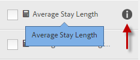
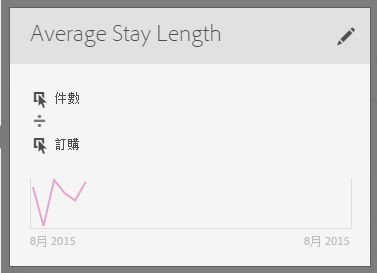

# 建立量度

計算量度產生器提供的畫布可用來拖放維度、量度、區段及函數，讓您根據容器階層邏輯、規則及運算子來建立自訂量度。此整合性開發工具可讓您建立並儲存簡單的計算量度或複雜的進階計算量度。

有幾種方式可以存取計算量度產生器:

* 在 Analysis Workspace 中，開啟專案並按一下&#x200B;**[!UICONTROL 「+ 新增]** &gt; **[!UICONTROL 建立量度」]**。
* 在 [!DNL Analytics] 中，前往&#x200B;**[!UICONTROL 元件]** &gt; **[!UICONTROL 計算量度]**。

* 按一下[計算量度管理器](/help/components/c-calcmetrics/c-workflow/cm-workflow/cm-manager.md)頂端的&#x200B;**[!UICONTROL 「+ 新增」]**，或者

* 前往 **[!UICONTROL Analytics]** &gt; **[!UICONTROL 報表]**，開啟任一報表並按一下「量度」圖示  以叫出「量度」欄，然後按一下&#x200B;**[!UICONTROL 「新增」]**。

## UI 元件 {#section_9382AEEBA4244DD6A9F6C1DD3F6D076B}

<table id="table_60A82936321047D1A335331BF83B0972"> 
 <thead> 
  <tr> 
   <th colname="col2" class="entry"> 欄位 </th> 
   <th colname="col3" class="entry"> 說明 </th> 
  </tr> 
 </thead>
 <tbody> 
  <tr> 
   <td colname="col2">  標題  </td> 
   <td colname="col3"> 
必須命名量度。未命名的量度將無法儲存。 
 </td> 
  </tr> 
  <tr> 
   <td colname="col2">  說明  </td> 
   <td colname="col3"> 
提供使用者易記的說明，以顯示其用途並與類似量度加以區別。 
 
此說明也會顯示在報表中。最好「不要」在說明中加入公式，而是該說明此量度適合和不適合的用途。(公式會在您建立量度時產生，位在「摘要」標頭下方。因此無需將公式加入說明中。) 
 </td> 
  </tr> 
  <tr> 
   <td colname="col2">  格式  </td> 
   <td colname="col3"> 
選項包括「小數」、「時間」、「百分比」和「貨幣」。 
 </td> 
  </tr> 
  <tr> 
   <td colname="col2">  小數位數  </td> 
   <td colname="col3"> 
顯示要在報表中顯示幾個小數位數。您可指定的小數位數上限為 10。 
 </td> 
  </tr> 
  <tr> 
   <td colname="col2">  將上升趨勢顯示為...  </td> 
   <td colname="col3"> 
此量度極性設定顯示 Analytics 應將量度的上升趨勢視為好 (綠色) 或壞 (紅色)。因此，報表的圖形會隨著量度上升而顯示為綠色或紅色。 
 </td> 
  </tr> 
  <tr> 
   <td colname="col2">  標記  </td> 
   <td colname="col3"> 
標記是組織量度的好方法。所有使用者都能建立標記，並套用一或多個標記至量度。不過，您僅可以看見自己所擁有或已共用給您之區段的標記。您應該建立什麼樣的標記? 以下是一些建議的實用標記: 
     <ul id="ul_9A6CE5F179424687A39F2D5C1A953258"> 
      <li id="li_A8815F2D8D284874AD701A7B103D82A3">以<b>團隊名稱</b>為基礎的標記，例如「社交行銷」、「手機行銷」。 </li> 
      <li id="li_A51A4515A541488E9D90296A955E9F4F"><b>專案</b>標記 (分析標記)，例如「登入頁面分析」。 </li> 
      <li id="li_B4605470A7094026AC168420B64BBCC3"><b>類別</b>標記: 「男性」、地理區。 </li> 
      <li id="li_B6EAB0F2A96C41209C4EC97B9E64390B"><b>工作流程</b>標記: 「待核准」、策劃 (特定的業務單位) </li> 
     </ul> 
 </td> 
  </tr> 
  <tr> 
   <td colname="col2">  摘要  </td> 
   <td colname="col3"> 
「摘要」公式會隨著您變更量度定義而更新。當您將游標放在量度上並按一下  圖示，此公式也會顯示在量度邊欄中。 
 </td> 
  </tr> 
  <tr> 
   <td colname="col2">  定義  </td> 
   <td colname="col3"> 
這裡是您拖曳量度/計算量度、區段和/或函數進來以建立計算量度的地方。 
 
 
     <ul id="ul_B13401A266354DC594C6176025DB61CB"> 
      <li id="li_01776C32C7C5440AA1F847096CBED92B">如果您拖曳一個計算量度進來，它就會自動展開其量度定義。 </li> 
      <li id="li_A483D352522E4572AB43042473053359">您可以使用容器巢狀嵌套定義。不過，這些容器與區段容器不同，其功能比較類似數學運算式，用以決定運算順序。 </li> 
     </ul> 
 </td> 
  </tr> 
  <tr> 
   <td colname="col2">  運算元  </td> 
   <td colname="col3"> 
預設運算子以 () 分隔，另外還有 +、- 和 x 運算子。 
 </td> 
  </tr> 
  <tr> 
   <td colname="col2">  預覽  </td> 
   <td colname="col3"> 
提供快速閱覽，以便查看可能的錯誤。預覽涵蓋最近 90 天。這可供您初步衡量是否為量度選擇了正確的元件。意外的結果可能表示您需要再次檢查量度定義。 
 </td> 
  </tr> 
  <tr> 
   <td colname="col2">  產品相容性  </td> 
   <td colname="col3"> 
產品相容性會顯示量度是否與<a href="https://marketing.adobe.com/resources/help/zh_TW/reference/data_latency.html"  >目前的資料</a>、完全處理的資料相容，或僅與行銷管道報表 (首次接觸配置) 相容。 
附註: 目前的資料並未支援所有量度。包含區段或函數的量度與目前的資料不相容。<a href="/help/components/c-calcmetrics/cm-compatibility.md"  > 更多... </a> 
 
 </td> 
  </tr> 
  <tr> 
   <td colname="col2">  新增  </td> 
   <td colname="col3"> 
若為所有類型的計算量度，您可以將容器和靜態數字新增到定義中。若為進階計算量度，您也可以新增區段和函數。 
 
 
     <ul id="ul_607C1B303F334062BC620317667DE490"> 
      <li id="li_53462789B8AF4F1AA9B45565D37CF22B">容器的功能類似數學運算式，用以決定運算順序。所以容器中的項目會先行處理，再進行下一個運算。 </li> 
      <li id="li_401A9E0D8B3B468990289DBF66A06F63">拖曳區段至容器可分割該容器中的項目。(僅限進階計算量度) </li> 
      <li id="li_F191B200D7A944F9ADC0573A9A82A6DA">您可以在容器中堆疊多個區段。 </li> 
     </ul> 
 </td> 
  </tr> 
  <tr> 
   <td colname="col2"> 齒輪圖示 (「量度類型」、「歸因」) </td> 
   <td colname="col3"> 
選取量度旁的齒輪圖示，即可指定<a href="/help/components/c-calcmetrics/c-workflow/cm-workflow/c-build-metrics/m-metric-type-alloc.md"  >量度類型和歸因模型</a>。 
 </td> 
  </tr> 
  <tr> 
   <td colname="col2">  + 新增  </td> 
   <td colname="col3"> 
可讓您建立新元件，例如新區段 (會前往「<a href="https://marketing.adobe.com/resources/help/zh_TW/analytics/segment/seg_build_ui.html"  >區段產生器</a>」)。 
 </td> 
  </tr> 
  <tr> 
   <td colname="col2"> 
搜尋元件 
 </td> 
   <td colname="col3"> 
此搜尋列可讓您搜尋維度、量度、區段 (僅限進階計算量度)，以及函數 (僅限進階計算量度)。 
 </td> 
  </tr> 
  <tr> 
   <td colname="col2"> 
維度清單 
 </td> 
   <td colname="col3"> 
您可以拖入「頁面」並直接從計算量度產生器選取「首頁」，無須為了在區段產生器中建立簡易區段 (例如「頁面 = 首頁」) 而離開計算量度產生器。 
 
如此將可讓工作流程更為流暢，方便建立區段計算量度。 
 </td> 
  </tr> 
  <tr> 
   <td colname="col2"> 
量度清單 
 </td> 
   <td colname="col3"> 
量度共有 3 個類別: 
 
    <ul id="ul_7BF50F4964EF45858FBA1634FBFA45CF"> 
     <li id="li_90F2312927A6499CA1CE04F8FFC912CF">標準量度 ( ) </li> 
     <li id="li_A3F59083E79B4AC780D6F8CEDFFD20C9">計算量度 ( ) </li> 
     <li id="li_8735E76637ED4C3F983731A66E04C93E">量度範本 () - 位於清單底部。 </li> 
    </ul> 
當您將游標放在量度上時，其右側會顯示資訊圖示: 。按一下此圖示會提供下列資訊: 
 
    <ul id="ul_DF35DDB9FBFA40C8A93FA0F2286A0BBE"> 
     <li id="li_4215AA9BF93F4C8B941002A7A4D2F50B">其計算公式。 </li> 
     <li id="li_6A8E39EB6DCE4377B0B594B6D4FC0294">量度的預覽趨勢。 </li> 
     <li id="li_44C1595E4BE64ED69D1DB3BB6655ED55">右上方的編輯 (鉛筆) 圖示會帶您前往計算量度產生器，您可於該處編輯此計算量度。 </li> 
    </ul> 
 
 </td> 
  </tr> 
  <tr> 
   <td colname="col2"> 
區段清單 
 </td> 
   <td colname="col3"> 
(僅限進階計算量度) 身為管理員，此清單會顯示在您的登入公司中建立的所有區段。如果您不是管理員使用者，此清單會顯示您擁有以及與您共用的區段。<a href="https://marketing.adobe.com/resources/help/zh_TW/analytics/segment/seg_rights.html"  > 更多... </a> 
 </td> 
  </tr> 
  <tr> 
   <td colname="col2"> 
函數清單 
 </td> 
   <td colname="col3"> 
(僅限進階計算量度) 函數分為兩種清單:  <a href="/help/components/c-calcmetrics/cm-reference/cm-functions.md"  >基本</a> (最常使用) 和<a href="/help/components/c-calcmetrics/cm-reference/cm-adv-functions.md"  >進階</a>。 
 </td> 
  </tr> 
  <tr> 
   <td colname="col2"> 
報表套裝選擇器 
 </td> 
   <td colname="col3"> 
可讓您切換至其他報表套裝。 
 </td> 
  </tr> 
 </tbody> 
</table>

