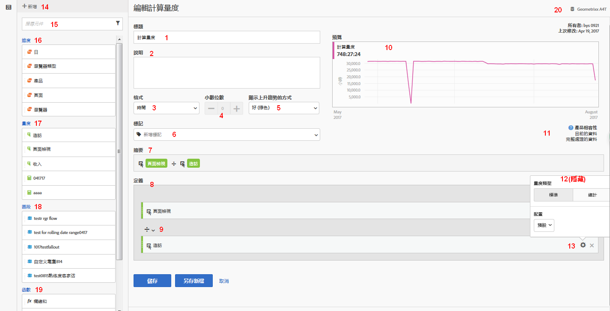

# 建置量度 {#build-metrics}

>[!CONTEXTUALHELP]
>id="components_calculatedmetrics_externalid"
>title="外部 ID"
>abstract="變更外部 ID 可能會影響計算量度在外部來源 (例如商業智慧工具) 中的顯示方式"

Adobe Analytics 提供的畫布可用來拖放維度、量度、區段及函數，根據容器階層邏輯、規則及運算子來建立自訂量度。此整合性開發工具可讓您建置並儲存簡單或複雜的計算量度。

## 開始建置計算量度

您可以使用計算量度產生器來建立或編輯計算量度。用這個方式建立的計算量度會出現在元件清單中，而且之後可用於整個組織的專案。或者，您也可以快速建立僅供建立量度之專案使用的計算量度，如[量度](/help/analyze/analysis-workspace/components/apply-create-metrics.md)的[建立單一專案的計算量度](/help/analyze/analysis-workspace/components/apply-create-metrics.md#create-calculated-metrics-for-a-single-project)中所述。

存取計算量度產生器以開始建立可在元件清單中使用的計算量度。

1. 以下列任一方式存取計算度量產生器：

   * 在 Analysis Workspace 中開啟專案，然後選取「**[!UICONTROL 元件]**」>「**[!UICONTROL 建立量度]**」。
   * 在 Analysis Workspace 中開啟專案，然後選取左側邊欄中&#x200B;[!UICONTROL **量度**]&#x200B;區段旁的&#x200B;**加 (+) 號**&#x200B;圖示。
   * 在 [!DNL Adobe Analytics] 中，前往「**[!UICONTROL 元件]** > **[!UICONTROL 計算量度]**」，然後選取計算量度頁面頂端的「**[!UICONTROL + 新增]**」。

1. 繼續[計算量度產生器的區域](#areas-of-the-calculated-metrics-builder)。

## 計算量度產生器的區域

下圖和隨附的表格解釋計算量度產生器的部分主要區域和功能。

| 影像中的位置 | 名稱與功能 |
|---|---|
| 1 | **標題：**&#x200B;必須為量度命名未命名的量度將無法儲存。 |
| 2 | **說明：** 提供使用者易記的說明，以顯示其用途以及與類似量度區別。 
此說明也會顯示在報表中。最好「不要」在說明中加入公式，而是該說明此量度適合和不適合的用途。(公式會在您建立量度時產生，位在「摘要」標頭下方。因此無需將公式加入說明中。) 
 |
| 3 | **格式：** 選項包括「小數」、「時間」、「百分比」及「貨幣」。 |
| 4 | **小數位數：**&#x200B;顯示要在報告中顯示幾個小數位數。您可指定的小數位數上限為 10。 |
| 5 | **顯示上升趨勢的方式：**&#x200B;此量度極性設定顯示 Analytics 應將量度的上升趨勢視為好 (綠色) 或壞 (紅色)。因此，報表的圖形會隨著量度上升而顯示為綠色或紅色。 |
| 6 | **標記：**&#x200B;標記是組織量度的好方法。所有使用者都能建立標記，並套用一或多個標記至量度。不過，您僅可以看見自己所擁有或已共用給您之區段的標記。您應該建立什麼樣的標記？以下是一些建議的實用標記：<ul><li>**團隊名稱**，例如「社交行銷」、「行動裝置行銷」。</li><li>**專案** (分析標記)，例如「登入頁面分析」。</li><li>**類別**，例如「女士」；「地理」。</li><li>**工作流程**，例如「待核准」、監管 (特定的業務單位)</li></ul> |
| 7 | **摘要：** 
「摘要」公式會隨著您變更量度定義而隨時更新。(此公式也會顯示在左側的量度邊欄中) 當您將滑鼠游標停留在量度上並按一下 圖示。 
 |
| 8 | **定義：**&#x200B;此為您拖曳量度/計算量度、區段和/或函數進來，以建置計算量度的地方。 <ul><li>如果您將一個計算量度拖曳進來，它將自動展開其量度定義。 </li> <li>您可以使用容器巢狀嵌套定義。不過，這些容器與區段容器不同，其功能比較類似數學運算式，用以決定運算順序。 </li> </ul> |
| 9 | **運算子：** 除以 ( 預設運算子以 ( ) 分隔，另外還有 +、- 及 x 運算子。 |
| 10 | **預覽：** 提供快速閱覽，以便查看可能的錯誤。預覽涵蓋最近 90 天。這可供您初步衡量是否為量度選擇了正確的元件。意外的結果可能表示您需要再次檢查量度定義。 |
| 11 | **產品相容性：**&#x200B;產品相容性會顯示量度是否與<a href="https://experienceleague.adobe.com/docs/analytics/analyze/reports-analytics/current-data.html?lang=zh-Hant"  >目前的資料</a>、完整處理的資料相容，或僅與行銷管道報告 (首次接觸配置) 相容。 
附註：目前的資料並未支援所有量度。包含區段或函數的量度與目前的資料不相容。<a href="/help/components/c-calcmetrics/cm-compatibility.md"  > 更多... </a> 
 
 |
| 12 | **新增：**&#x200B;針對所有類型的計算量度，您可以將容器和靜態數字新增至定義。若為進階計算量度，您也可以新增區段和函數。 <ul><li>容器的功能類似數學運算式，用以決定運算順序。所以容器中的項目會先行處理，再進行下一個運算。</li><li>拖曳區段至容器可分割該容器中的項目。(僅限進階計算量度)</li><li>您可以在容器中堆疊多個區段。</li></ul> |
| 13 | **齒輪圖示 (量度類型、歸因)：**&#x200B;請選取量度旁的齒輪圖示，即可指定<a href="/help/components/c-calcmetrics/c-workflow/cm-workflow/c-build-metrics/m-metric-type-alloc.md"  >量度類型和歸因模型</a>。 |
| 14 | **新增：**&#x200B;可讓您建立新元件，例如新區段 (會前往「<a href="/help/components/segmentation/segmentation-workflow/seg-build.md"  >區段產生器</a>」。) |
| 15 | **搜尋元件：**&#x200B;此搜尋列可讓您搜尋維度、量度、區段 (僅限進階計算量度)，以及函數 (僅限進階計算量度)。 |
| 16 | **維度清單：**&#x200B;您可以拖曳至「頁面」並直接從計算量度產生器選取「首頁」，無須為了在區段產生器中建立簡易區段 (例如「頁面 = 首頁」) 而離開計算量度產生器。
如此將可讓工作流程更為流暢，方便建立區段計算量度。
 |
| 17 | **量度清單：**&#x200B;量度分為 3 種類別： <ul> <li>標準量度 () </li><li>計算量度 ( ) </li><li id="li_8735E76637ED4C3F983731A66E04C93E">量度範本 ( ) - 位於清單底部。 </li> </ul> 
當您將滑鼠游標停留在量度上時，您可在其右側看到「資訊」圖示： 。按一下此圖示會提供下列資訊： 
<ul> <li>其計算公式。 </li><li>量度的預覽趨勢。 </li><li>編輯 (鉛筆) 圖示 右上方的  會帶您前往計算量度產生器，您可於該處編輯此計算量度。 </li></ul> |
| 18 | **區段清單：**(僅限進階計算量度) 身為管理員，此清單會顯示在您的登入公司中建立的所有區段。如果您不是管理員使用者，此清單會顯示您擁有以及與您共用的區段。<a href="https://experienceleague.adobe.com/docs/analytics/components/segmentation/segment-reference/seg-rights.html?lang=zh-Hant"  > 更多... </a> |
| 19 | **函數清單：** (僅限進階計算量度) 函數分為兩個清單：<a href="/help/components/c-calcmetrics/cm-reference/cm-functions.md"  >基本</a> (最常用) 及<a href="/help/components/c-calcmetrics/cm-reference/cm-adv-functions.md"  >進階</a>。 |
| 20 | **報告套裝選擇器：**&#x200B;可讓您切換至不同的報告套裝。 |

{style="table-layout:auto"}
