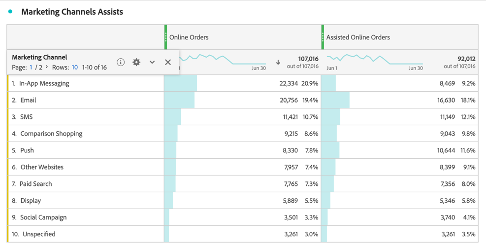

# 建立更複雜的計算量度

本文會說明一個更複雜的計算量度範例。 此計算量度會顯示哪些行銷管道協助推動訂單。 此型別的計算量度可適用於任何維度或成功事件。

1. 開始建立計算量度，如[建立量度](/help/components/c-calcmetrics/c-workflow/cm-workflow/c-build-metrics/cm-build-metrics.md)中所述。

1. 在計算量度產生器中，將量度命名為`Assisted Online Orders`或類似名稱。

1. 從&#x200B;**[!UICONTROL Metrics]**&#x200B;元件中選取&#x200B;**[!UICONTROL 線上訂單]**&#x200B;量度，並將量度拖曳至&#x200B;**[!UICONTROL 定義]**&#x200B;區域。

   1. 選取量度的。
   1. 選取&#x200B;**[!UICONTROL 使用非預設歸因模型]**。
   1. 調整&#x200B;**[!UICONTROL 欄歸因模型]**&#x200B;中的歸因模型。
      1. 選取&#x200B;**[!UICONTROL 模型]**&#x200B;的&#x200B;**[!UICONTROL 自訂]**。 將&#x200B;**[!UICONTROL 入門者]**&#x200B;設定為`0`，**[!UICONTROL 播放器]**&#x200B;設定為`100`，以及&#x200B;**[!UICONTROL 更靠近]**&#x200B;設定為`0`。
      1. 選取&#x200B;**[!UICONTROL 容器]**&#x200B;的&#x200B;**[!UICONTROL 訪客]**。
      1. 選取&#x200B;**[!UICONTROL 回顧期間]**&#x200B;的&#x200B;**[!UICONTROL 30天]**。

      1. 選取&#x200B;**[!UICONTROL 「套用」]**。

      

1. 選取&#x200B;**[!UICONTROL 儲存]**&#x200B;以儲存計算量度。

若要使用計算量度：

1. 在Analysis Workspace中，使用&#x200B;**[!UICONTROL 行銷管道]**&#x200B;維度、**[!UICONTROL 線上訂單]**&#x200B;以及您新的&#x200B;**[!UICONTROL 輔助線上訂單]**&#x200B;量度來建立自由表格。

   

1. （選用）如[共用計算量度](/help/components/c-calcmetrics/c-workflow/cm-workflow/cm-sharing.md)中所述，與組織中的其他使用者共用量度。

這是輕鬆辨別哪些行銷管道有助於提升訂購量的一種方式。或者，您也可以從自由表格選取任何量度，然後從快顯功能表直接從表格調整歸因模型。
