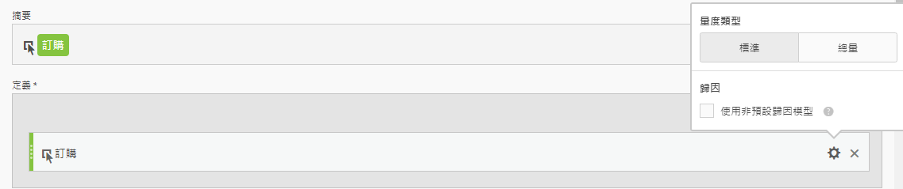
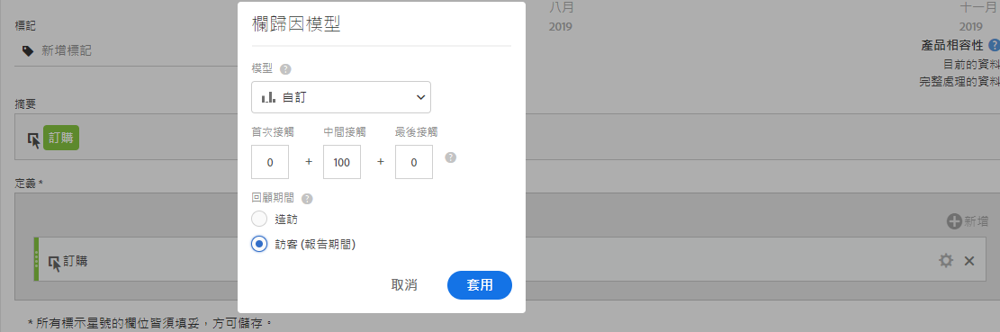
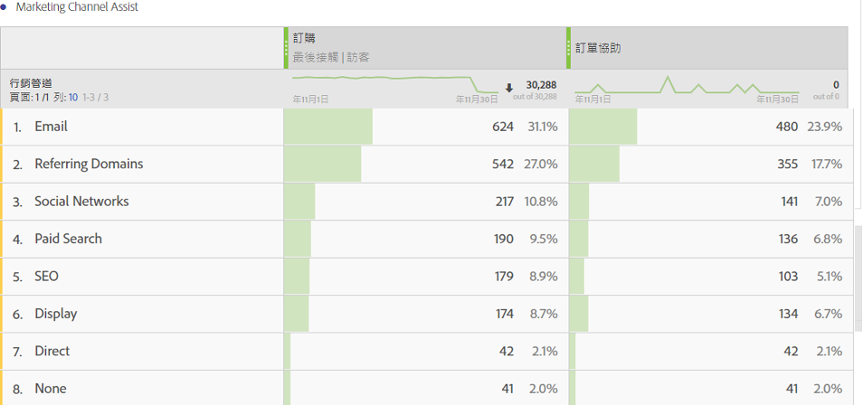

# 建立「訂單協助」量度

下列資訊說明如何建立量度，以顯示哪些行銷管道協助推動訂單。 這可用於任何可能有助益的維度或成功案例。

1. 開始建立計算量度，如[建立量度](/help/components/c-calcmetrics/c-workflow/cm-workflow/c-build-metrics/cm-build-metrics.md)中所述。

1. 在計算量度產生器中，將量度命名為「輔助訂購」或類似名稱。

1. 將「訂購」量度拖進「定義」畫布。接著，在設定齒輪中勾選&#x200B;**[!UICONTROL 「使用非預設歸因模型」]**&#x200B;核取方塊，調整歸因模型。

   

1. 選取&#x200B;**[!UICONTROL 「自訂」]**&#x200B;歸因模型。將加權變更為 0 (首次接觸)、100 (中間接觸) 和 0 (最後接觸)。

   

1. 選取&#x200B;[!UICONTROL **套用**] > [!UICONTROL **儲存**]。

1. 在Analysis Workspace中，使用「行銷管道」維度、「訂單」和新的「輔助訂單」量度建立自由表格。

   

   這是輕鬆辨別哪些行銷管道有助於提升訂購量的一種方式。另外，您也可以在自由表格中，以滑鼠右鍵按一下量度，直接在表格中調整歸因模型。

1. （選用）如[共用計算量度](/help/components/c-calcmetrics/c-workflow/cm-workflow/cm-sharing.md)中所述，與組織中的其他使用者共用量度。
