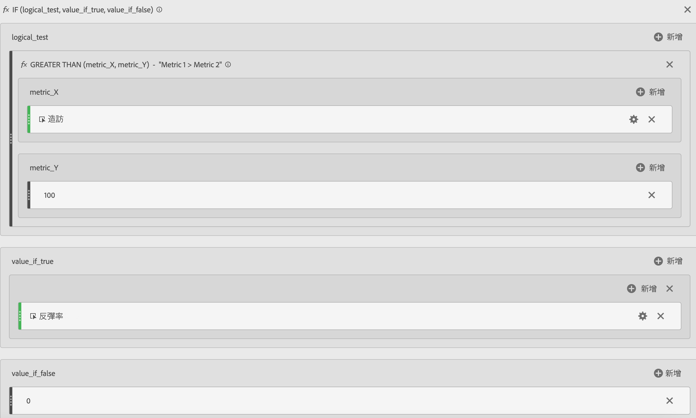
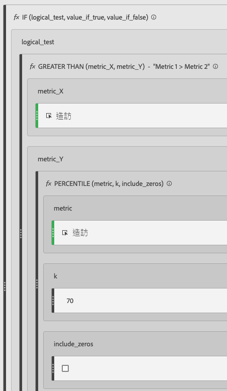
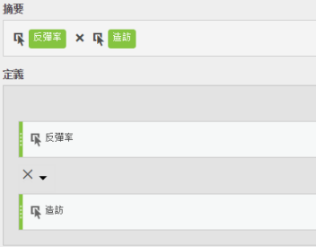

# 篩選和加權量度

顯示篩選和加權量度的範例。

## 已篩選的反彈率 {#section_D42F2452E4464948934063EB6F2DAAB4}

這個簡單的已篩選量度只顯示超過 100 次瀏覽之頁面的反彈率：

請記住，此公式相依於一致的時間範圍。如果您針對單日執行報表，則超過 20 次瀏覽的頁面都值得查看。如果您針對一個月執行報表，可能會想讓篩選包含更多次瀏覽。

## 使用百分位數篩選的反彈率 {#section_4F3E6D33A1FD438A932FA662B3510552}

依瀏覽次數排序時，此篩選器會顯示前 30% 頁面的反彈率。

## 加權量度 {#section_F2D16B14569948289CF1310F9E6E3FC2}

假設您想在一般情形下依反彈率排序，但瀏覽次數較高的頁面應排在清單中較前面的位置。那麼您應建立加權的反彈率，如下所示：

