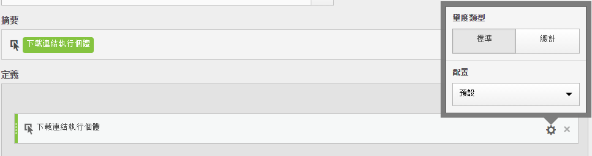

# 量度類型和歸因 {#metric-type-attribution}

>[!CONTEXTUALHELP]
>id="components_calculatedmetrics_attributionmodel"
>title="模型"
>abstract="選取此量度的歸因模型。"

>[!CONTEXTUALHELP]
>id="components_calculatedmetrics_attribution_lasttouch"
>title="上次接觸"
>abstract="100% 功勞歸於訪客看到的最後一個維度值。"

>[!CONTEXTUALHELP]
>id="components_calculatedmetrics_attribution_firsttouch"
>title="首次接觸"
>abstract="100% 功勞會歸於訪客看到的第一個維度值。"

>[!CONTEXTUALHELP]
>id="components_calculatedmetrics_attribution_linear"
>title="線性"
>abstract="功勞平均分佈在所有維度值上。"

>[!CONTEXTUALHELP]
>id="components_calculatedmetrics_attribution_participation"
>title="參與率"
>abstract="100% 功勞歸於訪客看到的每個維度值。 欄總計會出現浮報現象。"

>[!CONTEXTUALHELP]
>id="components_calculatedmetrics_attribution_sametouch"
>title="同一次接觸"
>abstract="功勞僅給予與轉換同一事件中發生的維度值。"

>[!CONTEXTUALHELP]
>id="components_calculatedmetrics_attribution_instance"
>title="同一次接觸"
>abstract="功勞僅給予與轉換同一事件中發生的維度值。"

>[!CONTEXTUALHELP]
>id="components_calculatedmetrics_attribution_ushaped"
>title="U 型"
>abstract="40% 功勞歸於第一個維度值，40% 歸於最後一個維度值，20% 則分配到中間的維度值。"

>[!CONTEXTUALHELP]
>id="components_calculatedmetrics_attribution_jcurve"
>title="J 曲線"
>abstract="60% 功勞歸於最後一個維度值，20% 歸於第一個維度值，20% 則分配到中間的維度值。"

>[!CONTEXTUALHELP]
>id="components_calculatedmetrics_attribution_jshaped"
>title="J 曲線"
>abstract="60% 功勞歸於最後一個維度值，20% 歸於第一個維度值，20% 則分配到中間的維度值。"

>[!CONTEXTUALHELP]
>id="components_calculatedmetrics_attribution_inversej"
>title="反向 J"
>abstract="60% 功勞歸於第一個維度值，20% 歸於最後一個維度值，20% 則分配到中間的維度值。"

>[!CONTEXTUALHELP]
>id="components_calculatedmetrics_attribution_reversejshaped"
>title="反向 J"
>abstract="60% 功勞歸於第一個維度值，20% 歸於最後一個維度值，20% 則分配到中間的維度值。"

>[!CONTEXTUALHELP]
>id="components_calculatedmetrics_attribution_timedecay"
>title="時間耗損"
>abstract="在時間上最接近轉換的維度值獲得最多功勞。"

>[!CONTEXTUALHELP]
>id="components_calculatedmetrics_attribution_custom"
>title="自訂"
>abstract="根據歸因加權定義您自己的位置。"

>[!CONTEXTUALHELP]
>id="components_calculatedmetrics_attribution_positionbased"
>title="自訂"
>abstract="根據歸因加權定義您自己的位置。"

>[!CONTEXTUALHELP]
>id="components_calculatedmetrics_attribution_algorithmic"
>title="演算法"
>abstract="功勞是根據統計演算法動態決定的。"

>[!CONTEXTUALHELP]
>id="components_calculatedmetrics_attribution_container"
>title="容器"
>abstract="選取容器以設定所需的歸因範圍。"

>[!CONTEXTUALHELP]
>id="components_calculatedmetrics_attribution_lookbackwindow"
>title="回顧視窗"
>abstract="此設定可決定要為每個轉換套用的資料歸因期間。"

[建置計算量度](/help/components/c-calcmetrics/c-workflow/cm-workflow/c-build-metrics/cm-build-metrics.md)時，您可以指定量度類型和歸因模型。

## 量度類型

若要在建置計算量度時指定量度類型：

1. 請選取要選取類型旁的齒輪圖示。

   

1. 從下列選項中選擇：

   | 量度類型 | 定義 |
   |---|---|
   | 標準 | 這些量度就是在標準 [!DNL Analytics] 報表中使用的量度。如果某個公式由單一標準量度組成，則其顯示的資料將與其非計算量度相對應公式一樣。標準量度適合用來建立每個行項目專屬的計算量度。例如，[訂單] / [造訪] 會採用該特定條列項目的訂單，然後除以該特定條列項目的造訪次數。 |
   | 總計 | 使用適用於每個條列項目報告期間的總計。如果公式由單一總計量度組成，則會在每個條列項目顯示相同總數。總計量度適合用來建立要與網站資料總計比較的計算量度。例如，[訂單數]/[總造訪數]可顯示相較於網站「全部」造訪數的訂單比例，而不只是特定條列項目的造訪數。 |

## 線性配置如何運作

[歸因](/help/analyze/analysis-workspace/attribution/overview.md)為計算量度中配置模式的評估方式。

如需非預設歸因模型及支援的回顧期間的完整清單，請參閱[歸因模型與回顧期間](/help/analyze/analysis-workspace/attribution/models.md)。

下列範例將說明具有線性配置的計算量度在報告中將如何運作：

| | 點擊 1 | 點擊 2 | 點擊 3 | 點擊 4 | 點擊 5 | 點擊 6 | 點擊 7 |
|--- |--- |--- |--- |--- |--- |--- |--- |
| 傳入資料 | 促銷活動 A | - | 促銷活動 A | 促銷活動 B | - | 促銷活動 C | $10 |
| 上次接觸 eVar | 促銷活動 A | 促銷活動 A | 促銷活動 A | 促銷活動 B | 促銷活動 B | 促銷活動 C | $10 |
| 首次接觸 eVar | 促銷活動 A | 促銷活動 A | 促銷活動 A | 促銷活動 A | 促銷活動 A | 促銷活動 A | $10 |
| 範例 prop | 促銷活動 A | - | 促銷活動 A | 促銷活動 B | - | 促銷活動 C | $10 |

在本範例中，A、B和 C 值在點擊 1、3、4 和 6 時傳入，然後在點擊 7 時進行 $10 的購物。在第二列中，這些值會持續存在於上次接觸瀏覽的所有點擊間。第三列說明首次接觸瀏覽持續性最後，最後一列說明如何針對不具持續性的 PROP 記錄資料。

