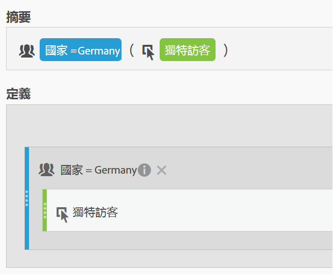
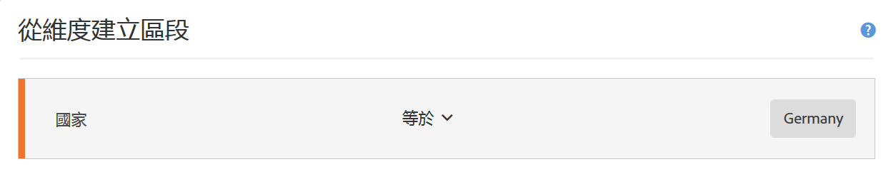
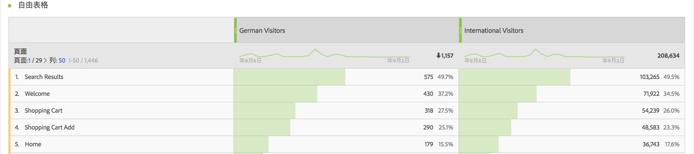
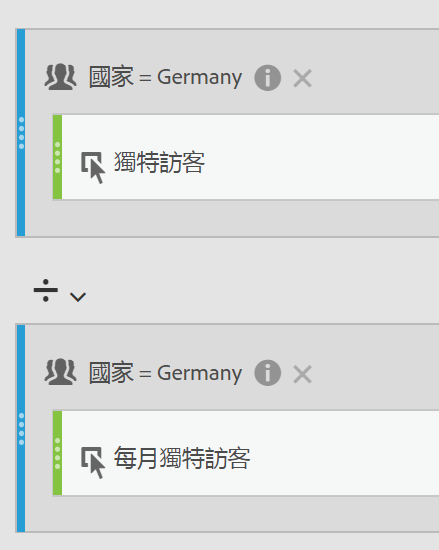
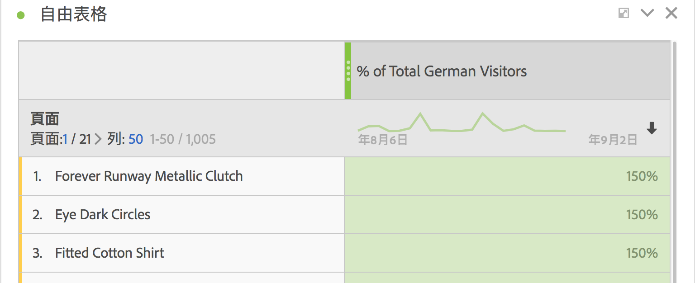

# 區段量度

在計算量度產生器中，您可以在量度定義中套用區段。如果您想導出新的量度以便在分析中使用，這會很有幫助。請記住，區段定義可透過區段產生器進行更新。如果進行了更動，該區段將自動更新任何套用此區段的地方，包括如果此區段屬於計算量度定義的一部分。

## 建立區段量度 {#create}

假設您想比較「德國訪客」區段和「國際訪客」區段的不同面向。您可以建立能提供下列深入分析的量度：

* 這兩個群組的內容瀏覽行為相較之下的結果為何？(另一個範例：這兩個區段的轉換率相較之下的結果為何？)
* 相較於國際訪客，德國訪客瀏覽特定頁面佔總訪客人數的百分比為多少？
* 就這兩個不同區段所存取的內容來說，最大差異為何？

建立並儲存名為「德國訪客」的量度，以及名為「國際訪客」的量度：

1. 在計算量度產生器中建立一個名為「德國訪客」的臨時區段，其中「國家/地區」等於「德國」。

   將「國家/地區」維度拖曳至「定義」畫布，並選取&#x200B;[!UICONTROL **Germany**]&#x200B;作為值：

   

   >[!NOTE]
   >
   >您也可以在[區段產生器](/help/components/segmentation/segmentation-workflow/seg-build.md)中進行此步驟。但我們已透過在計算量度產生器中提供維度簡化了工作流程。 「臨時」表示左側邊欄的「**[!UICONTROL 區段]**」清單中不會顯示此區段。但您可以將滑鼠游標停留在該區段旁的「i」圖示上，並按一下&#x200B;**[!UICONTROL 「設為公開」]**&#x200B;以公開該區段。

1. 將「德國」區段拖曳至「定義」畫布，並將「不重複訪客」量度拖曳至其中：

   

1. 選取&#x200B;[!UICONTROL **儲存**]&#x200B;以儲存計算量度。

1. 在計算量度產生器中建立一個名為「國際訪客」的臨時區段，其中「國家/地區」不等於「德國」。

   將「國家/地區」維度拖曳至「定義」畫布，選取&#x200B;[!UICONTROL **Germany**]&#x200B;作為值，然後選取&#x200B;[!UICONTROL **does not equal**]&#x200B;作為運運算元。

1. 將「不重複訪客」量度拖曳至其中。

1. 選取&#x200B;[!UICONTROL **儲存**]&#x200B;以儲存計算量度。

1. 在 Analysis Workspace 中，將&#x200B;**[!UICONTROL 「頁面]**&#x200B;維度」拖曳至「自由表格」中，並將 2 個相鄰的新計算量度拖曳到最上方：

   

>[!BEGINSHADEBOX]

如需示範影片，請參閱 [分段量度](https://video.tv.adobe.com/v/25409?quality=12&learn=on){target="_blank"}。

>[!ENDSHADEBOX]

## 佔總量度的百分比 {#percent-total}

您可以透過將您的區段與總人口進行比較，進一步分析上述範例。若要這麼做，請先建立兩個新量度，「德國訪客總數 %」和「國際訪客總數 %」：

1. 將德國 (或國際) 訪客區段拖曳至畫布中。
1. 將另一個德國 (或國際) 訪客區段拖曳至下方。但這次按一下其設定 (齒輪) 圖示，選取量度類型「總計」。格式應為「百分比」。運算元應為「除以」。結果會產生此量度定義：

   

1. 將此量度套用至專案：

   
