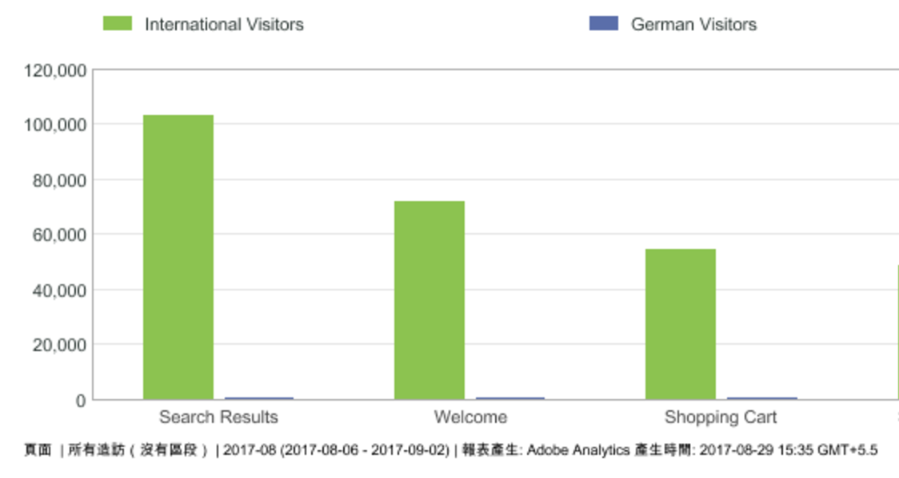
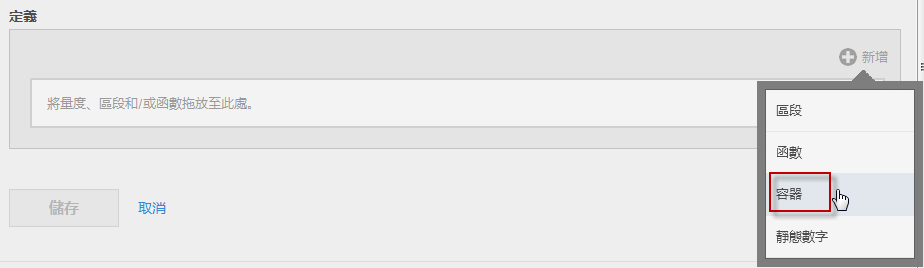
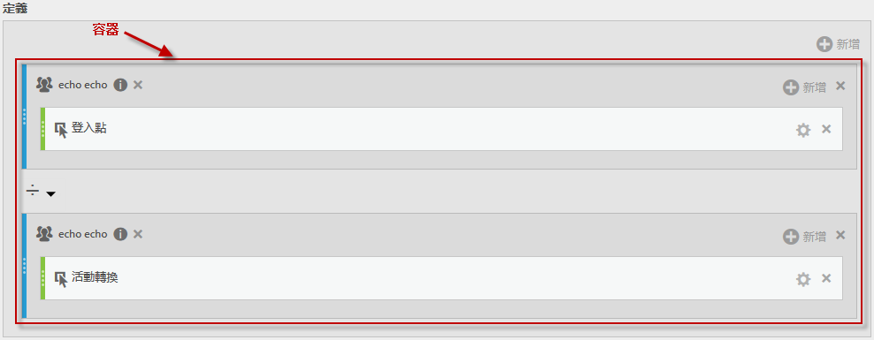
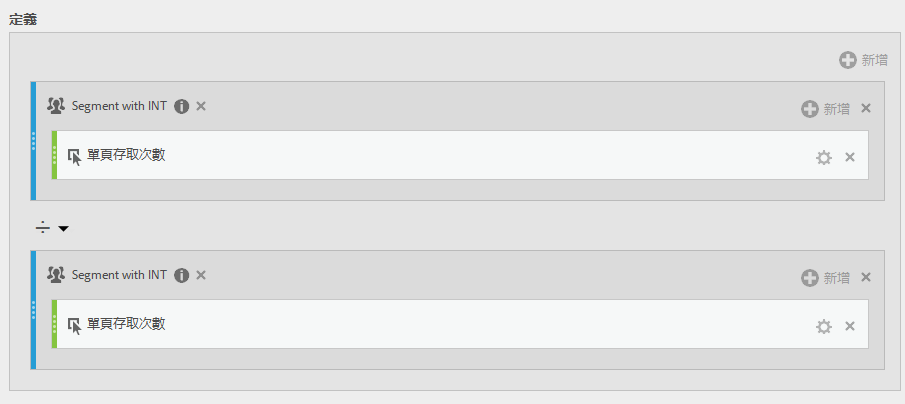

# 區段量度

對個別量度分段可讓您在同一份報表中比較量度。(僅限衍生量度)

## 比較區段 {#section_29A6E0070F084BFDB6228FA9CE106F48}

假設您想比較「美國訪客」區段和「國際訪客」區段的不同方面，您可以建立能提供下列分析項目的量度:

* 這兩個群組的內容瀏覽行為相較之下的結果為何? (另一個範例是: 這兩個區段的轉換率相較之下的結果為何?)
* 相較於國際訪客，美國訪客瀏覽特定頁面佔總訪客人數的百分比為多少?
* 就這兩個不同區段所存取的內容來說，最大差異為何?

先來看看第一個問題: 這兩個群組的內容瀏覽行為相較之下的結果為何?

1. 如果您沒有可供比較的區段，請先在計算量度產生器中建立一個內部區段，將其命名為「德國訪客」，其中「國家/地區」等於「德國」。直接將「國家/地區」維度拖放到「定義」畫布中，然後選取「德國」作為值即可:

   

   >[!NOTE]
   >
   >您也可以在[區段產生器](https://marketing.adobe.com/resources/help/zh_TW/analytics/segment/seg_build.html)中進行此操作。但我們已藉由在計算量度產生器中提供維度簡化了工作流程。

   >[!NOTE]
   >
   >「內部」表示左側欄的&#x200B;**[!UICONTROL 區段]**&#x200B;清單中不會顯示此區段。但您可以將游標停留在該區段旁的「i」圖示上，並按一下&#x200B;**[!UICONTROL 「設為公開」]**&#x200B;以公開該區段。

1. 如果您沒有可供比較的區段，請先建立一個名為「國際訪客」的區段，其中「國家/地區」不等於「德國」。
1. 將「德國」區段拖曳至「定義」畫布並將「獨特訪客」量度拖曳至其中，藉此建立並儲存名為「德國訪客」的量度:

   

1. 重複步驟 3，使用「國際訪客」區段和「獨特訪客」量度來建立「國際訪客」量度。
1. 在 Analysis Workspace 中，將&#x200B;**[!UICONTROL 「頁面]維度」拖曳至「自由表格」中，並將 2 個相鄰的新計算量度拖曳到最上方:**

   

1. 或是在 [!UICONTROL Reports &amp; Analytics] 中開啟[!UICONTROL 頁面]報表，按一下&#x200B;**[!UICONTROL 「顯示量度」]**，然後套用新的「美國訪客」和「國際訪客」分段量度，以查看其內容瀏覽行為相較之下的結果。

   

## 比較總數百分比 {#section_846CB89725F04388AE0352DB20189EE8}

您可以引入另一個查詢級別，也就是使用標準化百分比來比較訪客瀏覽行為。若要這麼做，請先建立兩個新量度「德國訪客總數 %」和「國際訪客總數 %」:

1. 將德國 (或國際) 訪客區段拖曳至畫布中。
1. 將另一個德國 (或國際) 訪客區段拖曳至下方。但這次按一下其設定 (齒輪) 圖示，選取量度類型「總計」。格式應為「百分比」。運算元應為「除以」。結果會產生此量度定義:

   

1. 將此量度套用至專案:

   

## 比較百分比差異 (使用容器) {#section_13D6353259B74C09B37BA6378A501938}

如果您想概略查看美國和國際瀏覽行為的最大差異，則可建立另一個量度，相減兩者的百分比。若要這麼做，您可使用「容器」功能有效做為兩組量度間的括號。

1. 在[!UICONTROL 定義]畫布中按一下&#x200B;**[!UICONTROL 「新增]** &gt; **[!UICONTROL 容器」]**:

   

1. 拖曳您先前建立的「美國訪客總數 %」量度至第一個容器 - 此量度就會展開其完整定義:

   

1. 在下方建立另一個容器，將「國際訪客總數 %」量度拖曳至其中。
1. 將 2 個容器間的運算元變更為減號 (-)。

   

1. 儲存量度 (確定已將其命名為「美國和國際間的差異 %」之類的名稱)。
1. 套用至報表後，您就能輕易看出最大的百分比差異落在哪裡，也能據以排序報表。

   

