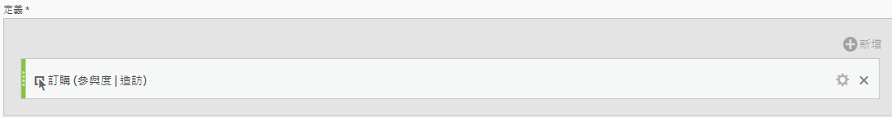
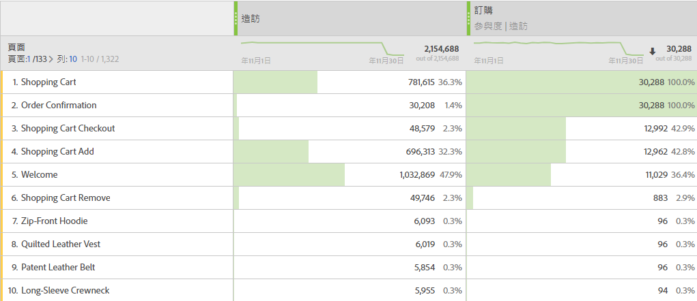

# 參與率量度

參與率量度可用來量化某個維度的個別值（例如「頁面檢視」）對包含特定量度（例如「訂購」）的造訪的貢獻或參與程度。

下列步驟顯示如何建立參與率量度。

1. [建立計算量度](../cm-workflow.md)，並在[計算量度產生器](cm-build-metrics.md)中命名量度`Orders (Visit Participation)`或類似名稱。
1. 將包含成功事件的量度（例如[!DNL Online Orders]）拖曳至[!UICONTROL **[!UICONTROL 定義]**]區域。
1. 選取量度的。
1. 在出現的快顯視窗中，選取「**[!UICONTROL 使用非預設歸因模型]**」以將該事件的[歸因模型](m-metric-type-alloc.md#attribution-models)定義給「**[!UICONTROL 參與率]**」，並為「[!UICONTROL 容器]」選取「**[!UICONTROL 造訪]**」。 選取&#x200B;**[!UICONTROL 套用]**&#x200B;以確認。

   

   **（分段|造訪|30天）**&#x200B;已新增至量度元件名稱。

1. 選取&#x200B;[!UICONTROL **儲存**]&#x200B;以儲存量度。
1. 在報表中使用計算量度。 例如，使用報表中的計算[!DNL Orders (Session Participation)]量度來顯示哪個客戶層促成（或參與）了包含訂單的工作階段。

   

<!--

The following information explains how to create a metric that shows which pages contributed to (or participated in) visits that contained an order.

This type of information could be useful for any content owner.

>[!NOTE]
>
>You can enable participation metrics in the Admin Tools, but only for custom events 1 - 100.

1. Begin creating a calculated metric, as described in [Build metrics](/help/components/c-calcmetrics/c-workflow/cm-workflow/c-build-metrics/cm-build-metrics.md).

1. In the Calculated metrics builder, name the metric "Participation".

1. Drag the success event "Orders" into the Definition canvas.

1. Change the [attribution model](/help/components/c-calcmetrics/c-workflow/cm-workflow/c-build-metrics/m-metric-type-alloc.md) of that event to **[!UICONTROL Participation]** under the **[!UICONTROL Settings]** gear. Select **[!UICONTROL Visit]** lookback. The definition should look similar to this:

   

1. Select [!UICONTROL **Save**] to save the metric.

1. Use the calculated metric in a **[!UICONTROL Pages]** report.

    

1. (Optional) Share the metric with other users in your organization, as described in [Share calculated metrics](/help/components/c-calcmetrics/c-workflow/cm-workflow/cm-sharing.md).
-->