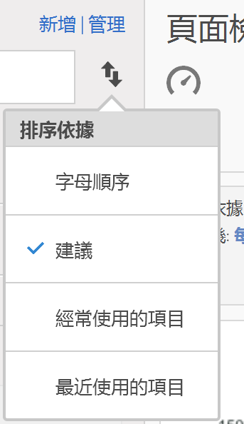
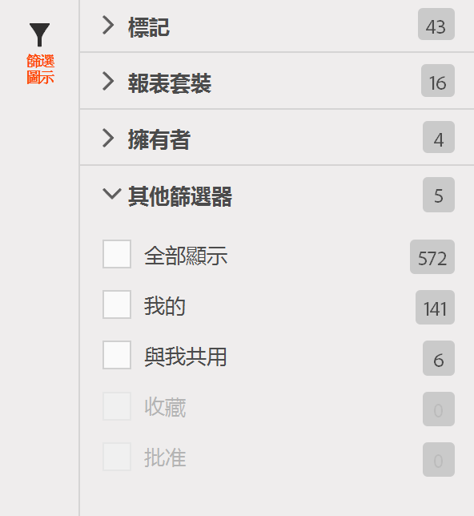

# 尋找量度

說明尋找量度的兩個主要方法: 排序和篩選。

## 排序{#section_89F9C4D515084F5796F2A54D468BF6C8}

開啟報表並按一下報表左側的「量度」圖示  帶出量度邊欄，量度選擇器中的「**排序依據]」下拉式清單會顯示四個排序選項:[!UICONTROL **

| 選項 | 使用時機 |
|---|---|
| 字母順序 | 適用於當您知道名稱時。 |
| 建議 | 大家常在報表中使用的通用量度 - 此項目是由後端從使用者常在此報表中使用的量度收集而得。 |
| 經常使用 | 適用於當您是新手使用者，需了解哪些是報表常用量度時。 |
| 最近使用 | 適用於當您在專案中工作，且會一再使用同一組量度時。 |

## 篩選 - 進階選擇{#section_33818CC048C04F098703AC229693F8CA}

開啟報表並按一下「量度」圖示，接著按一下&#x200B;**[!UICONTROL 「管理」]**。現在按一下「篩選」圖示。您可用數種方法進行篩選。

<table id="table_269081BC9DF54FFDA4E949FFC7488F42"> 
 <thead> 
  <tr> 
   <th colname="col1" class="entry"> 如果您要 </th> 
   <th colname="col2" class="entry"> 排序方式 </th> 
  </tr>
 </thead>
 <tbody> 
  <tr> 
   <td colname="col1"> 顯示此報表套裝中的所有量度。 </td> 
   <td colname="col2"> 其他篩選器 &gt; 全部顯示 </td> 
  </tr> 
  <tr> 
   <td colname="col1"> 只顯示您擁有的量度 </td> 
   <td colname="col2"> 其他篩選器 &gt; 我的 </td> 
  </tr> 
  <tr> 
   <td colname="col1"> 顯示其他人與我共用的量度 </td> 
   <td colname="col2">擁有者或 
 其他篩選器 &gt; 與我共用 
 </td> 
  </tr> 
  <tr> 
   <td colname="col1"> 只顯示公司核准的量度。 </td> 
   <td colname="col2"> 已核准 </td> 
  </tr> 
  <tr> 
   <td colname="col1"> 依量度篩選您正在工作的專案。 </td> 
   <td colname="col2">其中一個標記。 </td> 
  </tr> 
 </tbody> 
</table>

