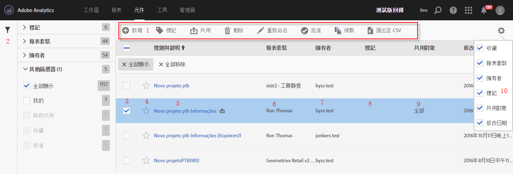

# 計算量度管理員

計算量度管理器提供許多管理量度的方式，例如共用、篩選、標記、核准、複製、刪除以及標記為我的最愛。

計算量度管理員會顯示您所擁有和已共用給您的區段。管理層級使用者可以查看組織中的所有自訂量度。此概覽會介紹「計算量度管理員」的使用者介面和功能。存取方式

* 前往左側導覽中的「**[!UICONTROL 分析]**」>「**[!UICONTROL 元件]**」。然後按一下&#x200B;**[!UICONTROL 「計算量度」]**。

| UI 功能 | 說明 |
|---|---|
| 計算量度管理工具列 | 您勾選某個量度後，便會出現此工具列。多數的管理工作均可以透過此工具列完成。 |
| 顯示/隱藏篩選器 | 按一下「顯示篩選器」就會出現篩選功能表。您可以依標記、報表套裝、擁有者、全部顯示 (僅限管理員)、與我共用、我的、我的最愛以及已核准來進行篩選。 |
| 核取方塊 | 勾選自訂量度以便加以管理。 |
| 我的最愛 | 按一下量度旁的星號，會使該星號變黃色並將量度標記為我的最愛。 |
| 區段標題和說明 | 計算量度產生器中提供。若要編輯標題和說明，請按一下標題連結，如此便會回到「計算量度產生器」。 |
| 報表套裝 | 此欄指出上次儲存量度的目標報表套裝。 |
| 擁有者 | 指出擁有自訂量度的人員。如果您不是管理員，您只能看見自己所擁有或已共用給您的量度。 |
| 標記 | 顯示由您或共用區段給您的人員對量度套用的標記。 |
| 共用對象 | 列出您將區段共用給的目標個人或群組 (僅限管理員使用) 或「全部」(僅限管理員使用)。 |
| 欄選擇器 | 可讓您在計算量度管理員中選取或取消選取欄，以便自訂檢視。 |
| 共用圖示    (未顯示) | 指出此自訂量度已由您共用或與您共用。 |
| 批准圖示    (未顯示) | 指出管理員已批准此自訂量度。 |
